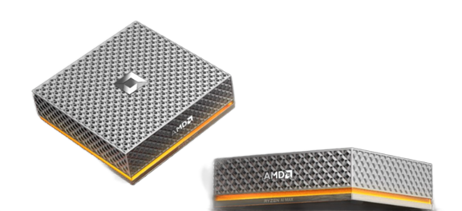
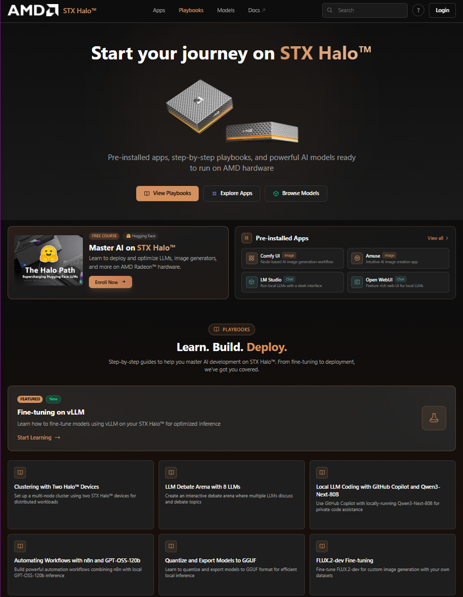

# Halo Playbooks

<p align="center">
  
</p>

This repository hosts all playbooks that will be part of the upcoming AMD Developer Platform launch.

## Quick Links

- [Overview](#overview)
- [Onboarding Portal](#onboarding-portal)
- [Playbook Proposal and Definition](#playbook-proposal-and-definition)
  - [How to Create a Playbook Proposal](#how-to-create-a-playbook-proposal)
  - [Example Playbook Proposals](#example-issues)


## Overview

We will maintain a curated set of 15 playbooks, organized into two tiers:

- **Core Playbooks (5)**: Mission-critical experiences that represent the highest-value workflows.
- **Supplemental Playbooks (10)**: Additional experiences that broaden capability but are not required for out-of-box (OOB) readiness.

These playbooks serve as the authoritative source for determining all required software assets (frameworks, foundational software, models, and apps).

Only assets required to deliver the Core Playbooks will be preinstalled on the device. The preinstalled software set will be the minimal union of all dependencies across the five core playbooks.


## Onboarding Portal

Playbooks are the core component of the onboarding portal. The set of available playbooks in the portal will be updated according to the latest contents pushed to this repository.

> Note: The portal's appearance and hosting location may change depending on potential partnerships and agreements established prior to launch.

<p align="center">
  
</p>

## Playbook Proposal and Definition

To define the 15 playbooks, we need contributors to create issues for each playbook. Each issue should follow a specific format to ensure consistency and proper categorization.

### How to Create a Playbook Proposal

Create an issue at [github.com/amd/halo_playbooks](https://github.com/amd/halo_playbooks) with the following format.

1. **Title Format**: Use the format `[Playbook] <Descriptive Title>`
   - Example: `[Playbook] Local LLM coding with GitHub Copilot and Qwen3-Next-80B`

2. **Required Labels**: Add relevant labels to categorize the playbook:

   |   Type     | Format | Description | Examples |
   |------------|--------|-------------|----------|
   | Framework | `framework::<name>` | Framework used | `framework::llamacpp`, `framework::docker`, `framework::vllm` |
   | Model | `model::<name>` | Model used | `model::qwen3-next-80b`, `model::gpt-oss-120b` |
   | App | `app::<name>` | Application used | `app::vscode`, `app::openwebui`, `app::openhands` |
   | OS | `os::<name>` | Operating system(s) supported | `os::linux`, `os::windows` |
   | Track | `track::<type>` | **REQUIRED**: Either core or supplemental | `track::core`, `track::supplemental` |

3. **Milestone**: Assign the issue to the **`playbooks`** milestone

4. **Description**: Provide a detailed description (250+ words) that includes:
   - Expected length of the playbook (time to complete)
   - Expected flow and high-level step-by-step progression
   - Potential technical issues or challenges AMD may encounter to enable this playbook

### Example Issues

Here are examples of properly formatted playbook issues:

#### Playbook Example
```
[Playbook] Local LLM coding with GitHub Copilot and Qwen3-Next-80B

Labels:
- app::vscode
- framework::llamacpp
- model::qwen3-next-80b
- os::linux
- os::windows
- track::core

Milestone: playbooks
```

### Next Steps

Once all 15 playbooks have been defined through issues, contributors will be invited to create playbooks based on an initial template.
