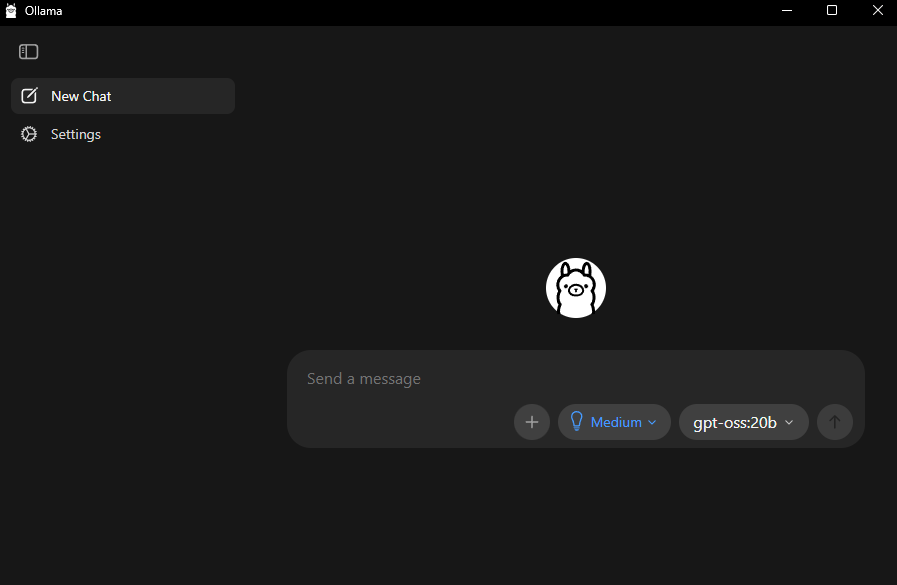

## Overview

Ollama is a lightweight tool for running large language models locally. It handles model downloading, quantization, and serving behind a simple command-line interface and desktop app, so you can go from zero to chatting with an LLM in minutes. Because everything runs on your own hardware, your prompts and data never leave the machine.

This playbook walks you through installing Ollama, pulling the GPT-OSS 20B model, and having a conversation with it, both from the terminal and the desktop app.

## What You'll Learn

- How to install and launch Ollama on your system
- Pull and run the GPT-OSS 20B model locally
- Chat with models using the CLI and the Ollama desktop app
- Query models programmatically through the REST API

## Installing Dependencies

<!-- @require:driver -->

### Installing Ollama

<!-- @os:windows -->

1. Download the installer from [ollama.com/download](https://ollama.com/download).
2. Run the `.exe` installer and follow the prompts.
3. Once installed, Ollama runs as a background service and is accessible from both the terminal and the desktop app.

Verify the installation by opening a terminal:

```powershell
ollama --version
```

You should see the installed version number printed to the console.
<!-- @os:end -->

<!-- @os:linux -->

Run the official install script:

```bash
curl -fsSL https://ollama.com/install.sh | sh
```

Verify the installation:

```bash
ollama --version
```

You should see the installed version number printed to the console.
<!-- @os:end -->

## Pulling Your First Model

Ollama manages models through a registry similar to container images. To download GPT-OSS 20B:

```bash
ollama pull gpt-oss:20b
```

This downloads the model weights to your local machine (approximately 12 GB). The download only happens once, and subsequent runs load the model from disk.

You can confirm the model is available with:

```bash
ollama list
```

You should see `gpt-oss:20b` in the output along with its size and last-modified date.

### Model Naming

Ollama model names follow the format `name:tag`. The tag usually indicates the parameter count or quantization variant. Some useful commands for managing models:

| Command | Description |
|---------|-------------|
| `ollama list` | Show all downloaded models |
| `ollama pull <model>` | Download a model without running it |
| `ollama rm <model>` | Remove a model to free disk space |
| `ollama show <model>` | Display model metadata and parameters |

## Chatting from the Terminal

Launch an interactive chat session directly from the command line:

```bash
ollama run gpt-oss:20b
```

Ollama loads the model into memory and drops you into a prompt. Try asking it something:

```
>>> What is the capital of France and why is it historically significant?
```

The model streams its response token-by-token directly in the terminal. Type `/bye` or press `Ctrl+D` to exit the session.

> **Tip**: The first run takes a few seconds to load the model into memory. Subsequent prompts within the same session respond much faster since the model stays loaded.

## Chatting from the Desktop App

Ollama also ships with a desktop application that provides a clean chat interface for interacting with your models.

<!-- @os:windows -->
Open **Ollama** from the Start menu or click the Ollama icon in the system tray and select **Open Ollama**.
<!-- @os:end -->

<!-- @os:linux -->
Launch **Ollama** from your application menu or by running `ollama app` from the terminal.
<!-- @os:end -->

Once the app is open:

1. Click **New Chat** in the sidebar.
2. Select **gpt-oss:20b** from the model dropdown in the bottom-right corner of the chat input area.
3. Type a message and press Enter to start chatting.

<p align="center">
  
</p>

The desktop app keeps a history of your conversations in the sidebar, making it easy to revisit previous chats.

## Using the REST API

While Ollama is running, it exposes a REST API on `http://localhost:11434` that you can use to integrate models into your own applications and scripts.

### Generate a Response

```bash
curl http://localhost:11434/api/generate -d "{\"model\": \"gpt-oss:20b\", \"prompt\": \"Explain GPU acceleration in two sentences.\", \"stream\": false}"
```

The response is a JSON object containing the model's output in the `response` field.

### Chat with Context

For multi-turn conversations, use the chat endpoint which maintains message history:

```bash
curl http://localhost:11434/api/chat -d "{\"model\": \"gpt-oss:20b\", \"messages\": [{\"role\": \"user\", \"content\": \"Hello! What can you help me with?\"}], \"stream\": false}"
```

### Python Example

```python
import requests

response = requests.post(
    "http://localhost:11434/api/generate",
    json={
        "model": "gpt-oss:20b",
        "prompt": "Write a haiku about local AI inference.",
        "stream": False,
    },
)

print(response.json()["response"])
```

### Key API Endpoints

| Endpoint | Method | Purpose |
|----------|--------|---------|
| `/api/generate` | POST | Single-turn text generation |
| `/api/chat` | POST | Multi-turn conversation with message history |
| `/api/tags` | GET | List available models |
| `/api/show` | POST | Show model details |
| `/api/pull` | POST | Pull a model from the registry |

For the full API reference, see the [Ollama API documentation](https://github.com/ollama/ollama/blob/main/docs/api.md).

## Next Steps

- **Try different models**: Browse the [Ollama model library](https://ollama.com/library) to explore hundreds of available models, from small coding assistants to large reasoning models.
- **Create custom models**: Use a [Modelfile](https://github.com/ollama/ollama/blob/main/docs/modelfile.md) to set custom system prompts, temperature, and other parameters for a tailored experience.
- **Build with the API**: Use the [Python](https://github.com/ollama/ollama-python) or [JavaScript](https://github.com/ollama/ollama-js) client libraries to integrate Ollama into your applications.
- **Connect to frontends**: Pair Ollama with tools like [Open WebUI](https://github.com/open-webui/open-webui) for a feature-rich chat interface with search, personas, and document upload.

For more information, check out the [Ollama documentation](https://github.com/ollama/ollama/blob/main/README.md).
