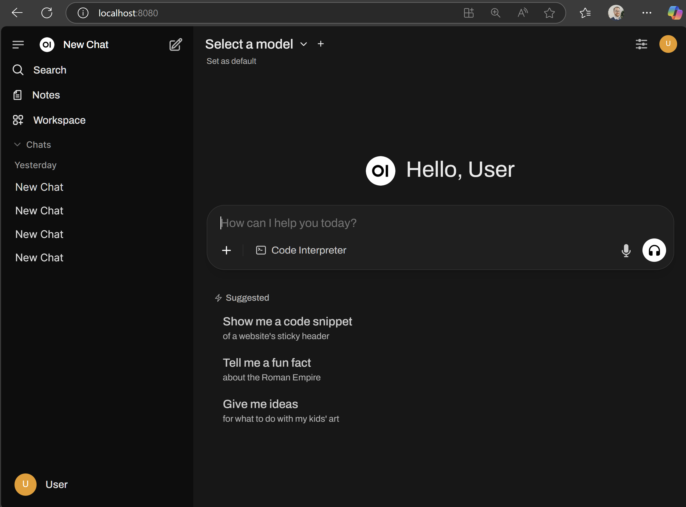

# How to Chat with LLMs in Open WebUI

<!-- Playbook content goes here -->
## Overview

Open WebUI is a self-hosted, browser-based interface that feels like a familiar chatbot, but it’s really a **control room** for whatever AI engines you connect behind it. Instead of being tied to one provider, Open WebUI can connect to **any backend that exposes an OpenAI-compatible API**, so you can swap models and capabilities without switching UIs.

In this playbook, we use **Lemonade** as the backend because it gives you a clean **OpenAI-compatible endpoint** for multiple modalities (LLMs, vision, Stable Diffusion image generation, audio) in one place, which will be perfect for learning the full workflow end-to-end.

---

## What You’ll Learn

By the end, you’ll be able to:

- Connect Open WebUI to a local OpenAI-compatible backend (Lemonade)
- Chat with a local LLM from your browser
- Upload an image and ask a vision model questions about it
- Generate images from text prompts using Stable Diffusion models (SD-Turbo / SDXL)
- Understand the mental model so you can swap in other backends later (Ollama, vLLM, llama.cpp server, etc.)

---

## Core Concepts (Mental Model)

### The three moving parts

Open WebUI setups are easiest when you keep this simple map in your head:

| Piece | What it does | Examples |
|---|---|---|
| Frontend (UI) | The web app you interact with | Open WebUI |
| Backend (Model Server) | Hosts models and exposes HTTP endpoints | Lemonade, Ollama, vLLM, llama.cpp server, OpenAI-compatible servers |
| Models | The actual LLM / vision / diffusion / audio models | CodeLlama, DeepSeek, Gemma-MM, SDXL, SD-Turbo, Whisper |

Open WebUI does not “run the model.” It sends requests to a backend server. The backend runs the model and returns the result.

### Why “OpenAI-compatible API” matters

Open WebUI is built around standard OpenAI-style endpoints, like: 
  - Chat: `/chat/completions`
  - Models list: `/models`
  - Image generation: `/images/generations`
  - Audio transcription: `/audio/transcriptions`

Lemonade exposes these under `http://localhost:8000/api/v1/...`

If a backend supports those endpoints, Open WebUI can talk to it with minimal setup. That’s why we can switch backends without changing our workflow.

---

## One-Time Setup (Do This Once)

This section gets you to a stable baseline: Lemonade running, Open WebUI running, and a working connection between them.

### 1) Install Lemonade, Start Lemonade Server, and Download Models

- Install Lemonade for your platform (App + Server) using the `.msi` installer from the [official documentation page](https://lemonade-server.ai/install_options.html).
- Start the Lemonade server:
  -  Open Powershell
  -  Run the command: `lemonade-server serve`
- Confirm server status to make sure that it is listening locally:
  - In the same Powershell terminal, run: `lemonade-server status`
  - It should show Lemonade server running (commonly on port `8000`)
  - Expect to see `Server is running on port 8000`
-  Open the Lemonade Server app and download required models from the `Model Manager` tab

<p align="center">
  
</p>

- Confirm the API is reachable:
  - Open `http://localhost:8000/api/v1/models`
  - You should see a JSON list of models downloaded in Lemonade

> If you don’t see your models in `/models`, Open WebUI won’t be able to select them later.


### 2) Install Open WebUI (first-time setup)

<!-- @os:windows -->
Open PowerShell and create a fresh virtual environment:

```bash
python -m venv openwebui-venv
.\openwebui-venv\Scripts\activate
python -m pip install --upgrade pip
pip install open-webui
```
<!-- @os:end -->

<!-- @os:linux -->
Open a terminal and create a fresh virtual environment:

```bash
python3 -m venv openwebui-venv
source openwebui-venv/bin/activate
python -m pip install --upgrade pip
pip install open-webui
```
<!-- @os:end -->

> Note: Open WebUI also provides a variety of other installation options, such as Docker, on their GitHub.

### 3) Start Open WebUI Server

- Run this command to launch the Open WebUI HTTP server:
```bash
open-webui serve
```
- In a browser, navigate to `http://localhost:8080`.
- Open WebUI will ask you to create a local administrator account. You can fill any username, password, and email you like. Once you are signed in, you will see the chat interface.

<p align="center">
  
</p>
  
> Keep the terminal window open. Closing it stops Open WebUI.


### 4) Connect Open WebUI to Lemonade

In Open WebUI:

1. Go to **Admin Settings → Connections**
2. Under **OpenAI API**, add a new connection:
   - **Base URL:** `http://localhost:8000/api/v1`
   - **API Key:** `-` (a single dash works for local)
3. Save

Return to the chat page and open the model dropdown.

Expected result: you can see downloaded Lemonade models in the list.

---

## Main Activities

Now you’re all set up. Let's look at three interesting things to do.

---

### Activity 1: Chat with a Local LLM

1. In the chat screen, choose an LLM model (example: `DeepSeek-R1-Distill-Llama-8B-NPU`).
2. Ask something like: `Give me a short plan for a 30-minute deep work session. Make it practical and specific.`
3. The model will respond in the chat
4. At this time, open `Task Manager` on your system. You will see **high GPU/NPU utilization** based on the model you selected. That clearly shows you’re running locally.
5. You can keep chatting without changing anything else

You just proved that Open WebUI can send requests to Lemonade using the OpenAI-compatible chat endpoint.

---

### Activity 2: Upload an Image and Ask Questions (Vision)

This requires a model that supports image input (a vision / multimodal model).

1. Select a vision-capable model (example: `Gemma-3-4b-it-mm-NPU`, or any model labeled for vision in Lemonade)
2. Click the **`+`** button in the message box and upload an image
3. Ask something that forces true image understanding: `Describe what’s happening in this image and list the key objects you see.`
4. The model answers based on the image content, not generic text.

You just proved that Open WebUI can send multimodal requests (text + image) through the backend (Lemonade, in this case) to a vision model.

---

### Activity 3: Generate an Image from a Text Prompt (Stable Diffusion)

This is the most important concept shift in this playbook:

Stable Diffusion models **do not “chat.”**
They generate images through an **Images API**, not the chat endpoint.

#### Step 1: Configure Image Generation in Open WebUI

1. Go to **Admin Settings → Images**
2. Set:
   - **Image Generation:** ON
   - **Image Generation Engine:** Default (OpenAI)
   - **OpenAI API Base URL:** `http://localhost:8000/api/v1`
   - **OpenAI API Key:** `-`
   - **Model:** `SD-Turbo` (fast) or `SDXL-Base-1.0` (higher quality)
3. Save

> Use the base URL exactly as above (no trailing slash, no double slashes).

#### Step 2: Generate an image from the chat screen

1. Go back to chat
2. Select a **normal LLM** in the model dropdown (example: DeepSeek).  **Do not select a Stable Diffusion model** as this is a chat model selector.
3. In the message area, toggle **Image** ON
4. Use a prompt like: `A cinematic photo of heavy traffic at sunset, 35mm lens, dramatic lighting, ultra detailed`
5. An image is generated and appears in the chat

You just proved that Open WebUI can coordinate a “two-part” workflow:
  - the LLM helps refine the prompt
  - the image is generated via Lemonade’s Images endpoint using Stable Diffusion

---

## Troubleshooting (Fast Fixes)

### “No models show up”
- Confirm `http://localhost:8000/api/v1/models` loads in a browser
- Re-check Open WebUI connection Base URL: `http://localhost:8000/api/v1`

### “This model does not support chat completion” error message
- You selected an image model (SD-Turbo / SDXL) in the chat model dropdown.
- Fix: select an LLM for chat, and use the Image toggle + Images settings for generation.

### Image generation errors/timeouts
- Start with `SD-Turbo` first (fast, fewer steps)
- Once working, switch the image model to `SDXL-Base-1.0` for quality

---

## Next Steps (Where this gets really interesting)

You now have a working local AI “stack”—a single UI controlling multiple model types through a standard API.

Here are three expansions that unlock entirely new workflows:

### 1) Speech-to-Text with Whisper
Try turning audio into text using a Whisper model, then feed it into an LLM for summarization, action items, or rewriting. This is the foundation for meeting notes and voice-driven assistants.

### 2) Python Coding inside Open WebUI
Use Open WebUI’s built-in code execution experience to run Python snippets, inspect outputs, and iterate faster—without leaving the UI. [Reference](https://lemonade-server.ai/docs/server/apps/open-webui/#python-coding)

### 3) HTML Rendering inside Open WebUI
Render HTML outputs directly in the interface. This is surprisingly powerful for building quick prototypes, formatted reports, and interactive snippets. [Reference](https://lemonade-server.ai/docs/server/apps/open-webui/#html-rendering)

---

## References

- [Open WebUI (GitHub)](https://github.com/open-webui/open-webui)
- [Lemonade (GitHub)](https://github.com/lemonade-sdk/lemonade)
- [Lemonade Server docs](https://lemonade-server.ai/docs)
- [Lemonade ↔ Open WebUI integration guide](https://lemonade-server.ai/docs/server/apps/open-webui)
- [Lemonade Server API spec (endpoints)](https://lemonade-server.ai/docs/server/server_spec)
- [Video walkthrough (Lemonade)](https://www.youtube.com/watch?v=mcf7dDybUco)
- [Video walkthrough (Open WebUI + Lemonade)](https://www.youtube.com/watch?v=yZs-Yzl736E)
