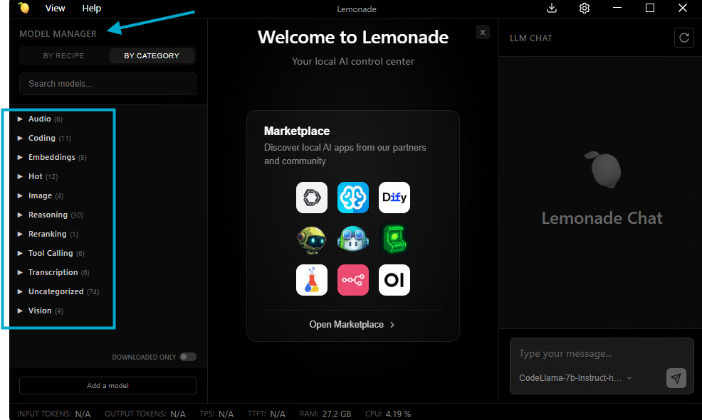

# Platform Configuration

This document describes the expected platform configuration for running this playbook.

## Required Apps/Frameworks

### Windows/Linux
Lemonade should be pre-installed from [here](https://lemonade-server.ai/install_options.html). 

- **Open WebUI** (frontend web app)
- **Lemonade Server** (backend model server)

> This playbook uses **Open WebUI** (Python package) and **Lemonade** (Lemonade server/app) both **running natively**.  
> Docker is **not required** for the main flow in this playbook.

## Required Models (in Lemonade)

Models should be downloaded inside the **Lemonade app** (using the built-in Model Manager) or via Lemonade’s model management commands (`lemonade-server pull <model_name>`). This playbook assumes that required models are downloaded and show up in the models list endpoint.

Check model availability:
- Open: `http://localhost:8000/api/v1/models`
- Downloaded models will be listed under `"data"`.

### Recommended models

| Capability | Model ID | Notes |
|---|----|-----|
| LLM (Text input → Text output) | `Llama-3.2-1B-Instruct-Hybrid` (or similar) | Any Lemonade LLM model for chat, text completion, coding, or reasoning |
| VLM (Image → Text) | `Gemma-3-4b-it-GGUF` (or any model in the **Vision** category) | Any multimodal/vision-capable model that can take images as part of their input |
| Image Generation (Text → Image) | `SDXL-Turbo` (or any model in the **Image** category) | Any Stable Diffusion model that generates images for a text prompt |
| Audio (Speech → Text) | `Whisper-Large-v3` (or any model in the **Audio** category) | Any ASR model that converts audio into text |

  

## Ports used

- **Lemonade Server:** `http://localhost:8000`
- **Open WebUI:** `http://localhost:8080`

If these ports are already used on your system, change them when starting the server(s).
