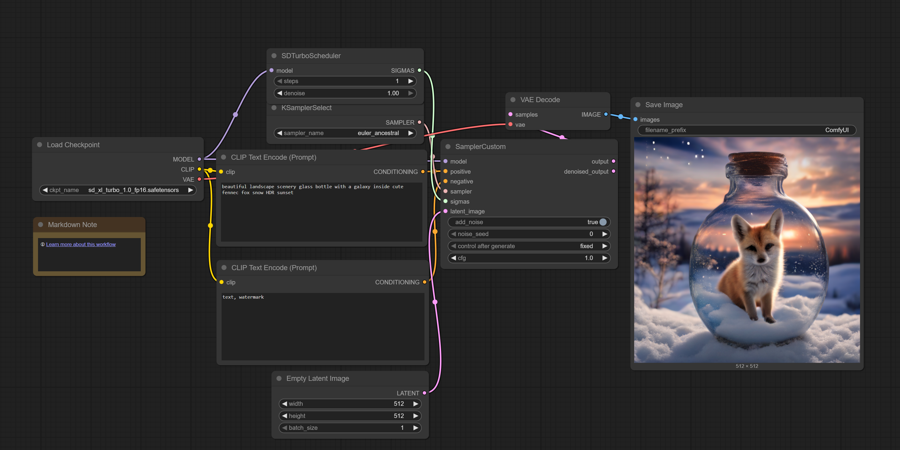

## Overview

ComfyUI is a powerful, node-based interface for Stable Diffusion and other diffusion models. Unlike traditional text-to-image interfaces with simple prompt boxes, ComfyUI exposes the entire image generation pipeline as a visual graph—giving you fine-grained control over every step from text encoding to latent space manipulation to final decoding.

This tutorial teaches you how to use ComfyUI with the Flux.2-dev model on your AMD Radeon™ GPU to generate high-quality AI images.

## What You'll Learn

- How ComfyUI's node-based workflow system works
- How to launch ComfyUI and load a Flux workflow
- How to modify prompts and generation parameters
- Key concepts for understanding diffusion model pipelines

## Why ComfyUI?

ComfyUI offers several advantages:

- **Transparency**: See exactly what operations happen during generation—tokenization, CLIP encoding, sampling, VAE decoding
- **Experimentation**: Swap components easily (different samplers, schedulers, models) without code changes
- **Reproducibility**: Save and share complete workflows as JSON files
- **Extensibility**: Custom nodes let you add new functionality directly into the pipeline

## Launching ComfyUI

Your STX Halo™ comes with ComfyUI pre-installed and configured for ROCm. To start it:

<!-- @os:windows -->
Open PowerShell and run:

```powershell
cd C:\AMD\comfyui
python main.py
```
<!-- @os:end -->

<!-- @os:linux -->
Open a terminal and run:

```bash
cd ~/AMD/comfyui
python main.py
```
<!-- @os:end -->

ComfyUI starts a local web server. Open your browser to `http://127.0.0.1:8188` to access the interface.

> **Tip**: Add the `--highvram` flag for faster generation on the STX Halo's 128GB unified memory.

## Understanding the Interface

When ComfyUI loads, you'll see a canvas with connected nodes. Each node represents an operation in the diffusion pipeline:

<p align="center">
  
</p>

### Core Node Types

| Node | Purpose |
|------|---------|
| **Load Checkpoint** | Loads the diffusion model (Flux.2-dev is pre-loaded) |
| **CLIP Text Encode** | Converts your text prompt into embeddings |
| **KSampler** | Runs the denoising loop (the actual "diffusion" process) |
| **VAE Decode** | Converts latent space output to a visible image |
| **Save Image** | Writes the final image to disk |

### Data Flow

Connections between nodes show data flow. In a typical workflow:

1. **Prompt** → CLIP encoder → conditioning embeddings
2. **Model** + **conditioning** + **latent noise** → KSampler → denoised latents
3. **Denoised latents** → VAE Decode → final image

This matches the mathematical pipeline of diffusion models—ComfyUI simply makes each step visible and configurable.

## Generating Your First Image

The Flux.2-dev model is already loaded. To generate an image:

1. **Find the CLIP Text Encode node** labeled "positive" (your main prompt)
2. **Enter your prompt**—be specific and descriptive:

   ```
   A photorealistic red fox sitting in a snowy forest clearing, 
   morning light filtering through pine trees, 
   detailed fur texture, bokeh background
   ```

3. **Click "Queue Prompt"** in the sidebar (or press `Ctrl+Enter`)
4. Watch the nodes highlight as each step executes

Your generated image appears in the **Save Image** node and is saved to the `output/` folder.

## Adjusting Generation Parameters

### KSampler Settings

The KSampler node controls the core diffusion process:

| Parameter | What It Controls | Recommended for Flux |
|-----------|------------------|---------------------|
| **steps** | Number of denoising iterations | 20–30 for quality, 10–15 for speed |
| **cfg** | Classifier-free guidance scale—how closely to follow the prompt | 3.5–4.5 (Flux uses lower values than SD) |
| **sampler_name** | Denoising algorithm | `euler` or `dpmpp_2m` work well |
| **scheduler** | Noise schedule curve | `normal` or `karras` |
| **seed** | Random seed for reproducibility | Set fixed values to iterate on a composition |

### Negative Prompts

Connect a second CLIP Text Encode node to the **negative** conditioning input of KSampler. This guides the model away from unwanted features:

```
blurry, low quality, distorted, watermark, text
```

## Working with Workflows

### Saving Workflows

Click the **Save** button in the menu to export your workflow as a JSON file. This captures:

- All nodes and their parameters
- All connections between nodes
- Current prompt text

### Loading Workflows

Drag a workflow JSON file onto the canvas, or use **Load** from the menu. The Flux workflow you see by default is loaded from a saved workflow file.

### Sharing Workflows

Workflows are self-contained—share the JSON file with colleagues, and they can reproduce your exact setup. This makes ComfyUI excellent for collaborative experimentation.

## Key Concepts

### Latent Space Operations

ComfyUI operates primarily in latent space (a compressed 4-channel representation). The VAE encodes images into this space and decodes latents back to pixels. You can:

- Generate at higher resolutions by adjusting the **Empty Latent Image** node dimensions
- Perform image-to-image by encoding a source image to latents first

### Conditioning and Guidance

The dual CLIP encoders in Flux (CLIP-L and T5-XXL) create rich text embeddings. The KSampler uses these to guide denoising toward your prompt. Higher CFG values mean stronger guidance but can cause artifacts—Flux is trained for lower CFG values than earlier Stable Diffusion models.

### Schedulers and Samplers

Different samplers implement different numerical methods for solving the reverse diffusion equation. In practice:

- **euler**: Fast, good baseline quality
- **dpmpp_2m**: Often higher quality, slightly slower
- **ddim**: Deterministic, useful for consistent results

## Next Steps

- **Explore LoRA nodes**: Apply style or subject adapters without retraining
- **Try ControlNet**: Add structural guidance from edge maps, depth, or poses
- **Build custom workflows**: Chain multiple generations, add upscaling, or create image variations
- **Browse community workflows**: [ComfyUI Examples](https://github.com/comfyanonymous/ComfyUI_examples) has many ready-to-use workflows

ComfyUI's strength is experimentation—connect nodes differently, adjust parameters, and observe how each change affects the output. This hands-on exploration builds intuition for how diffusion models work.
