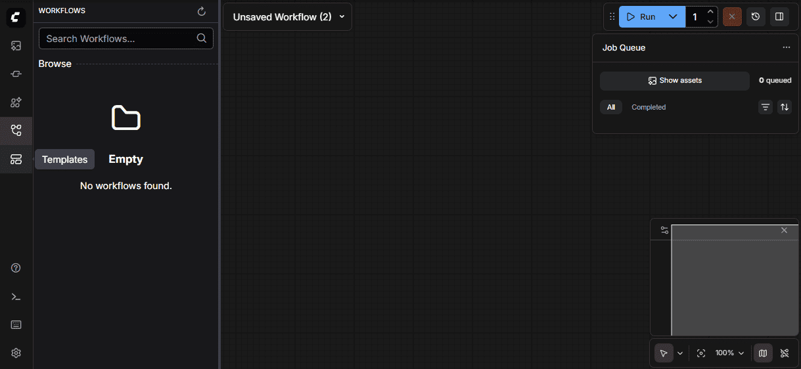
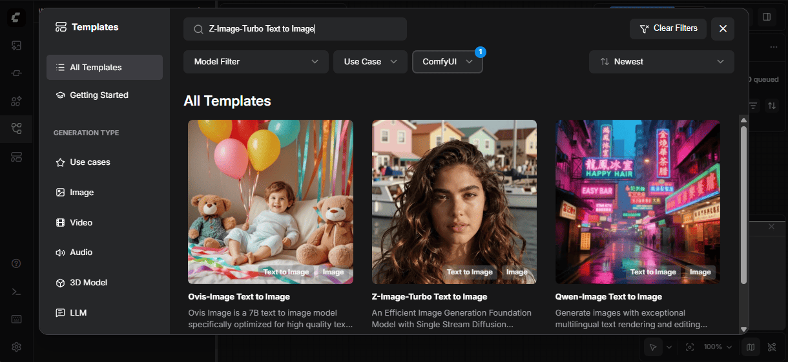
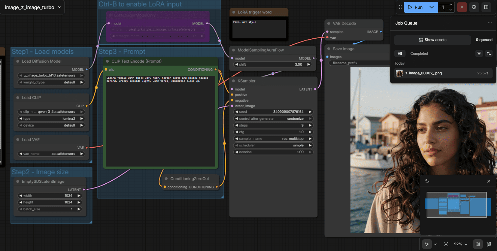

## Overview

ComfyUI is a powerful, node-based interface for Stable Diffusion and other diffusion models. Unlike traditional text-to-image interfaces with simple prompt boxes, ComfyUI exposes the entire image generation pipeline as a visual graph, giving you fine-grained control over every step from text encoding to latent space manipulation to final decoding.

This tutorial teaches you how to use ComfyUI with the Z Image Turbo model on your STX Halo™ GPU to generate high-quality AI images.

## What You'll Learn

- How to launch ComfyUI and load the Z Image Turbo template
- Understanding diffusion pipeline components
- Generating images and tuning generation parameters
- Saving and sharing workflows

## Installing Dependencies

<!-- @require:comfyui,driver -->

<!-- @os:windows -->
<!-- @test:id=comfyui-clone-windows timeout=300 -->
```powershell
if (Test-Path "ComfyUI\.git")
{
  cd ComfyUI
  git pull
}
else
{
  git clone https://github.com/Comfy-Org/ComfyUI.git
}
```
<!-- @test:end -->
<!-- @os:end -->

<!-- @os:linux -->
<!-- @test:id=comfyui-clone-linux timeout=300 -->
```bash
if [ -d "ComfyUI/.git" ]; then
  cd ComfyUI
  git pull
else
  git clone https://github.com/Comfy-Org/ComfyUI.git
fi
```
<!-- @test:end -->
<!-- @os:end -->


<!-- @os:windows -->
<!-- @test:id=create-venv timeout=120 -->
```powershell
if (Test-Path "comfyui_venv") { Remove-Item -Recurse -Force comfyui_venv}
py -3.12 -m venv comfyui_venv
.\comfyui_venv\Scripts\python.exe -V
```
<!-- @test:end --> 
<!-- @os:end -->

<!-- @os:linux -->
<!-- @test:id=create-venv timeout=120 -->
```bash
rm -rf comfyui_venv
sudo apt update
sudo apt install -y python3-venv
python3.12 -m venv comfyui_venv
source comfyui_venv/bin/activate
python --version
```
<!-- @test:end -->
<!-- @setup:id=activate-comfyui_venv-linux command="cd ComfyUI && source comfyui_venv/bin/activate" -->
<!-- @os:end -->

<!-- @os:windows -->
<!-- @test:id=comfyui-install-windows timeout=300 setup=activate-comfyui_venv-windows -->
```powershell
.\comfyui_venv\Scripts\python.exe -m pip install --upgrade pip
.\comfyui_venv\Scripts\python.exe -m pip install -r .\ComfyUI\requirements.txt
```
<!-- @test:end -->
<!-- @os:end -->

<!-- @os:linux -->
<!-- @test:id=comfyui-install-linux timeout=300 setup=activate-comfyui_venv-linux -->
```bash
python -m pip install --upgrade pip
python -m pip install -r requirements.txt
```
<!-- @test:end -->
<!-- @os:end -->


<!-- @os:windows -->
<!-- @test:id=comfyui-install-rocm-torch-windows timeout=900 -->
```powershell
.\comfyui_venv\Scripts\python.exe -m pip install --no-cache-dir `
https://repo.radeon.com/rocm/windows/rocm-rel-7.2/rocm_sdk_core-7.2.0.dev0-py3-none-win_amd64.whl `
https://repo.radeon.com/rocm/windows/rocm-rel-7.2/rocm_sdk_devel-7.2.0.dev0-py3-none-win_amd64.whl `
https://repo.radeon.com/rocm/windows/rocm-rel-7.2/rocm_sdk_libraries_custom-7.2.0.dev0-py3-none-win_amd64.whl `
https://repo.radeon.com/rocm/windows/rocm-rel-7.2/rocm-7.2.0.dev0.tar.gz

.\comfyui_venv\Scripts\python.exe -m pip install --no-cache-dir `
https://repo.radeon.com/rocm/windows/rocm-rel-7.2/torch-2.9.1%2Brocmsdk20260116-cp312-cp312-win_amd64.whl `
https://repo.radeon.com/rocm/windows/rocm-rel-7.2/torchaudio-2.9.1%2Brocmsdk20260116-cp312-cp312-win_amd64.whl `
https://repo.radeon.com/rocm/windows/rocm-rel-7.2/torchvision-0.24.1%2Brocmsdk20260116-cp312-cp312-win_amd64.whl
```
<!-- @test:end -->
<!-- @os:end -->


<!-- @os:linux -->
<!-- @test:id=comfyui-install-rocm-torch-linux timeout=900 hidden=True setup=activate-comfyui_venv-linux -->
```bash
sudo apt install python3-pip -y
pip3 install --upgrade pip wheel
wget https://repo.radeon.com/rocm/manylinux/rocm-rel-7.2/torch-2.9.1%2Brocm7.2.0.lw.git7e1940d4-cp312-cp312-linux_x86_64.whl
wget https://repo.radeon.com/rocm/manylinux/rocm-rel-7.2/torchvision-0.24.0%2Brocm7.2.0.gitb919bd0c-cp312-cp312-linux_x86_64.whl
wget https://repo.radeon.com/rocm/manylinux/rocm-rel-7.2/triton-3.5.1%2Brocm7.2.0.gita272dfa8-cp312-cp312-linux_x86_64.whl
wget https://repo.radeon.com/rocm/manylinux/rocm-rel-7.2/torchaudio-2.9.0%2Brocm7.2.0.gite3c6ee2b-cp312-cp312-linux_x86_64.whl
pip3 uninstall torch torchvision triton torchaudio
pip3 install torch-2.9.1+rocm7.2.0.lw.git7e1940d4-cp312-cp312-linux_x86_64.whl torchvision-0.24.0+rocm7.2.0.gitb919bd0c-cp312-cp312-linux_x86_64.whl torchaudio-2.9.0+rocm7.2.0.gite3c6ee2b-cp312-cp312-linux_x86_64.whl triton-3.5.1+rocm7.2.0.gita272dfa8-cp312-cp312-linux_x86_64.whl
```
<!-- @test:end --> 
<!-- @os:end -->


<!-- @os:windows -->
<!-- @test:id=comfyui-verify-torch-windows timeout=300 hidden=True -->
```powershell
.\comfyui_venv\Scripts\python.exe -c "import torch, sys; sys.exit(0 if torch.cuda.is_available() else 1)"
```
<!-- @test:end --> 
<!-- @os:end -->


<!-- @os:linux -->
<!-- @test:id=comfyui-verify-torch-linux timeout=300 hidden=True setup=activate-comfyui_venv-linux -->
```bash
python3 -c "import torch, sys; sys.exit(0 if torch.cuda.is_available() else 1)"
```
<!-- @test:end --> 
<!-- @os:end -->


<!-- @os:windows -->
<!-- @test:id=comfyui-server-up-windows timeout=300 hidden=True -->
```powershell
$comfy = Start-Process -FilePath ".\comfyui_venv\Scripts\python.exe" `
  -ArgumentList "main.py --listen 127.0.0.1 --port 8188" `
  -WorkingDirectory ".\ComfyUI" `
  -NoNewWindow -PassThru
try {
  # Poll for up to ~60s
  $ok = $false
  for ($i=0; $i -lt 60; $i++) {
    try {
      $resp = curl.exe -s http://127.0.0.1:8188/
      if ($resp) { $ok = $true; break }
    } catch {}
    Start-Sleep -Seconds 1
  }
  if (-not $ok) { exit 1 }
}
finally {
  Stop-Process -Id $comfy.Id -Force -ErrorAction SilentlyContinue
}
```
<!-- @test:end --> 
<!-- @os:end -->

<!-- @os:linux -->
<!-- @test:id=comfyui-server-up-linux timeout=300 hidden=True setup=activate-comfyui_venv-linux -->
```bash
python3 main.py --listen 127.0.0.1 --port 8188 &
sleep 5
curl -s http://127.0.0.1:8188
```
<!-- @test:end --> 
<!-- @os:end -->

## Launching ComfyUI

<!-- @os:windows -->

To launch ComfyUI on Windows, simply click the ComfyUI shortcut on your Desktop.
<!-- @os:end -->

<!-- @os:linux -->

To launch ComfyUI:

1. Navigate to `/usr/local/bin/ComfyUI/` (or to the appropriate folder if installed manually)
2. Run `python3 main.py --use-pytorch-cross-attention`

ComfyUI starts a local web server. Open your browser to `http://127.0.0.1:8188` to access the interface.

> **Tip**: Keep the terminal window open while using ComfyUI. Closing it will stop the server.
<!-- @os:end -->

## Finding the Z Image Turbo Template

Before generating images, you need to load the Z Image Turbo template. Here's how to find it:

1. **Look at the far left edge of the screen**—there's a vertical toolbar running from top to bottom on the leftmost side of the app.

2. **Find the folder icon**—in that left toolbar, look for an icon that looks like a folder. When you hover over it, it's labeled "Templates."

<p align="center">
  
</p>

3. **Click the folder icon**—this opens the Templates panel.

4. **Search for "Z Image Turbo"**—use the search bar or scroll through the available templates to find the Z Image Turbo Text To  Image workflow, then click to load it.

<p align="center">
  
</p>

## Downloading Models

<!-- @require:comfyui-models -->

<!-- @os:windows -->
<!-- @test:id=comfyui-populate-models-from-cache-windows timeout=600 hidden=True -->
```powershell
cd ComfyUI
$cacheDiff = "C:\ModelCache\ComfyUI\models\diffusion_models\z_image_turbo_bf16.safetensors"
$cacheTE   = "C:\ModelCache\ComfyUI\models\text_encoders\qwen_3_4b.safetensors"
$cacheVAE  = "C:\ModelCache\ComfyUI\models\vae\ae.safetensors"
if (-not (Test-Path $cacheDiff)) { Write-Error "models missing on runner: $cacheDiff"; exit 1 }
if (-not (Test-Path $cacheTE))   { Write-Error "models missing on runner: $cacheTE"; exit 1 }
if (-not (Test-Path $cacheVAE))  { Write-Error "models missing on runner: $cacheVAE"; exit 1 }
New-Item -ItemType Directory -Force -Path ".\models\diffusion_models" | Out-Null
New-Item -ItemType Directory -Force -Path ".\models\text_encoders"   | Out-Null
New-Item -ItemType Directory -Force -Path ".\models\vae"             | Out-Null
Copy-Item -Force $cacheDiff ".\models\diffusion_models\z_image_turbo_bf16.safetensors"
Copy-Item -Force $cacheTE   ".\models\text_encoders\qwen_3_4b.safetensors"
Copy-Item -Force $cacheVAE  ".\models\vae\ae.safetensors"
```
<!-- @test:end --> 
<!-- @os:end -->

<!-- @os:linux -->
<!-- @test:id=comfyui-populate-models-from-cache-linux timeout=600 hidden=True -->
```bash
cd ComfyUI
cache_diff="/opt/model_cache/ComfyUI/models/diffusion_models/z_image_turbo_bf16.safetensors"
cache_te="/opt/model_cache/ComfyUI/models/text_encoders/qwen_3_4b.safetensors"
cache_vae="/opt/model_cache/ComfyUI/models/vae/ae.safetensors"
test -f "$cache_diff" || (echo "models missing on runner: $cache_diff" && exit 1)
test -f "$cache_te" || (echo "models missing on runner: $cache_te" && exit 1)
test -f "$cache_vae" || (echo "models missing on runner: $cache_vae" && exit 1)
mkdir -p models/diffusion_models models/text_encoders models/vae
cp -f "$cache_diff" models/diffusion_models/z_image_turbo_bf16.safetensors
cp -f "$cache_te" models/text_encoders/qwen_3_4b.safetensors
cp -f "$cache_vae" models/vae/ae.safetensors
```
<!-- @test:end --> 
<!-- @os:end -->

## Understanding the Interface

When the Z Image Turbo template loads, you'll see a canvas with connected nodes. Each node represents an operation in the diffusion pipeline:

<p align="center">
  
</p>

### Pipeline Components

The Z Image Turbo workflow uses four key model components that work together:

| Component | Role |
|-----------|------|
| **Text Encoder** (Qwen 3 4B) | Converts your text prompt into embeddings the diffusion model understands |
| **Diffusion Model** (Z Image Turbo) | The core neural network that iteratively denoises latent representations into images |
| **VAE** (Variational Autoencoder) | Encodes images to/from latent space (decodes the final latents into pixels) |
| **LoRA** (optional) | Lightweight adapters that modify style or subject without retraining the base model |

Each node in the workflow corresponds to one of these components. Data flows left-to-right: text → embeddings → guided denoising → latents → final image.

## Generating Your First Image

The Z Image Turbo model is already loaded. To generate an image:

1. **Find the CLIP Text Encode node** labeled "Step 3" (your main prompt)
2. **Enter your prompt**: be specific and descriptive:

   ```
   A photorealistic red fox sitting in a snowy forest clearing, 
   morning light filtering through pine trees, 
   detailed fur texture, bokeh background
   ```

3. **Click the "Run Workflow"** in upper right corner (or press `Ctrl+Enter`)
4. Watch the nodes highlight as each step executes

The entire workflow execution should complete in less than 30 seconds. Your generated image appears in the **Save Image** node and is saved to the `output/` folder.

<!-- @os:windows -->
<!-- @test:id=comfyui-generate-zimage timeout=600 hidden=True -->
```powershell
$comfy = Start-Process -FilePath ".\comfyui_venv\Scripts\python.exe" `
  -ArgumentList "main.py --listen 127.0.0.1 --port 8188" `
  -WorkingDirectory ".\ComfyUI" `
  -NoNewWindow -PassThru
try {
  # Poll (wait for server to be ready) for up to ~60s
  $ok = $false
  for ($i=0; $i -lt 60; $i++) {
    try {
      $resp = curl.exe -s http://127.0.0.1:8188/
      if ($resp) { $ok = $true; break }
    } catch {}
    Start-Sleep -Seconds 1
  }
  if (-not $ok) { exit 1 }
  @'
import json, time, urllib.request

with open("image_z_image_turbo.json", "r", encoding="utf-8") as f:
  workflow = json.load(f)

req = urllib.request.Request(
  "http://127.0.0.1:8188/prompt",
  data=json.dumps({"prompt": workflow}).encode("utf-8"),
  headers={"Content-Type":"application/json"},
  method="POST",
)
with urllib.request.urlopen(req, timeout=30) as r:
  prompt_id = json.load(r)["prompt_id"]

for _ in range(120):
  with urllib.request.urlopen(f"http://127.0.0.1:8188/history/{prompt_id}", timeout=30) as r:
    hist = json.load(r)
  entry = hist.get(prompt_id, {})
  if entry.get("outputs"):
    break
  time.sleep(1)
else:
  raise SystemExit("No outputs after waiting.")

print("OK")
'@ | .\comfyui_venv\Scripts\python.exe -
}
finally {
  Stop-Process -Id $comfy.Id -Force -ErrorAction SilentlyContinue
}
```
<!-- @test:end --> 
<!-- @os:end -->

<!-- @os:linux -->
<!-- @test:id=comfyui-generate-zimage timeout=600 hidden=True setup=activate-comfyui_venv-linux -->
```python
import json, time, urllib.request

with open("assets/image_z_image_turbo.json", "r", encoding="utf-8") as f:
  workflow = json.load(f)

req = urllib.request.Request(
  "http://127.0.0.1:8188/prompt",
  data=json.dumps({"prompt": workflow}).encode("utf-8"),
  headers={"Content-Type":"application/json"},
  method="POST",
)
with urllib.request.urlopen(req, timeout=30) as r:
  prompt_id = json.load(r)["prompt_id"]

for _ in range(120):
  with urllib.request.urlopen(f"http://127.0.0.1:8188/history/{prompt_id}", timeout=30) as r:
    hist = json.load(r)
  entry = hist.get(prompt_id, {})
  if entry.get("outputs"):
    break
  time.sleep(1)
else:
  raise SystemExit("No outputs after waiting.")

print("OK")
```
<!-- @test:end --> 
<!-- @os:end -->


<!-- @os:windows -->
<!-- @test:id=comfyui-output-exists-windows timeout=60 hidden=True -->
```powershell
dir ComfyUI\output\*.png
```
<!-- @test:end --> 
<!-- @os:end -->

<!-- @os:linux -->
<!-- @test:id=comfyui-output-exists-linux timeout=60 hidden=True -->
```bash
ls ComfyUI/output/*.png
```
<!-- @test:end --> 
<!-- @os:end -->

## Adjusting Generation Parameters

### KSampler Settings

The KSampler node controls the core diffusion process:

| Parameter | What It Controls | Recommended for Z Image Turbo |
|-----------|------------------|-------------------------------|
| **steps** | Number of denoising iterations | 4–10 (turbo models are distilled for fewer steps) |
| **cfg** | Classifier-free guidance scale—how closely to follow the prompt | 1.0–2.0 (turbo models use very low guidance) |
| **sampler_name** | Denoising algorithm | `euler` and `res_multistep` work well for turbo models |
| **scheduler** | Noise schedule curve | `normal` or `simple` |
| **seed** | Random seed for reproducibility | Set fixed values to iterate on a composition |

### Image Size

To adjust output dimensions, find the **Empty Latent Image** node and modify **width** and **height**. Keep dimensions at or below 1024 pixels on the longest side for optimal quality.

### ModelSamplingAuraFlow

The **ModelSamplingAuraFlow** node is a specialized sampling modifier that adjusts how the diffusion process handles noise scheduling. You'll see this node connected to the model output in the Z Image Turbo workflow.

| Parameter | What It Controls | Recommended Values |
|-----------|------------------|-------------------|
| **shift** | Adjusts the noise schedule timing—higher values push more detail refinement to later steps | 1.0–4.0 (default is 3.0) |

When to adjust **shift**:

- **Lower values (1.0–2.0)**: Faster convergence, good for simple compositions
- **Higher values (3.0–4.0)**: More gradual refinement, can improve fine details in complex scenes

The AuraFlow sampling method is specifically designed for flow-matching models like Z Image Turbo, ensuring proper noise distribution throughout the generation process.

## Working with Workflows

### Saving Workflows

Click the **Save** button in the menu to export your workflow as a JSON file. This captures:

- All nodes and their parameters
- All connections between nodes
- Current prompt text

### Loading Workflows

Drag a workflow JSON file onto the canvas, or use **Load** from the menu. The Z Image Turbo workflow you see by default is loaded from a saved workflow file.

### Sharing Workflows

Workflows are self-contained—share the JSON file with colleagues, and they can reproduce your exact setup. This makes ComfyUI excellent for collaborative experimentation.

## Next Steps

- **Explore LoRA nodes**: Apply style or subject adapters without retraining
- **Add negative prompts**: Connect a second CLIP Text Encode node to the **negative** conditioning input of KSampler to guide the model away from unwanted features like blur, artifacts, or watermarks
- **Build custom workflows**: Chain multiple generations, add upscaling, or create image variations
- **Browse community workflows**: [ComfyUI Examples](https://github.com/comfyanonymous/ComfyUI_examples) has many ready-to-use workflows

ComfyUI's strength is experimentation: connect nodes differently, adjust parameters, and observe how each change affects the output. This hands-on exploration builds intuition for how diffusion models work.

For more information, check out the [ComfyUI Documentation](https://docs.comfy.org/).
