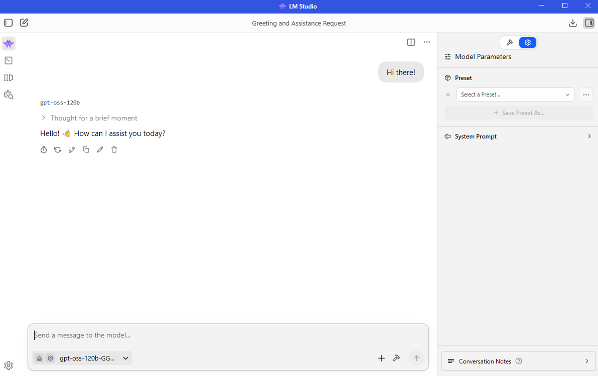

## Overview

LM Studio is a powerful GUI-based wrapper for [llama.cpp](https://github.com/ggml-org/llama.cpp) and also provides an [OpenAI compliant endpoint](https://lmstudio.ai/docs/developer/openai-compat) for local serving of models. LM Studio provides a simple but powerful interface to quickly and easily download and deploy models using LM Studio. LM Studio offers both Vulkan and ROCm based backends (called runtimes) for AMD users.


## What You'll Learn
- How to configure and use LM Studio to leverage STX Halo hardware
- Test and manage LLMs in a completely offline environment
- Serve models via OpenAI Compatible API to power custom workflows and apps


## Installing Dependencies

<!-- @require:lmstudio -->

## System Setup

<!-- @setup:memory-config -->


## Downloading Models

<!-- @require:lmstudio-models-gpt-oss-120b -->

## Chatting with an LLM
Learn how to start chatting with a ChatGPT-grade LLM completely locally.  

1. Press "Ctrl" + "1" or click on the 👾 button on the top left of the screen to open the Chat window. 
2. Press "Ctrl" + "M" to open the `Model Loader`, select "manually chose model load parameters", and click on "OpenAI GPT-OSS 120B"
3. Make sure "show advanced settings" is checked.  
4. Change context size to "128,000". Make sure "Flash Attention" is On and "GPU offload layers" is set to maximum.
5. Check "Remember settings" and click on `Load Model`.
6. Send a message and start interacting with the model!

<p align="center">
  
</p>

> Context size refers to the model's short-term memory limit, and with STX Halo, we can use 128,000 tokens to allow for handling extensive workflows that typically require cloud servers.

## Serve LLMs through an OpenAI compatible endpoint

LM Studio also offers an OpenAI compliant endpoint in the form of LM Studio Server. This has already been demonstrated in an agentic coding workflow with Cline here: "PLACEHOLDER FOR LINK TO PLAYBOOK". Another common use case is connecting LM Studio Server to any web application (React, Node.js, Python) by sending standard HTTP requests to the inference endpoint.

To set up LM Studio Server, use the following instructions:

1. On the left hand side, click on the "Developer" tab (command line icon) and then click on Server Settings.  
2. If you want to serve the model over your LAN, check "Serve on Local Network", if you want to use with a website or extensive calling within VS Code, enable "CORS"; otherwise leave these as defaults.  
3. Click on the toggle in front of Status: Stopped or press "Ctrl" + "R".  
4. An OpenAI compliant endpoint will now be running. The address is typically http://127.0.0.1:1234  
5. Staying on the same "Developer" tab, with the Status: Running, you can deploy an LLM by going through the steps mentioned in "Chatting with an LLM".  


This model will now be accessible through the LM Studio Server endpoint and will support OpenAI endpoints including:

| Endpoint | Method | Docs |
|------------|----------|----------|
| /v1/models | GET | [Models](https://lmstudio.ai/docs/developer/openai-compat/models) |
| /v1/responses | POST | [Responses](https://lmstudio.ai/docs/developer/openai-compat/responses) |
| /v1/chat/completions | POST |	[Chat Completions](https://lmstudio.ai/docs/developer/openai-compat/chat-completions) |
| /v1/embeddings | POST | [Embeddings](https://lmstudio.ai/docs/developer/openai-compat/embeddings) |
| /v1/completions | POST | [Completions](https://lmstudio.ai/docs/developer/openai-compat/completions) |

#### Example: Pinging your Endpoint
Having just created the OpenAI Compatible endpoint, let's look at how to integrate this into a Python developer environment and use your system as a local API Provider. 

```python
from openai import OpenAI # if not installed, run pip install openai in your selected environment

# Initialize the client specifically for your local server
# The API key is required by the library but ignored by LM Studio
client = OpenAI(
    base_url="http://localhost:1234/v1", 
    api_key="lm-studio"
)
print("Attempting to connect to local STX Halo server...")

try:
    # Create a simple chat completion request
    completion = client.chat.completions.create(
        model="local-model", # The model identifier is optional in local mode
        messages=[
            {"role": "system", "content": "You are a helpful coding assistant."},
            {"role": "user", "content": "Write a one-line Python joke."}
        ],
        temperature=0.7,
    )
    # Print the response
    print("\nConnection Successful! Server Response:\n")
    print(completion.choices[0].message.content)

except Exception as e:
    print(f"\nConnection Failed: {e}. Ensure LM Studio server is running on port 1234.")
```


#### Swapping between ROCm and Vulkan backends (Optional)

1. Press "Ctrl" + "Shift" + "R" on your keyboard. Alternatively click on the Discover tab (Magnifying Glass) on the left-hand side and then click on "Runtime" in the pop up.  
2. In the bottom right quadrant of the pop-up, you should see the "Selections" drawer with the "Engines" sub-header.  
3. The GGUF drop-down menu will show your currently selected backend. You can change this to ROCm or Vulkan llama.cpp depending on what you are trying to do. 
> Warning: selecting CPU llama.cpp here will disable GPU usage.  


## Next Steps
- **Custom App Integration**: Integrate your own Python scripts or applications using the local OpenAI-compatible API.
- **Advanced Frontends**: Connect powerful interfaces like Open WebUI to your server for chat history and persona management.

For more documentation, please visit: https://lmstudio.ai/docs/developer