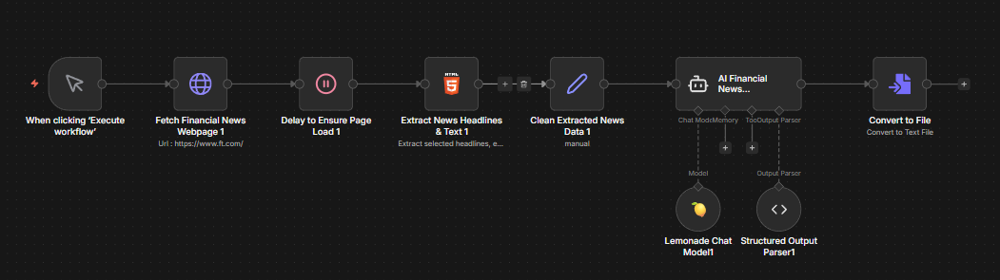

## Overview

n8n is a workflow automation platform that lets you connect apps and services using a visual node-based editor. Instead of writing code, you build workflows by dragging, connecting, and configuring nodes.

This playbook teaches you how to set up an AI-powered financial news summarizer that scrapes the Financial Times website, extracts key headlines, and uses a local LLM running on your Ryzen™ AI Halo to generate an investor-focused summary.

## What You'll Learn

- How to install and launch n8n
- Importing and configuring a pre-built workflow
- Connecting to Lemonade using the native n8n integration
- Understanding workflow nodes and data flow

## Why Lemonade?

[Lemonade](https://lemonade-server.ai) is a local LLM serving platform built for AMD hardware. It provides an OpenAI-compatible API that runs entirely on your machine—your data never leaves your device.

In this playbook, we use Lemonade to serve a local LLM that n8n connects to for AI-powered tasks. Unlike cloud-based LLM providers, Lemonade runs on your Ryzen™ AI Halo GPU, giving you full control over your models with zero API costs.

n8n includes a **native Lemonade node** (`Lemonade Chat Model`) that provides a first-class integration—no need to configure OpenAI-compatible endpoints manually. This makes connecting your local LLM to automation workflows straightforward.

## Prerequisites

<!-- @require:lemonade,nodejs -->

<!-- @test:id=lemonade-version timeout=60 hidden=True -->
```bash
lemonade-server --version
```
<!-- @test:end -->
<!-- @os:end -->

<!-- @os:windows -->
<!-- @test:id=lemonade-server-start timeout=900 hidden=True -->
```powershell
$p = Start-Process -FilePath "lemonade-server" -Argumentlist "serve --no-tray --host 127.0.0.1 --port 8000" -NoNewWindow -PassThru
try {
  $ok = $false
  for ($i=0; $i -lt 120; $i++) {
    $resp = curl.exe -s --max-time 2 http://127.0.0.1:8000/api/v1/models
    if ($LASTEXITCODE -eq 0 -and $resp) { $ok = $true; break }
    Start-Sleep -Seconds 1
  }
  if (-not $ok) { throw "Lemonade server not ready on http://127.0.0.1:8000" }
  Write-Host "OK: Lemonade server is responding"
} finally {
  & lemonade-server stop
  Start-Sleep -Seconds 2
  if ($p -and !$p.HasExited) { Stop-Process -Id $p.Id -Force -ErrorAction SilentlyContinue }
}
```
<!-- @test:end -->
<!-- @os:end -->

<!-- @test:id=node-npm-version timeout=60 hidden=True -->
```bash
node -v
npm -v
```
<!-- @test:end -->

## Installing n8n

Your STX Halo has Node.js pre-installed. Install n8n globally using npm:

<!-- @test:id=n8n-version timeout=60 hidden=True -->
```bash
n8n --version
```
<!-- @test:end -->

## Launching n8n

Start n8n from the terminal:

```bash
n8n start
```

<!-- @os:windows -->
<!-- @test:id=n8n-start timeout=300 hidden=True -->
```powershell
$N8N_CMD = "$env:APPDATA\npm\n8n.cmd"
$p = Start-Process -FilePath "cmd.exe" -ArgumentList "/c `"$N8N_CMD`" start" -NoNewWindow -PassThru
try {
  $ok = $false
  for ($i=0; $i -lt 120; $i++) {
    # Check HTTP status code only (body may be empty)
    $code = curl.exe -s -o NUL -w "%{http_code}" --max-time 2 http://127.0.0.1:5678/healthz
    if ($LASTEXITCODE -eq 0 -and $code -eq "200") { $ok = $true; break }
    Start-Sleep -Seconds 1
  }
  if (-not $ok) { throw "n8n not ready on http://127.0.0.1:5678/healthz" }
  Write-Host "OK: n8n server is responding"
} finally {
  # Kill the process actually listening on 5678
  $conn = Get-NetTCPConnection -LocalPort 5678 -State Listen -ErrorAction SilentlyContinue | Select-Object -First 1
  if ($conn) { Stop-Process -Id $conn.OwningProcess -Force -ErrorAction SilentlyContinue }
  # Also kill wrapper pid just in case
  if ($p -and -not $p.HasExited) { Stop-Process -Id $p.Id -Force -ErrorAction SilentlyContinue }
}
```
<!-- @test:end -->
<!-- @os:end -->

n8n starts a local web server. Open your browser to `http://localhost:5678` to access the editor.

> **Tip**: Keep the terminal window open while using n8n. Closing it will stop the server.

## Setting Up the Workflow

### Step 1: Sign Up or Log In to n8n

When you first open n8n, you'll be prompted to create an account or log in:

1. Open `http://localhost:5678` in your browser
2. Create a new account with your email, or log in if you already have one
3. Once logged in, you'll see the n8n dashboard

### Step 2: Import the Workflow

We've provided a pre-built workflow that you can import directly:

1. Download the workflow file: [financial-news-workflow.json](assets/financial-news-workflow.json)
2. If this is your first workflow, click **Start from Scratch** to open the workflow editor. Otherwise, click **Add workflow** in the top right.
3. Click the **...** menu (three dots) in the top bar and select **Import from file**
4. Select the downloaded `financial-news-workflow.json` file
5. The workflow will appear on the canvas

### Step 3: Understanding the Workflow

The imported workflow contains 7 connected nodes:

<p align="center">
  
</p>

| Node | Purpose |
|------|---------|
| **When clicking 'Execute workflow'** | Manual trigger to start the workflow |
| **Fetch Financial News Webpage** | HTTP GET request to `https://www.ft.com/` |
| **Delay to Ensure Page Load** | Wait node to ensure page content is fully loaded |
| **Extract News Headlines & Text** | HTML node that extracts headlines, editor's picks, top stories, and regional news using CSS selectors |
| **Clean Extracted News Data** | Set node that combines all extracted data into a single text field |
| **AI Financial News Summarizer** | AI Agent that processes the news with a financial analyst system prompt |
| **Lemonade Chat Model** | Connects to your local Lemonade server running the LLM |
| **Structured Output Parser** | Formats the AI output as structured JSON |
| **Convert to File** | Converts the summary to a downloadable file |

### Step 4: Configure Lemonade Credentials

Before running the workflow, you need to connect it to your local Lemonade server:

1. Double click the **Lemonade Chat Model** node
2. In the dropdown menu **Credential to connect with** select **Create New Credential**
3. Enter the following settings:

| Field | Value |
|-------|-------|
| **Base URL** | `http://localhost:8000/api/v1` |
| **API Key** | `lemonade` |

4. Click **Save**

> **Note**: Ensure Lemonade is running before testing. The workflow uses `gpt-oss-120b-mxfp4-GGUF` by default—you can change this in the Lemonade Chat Model node settings.

### Step 5: Test the Workflow

1. Ensure Lemonade is running with a model loaded
2. Click **Execute workflow** at the bottom center of the canvas
3. Watch each node execute from left to right—they turn green when complete
4. Click the **AI Financial News Summarizer** node to see the generated summary

## Understanding the AI Agent

The AI Financial News Summarizer uses a system prompt designed for financial analysis:

```
You are an AI financial analyst. Your role is to read, understand, and
summarize key financial news from today. The goal is to provide investors
with a clear and concise market overview to support better investment decisions.

Investor Outlook
Today's news points to [bullish/bearish/neutral] sentiment. Watch for
[economic event/earnings report] tomorrow, which could influence market direction.
```

The agent receives the cleaned news data and outputs a structured summary with market sentiment.

## Saving Your Workflow

Click the workflow name at the top and rename it if desired. Workflows auto-save as you work.

## Next Steps

- **Schedule automation**: Replace Manual Trigger with a **Schedule Trigger** to run daily
- **Send notifications**: Add a **Discord**, **Slack**, or **Email** node to receive summaries
- **Try different models**: Change the model in the Lemonade Chat Model node to experiment with different LLMs
- **Customize extraction**: Modify the HTML Extract node's CSS selectors to target different news sections
- **Try different backends**: n8n also supports [Ollama](https://n8n.io/workflows/?integrations=Ollama+Chat+Model), LM Studio, and other local LLM backends

### Explore n8n Templates

n8n has hundreds of pre-built workflow templates. Browse the official template library at:

**[https://n8n.io/workflows/](https://n8n.io/workflows/)**

Search for "AI", "LLM", or "automation" to find workflows you can import and customize.

For more information, check out the [n8n Documentation](https://docs.n8n.io/).
