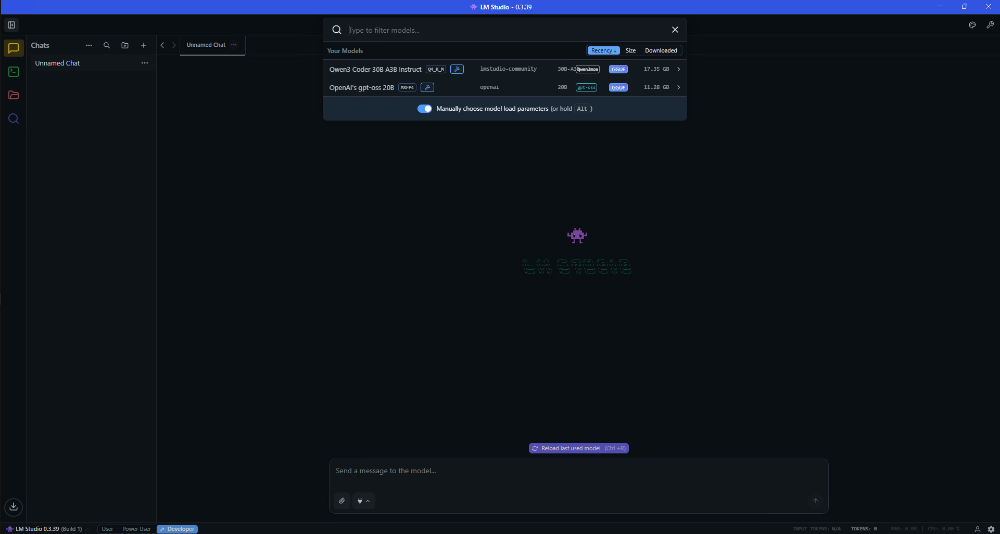

# Local LLM coding with GitHub Copilot and Qwen3-Coder-30B

## Overview

Coding agents are powerful tools that empower developers through collaboration with Large Language Models (LLMs). When embedded into Integrated Development Environments (IDEs), such as VSCode, coding agents can seamlessly integrate into a software engineer's workflow, enabling collaboration on complex tasks with unprecedented speed and efficiency. By automating routine tasks and providing intelligent assistance, coding agents free developers to focus on higher-level problem-solving, transforming how software is built.

This tutorial demonstrates how to use Cline, VSCode. and LMStudio to run a coding agent entirely on your local STX Halo™ machine, combining the productivity benefits of coding agents with the cost savings and privacy advantages of local compute. 

## What You'll Learn

* How to run VSCode with the Cline coding agent to aid in software engineering tasks.
* How to configure Cline to communicate with LM Studio for local inference of coding agents.
* How to use local coding agents to solve real-world software engineering tasks. 

## Launch and Configure LMStudio

In this tutorial, we are going to use LMStudio to serve the LLM behind the coding agent. Your STX Halo™ comes with LMStudio installed. In the search bar, search for `LM Studio` and launch the application. You will be greeted by the following page.

Next, we must load the LLM on the system. In this tutorial, we are going to use the `Qwen3-Coder-30B-A3B` model, a fantastic combination of quality and speed. To load the model, click on the search bar on the top of the LMStudio window, which will show the available models. You should see `Qwen3-Coder-30B-A3B`. To provide the quality necessary of coding agents, the context length will need to be increased from the default of `4096`. Click on the switch "Manually choose model load parameters" and then click on the Qwen3-Coder-30B-A3B model. 

This will bring up the model configuration, change the context length from `4096` to `32768` and hit `Enter` to load the model with the proper configuration.

Check to see if the Server is running. This can be done by going to the Developer tab in LM Studio on the left and to see the Status of "Running". If it is not running, flip the switch icon to see that it is running. 

## Launch and Configure VSCode

Your STX Halo™ comes with VSCode installed with the Cline extension. In the search bar, search for `VS Code` and launch the application.

The left panel will contain the Cline icon. Click on that icon to go into the Cline VSCode extension. The first step to run with Cline is to create an account.

Next, we need to configure Cline to communciate with the LM Studio server that we setup. Click on the Cline settings and set the API Provider to `LM Studio` and the model to `Qwen3-Coder-30B-A3B-GGUF`. 

## Creating your first project

Now that we are done with setup, lets use our local agent to create a website! To do this, have VS Code open an empty directory that will contain the source code generated by the agent, To do this, go to `File->Open Folder` on the top-left of VS Code.

Now we are ready to prompt the local coding agent. Click on the Cline extension on the left column and enter a prompt to kickoff the agent. As an example, we are using the prompt: `Create a website showcasing the ability to run local large-language models on the AMD Strix Halo device.` and hit `Enter`. 

The agent will then start to create files according to the prompt. As a user, you can watch the code be generated in VS Code as shown below:  

After generating the software, the agent is complete and you can run the application. In this case, because we prompted the agent to generate a website, the agent wrote to three files: `index.html`, `script.js`, and `styles.css`. By simply double clicking on the HTML file we could load and interact with the generated website.

## Next Steps

* **Retro Arcade Games:** Try some other prompts. It can also be fun for the agent to create retro-style games in Python using the `PyGame` package. This is an image of a simple pong game created with the following prompt: `Create a simple pong game using the PyGame python package.`

* **Data Analysis:** One area where coding agents are particularly useful is that of scripting and data analysis. This is a prompt to showcase the local models ability to generate data analysis software for stock price visualization: `Write a Python script that fetches daily price data for AMD (ticker: AMD) from an online API (use the yfinance library so no API key is needed). Loads the last 365 calendar days of data into a Pandas DataFrame. Computes 20-day and 50-day simple moving averages of the closing price. Store the data in a sqllite database and when the script is first run check to see if the sql lite database contains the requested data, if not, fetch it from the API. Plots a single matplotlib line chart with: Close, SMA-20, and SMA-50. Include a title, axis labels, and a legend. Saves the figure to amd_price_sma.png in the current directory and prints the path when done. Allow the user to pass in command line arguments for the total time period of data, the time period for the simple moving average to calculate, as well as to provide different tickers.`