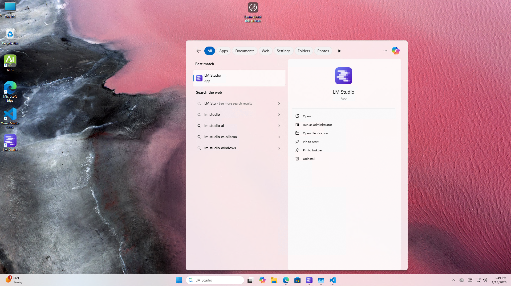
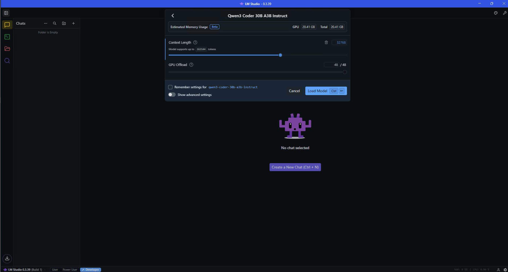
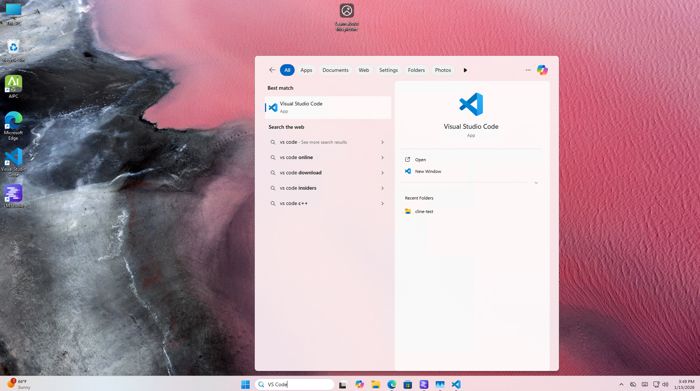
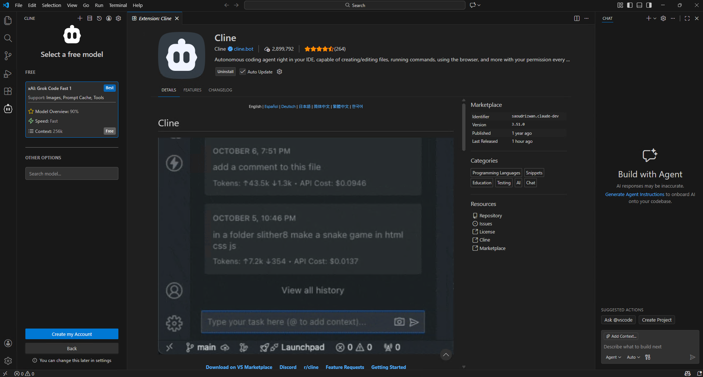
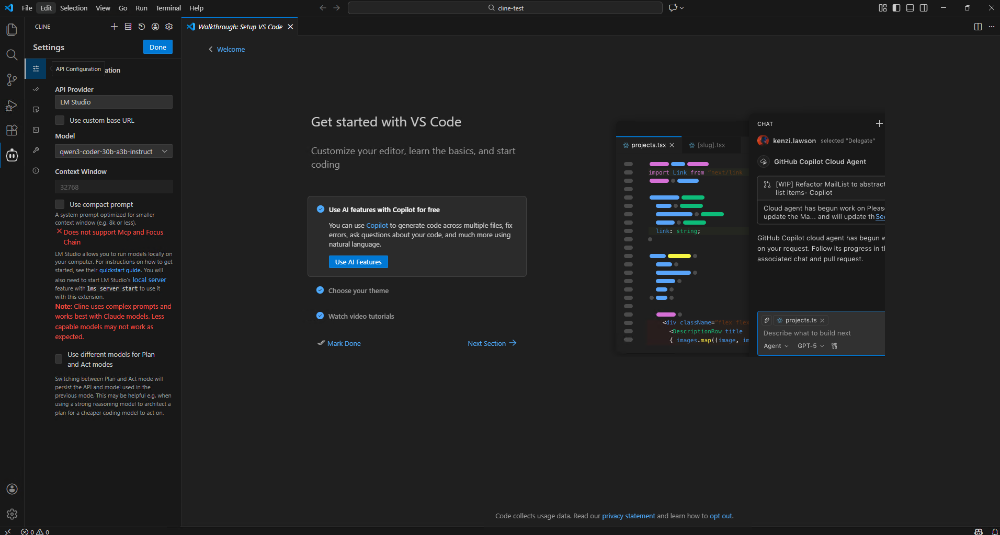

# Local LLM coding with GitHub Copilot and Qwen3-Coder-30B

## Overview

Coding agents are powerful tools that accelerate software development. When integrated into Integrated Development Environments (IDEs), such as through the Cline VSCode extension, these agents seamlessly integrate into a software engineer's workflow, enabling collaboration on complex tasks with unprecedented speed and efficiency. By automating routine tasks and providing intelligent assistance, coding agents free developers to focus on higher-level problem-solving, transforming how software is built.

This tutorial demonstrates how to use the Cline VSCode extension with LMStudio to run a coding agent entirely on your local machine, combining the productivity benefits of coding agents with the cost savings and privacy advantages of local compute. 

## What You'll Learn

* How to run VSCode with the Cline coding agent to aid in software engineering tasks.
* How to configure Cline to communicate with LM Studio for local inference of coding agents. 

## Launch and Configure LMStudio

In this tutorial, we are going to use LMStudio to serve the LLM. Your STX Halo™ comes with LMStudio installed. In the search bar, search for `LM Studio` and click the icon as shown below:

Now, we must load the LLM behind the coding agent. In this tutorial, we are going to use the Qwen3-Coder-30B-A3B model, a fantastic combination of quality and speed. to load the model, click on the search bar on top. You should see Qwen3-Coder-30B-A3B as shown below.

To provide the quality necessary of coding agents, the context length will need to be increased from the default. Click on the switch "Manually choose model load parameters" and then click on the Qwen3-Coder-30B-A3B model. This will bring up the model configuration, change the context length from 4096 to 32768 and hit `Enter` to load the model with the proper configuration.

Check to see if the Server is running. This can be done by going to the Developer tab in LM Studio on the left and to see the Status of "Running". If it is not running, flip the switch icon to see that it is running. 

## Launch and Configure VSCode

Your STX Halo™ comes with VSCode installed with the Cline extension. In the search bar, search for `VS Code` and click the icon as shown below:

Go to the Cline VSCode extension as shown below and create an account / sign into Cline:

Click on the Cline settings and set the API Provider to LM Studio and the model to Qwen3-Coder-30B-A3B-GGUF. 

## Creating your first project

The first step is to use VS Code to go to an empty directory . To do this, hit File->Open Folder, and go to a folder. This is what it should look like afterwards when opening an empty folder called `cline-test`:

Now you are ready to prompt the coding agent to generate some software. Click on the Cline extension on the left column and enter a prompt. We are using the prompt: "Create a website showcasing the ability to run local large-language models on the AMD Strix Halo device."

Now, the agent will start creating files as shown below:

Afterwards, you can run the application. In this case, the agent created three files: `index.html`, `script.js`, and `styles.css`. By simply double clicking on the HTML file we could load and interact with the generated website.

## Next Steps

TODO