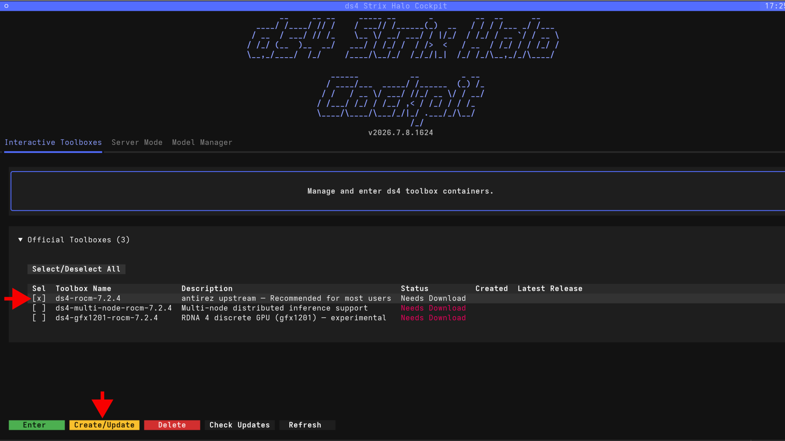
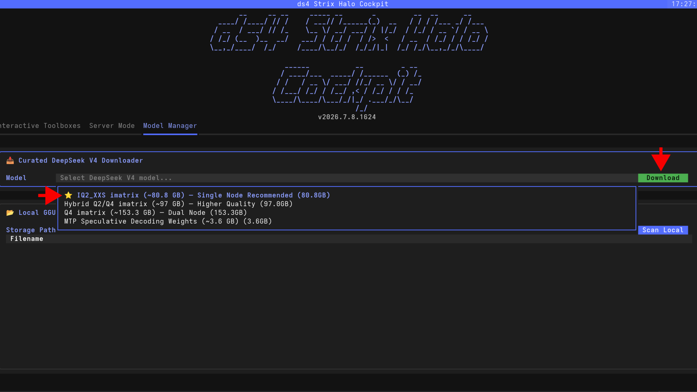
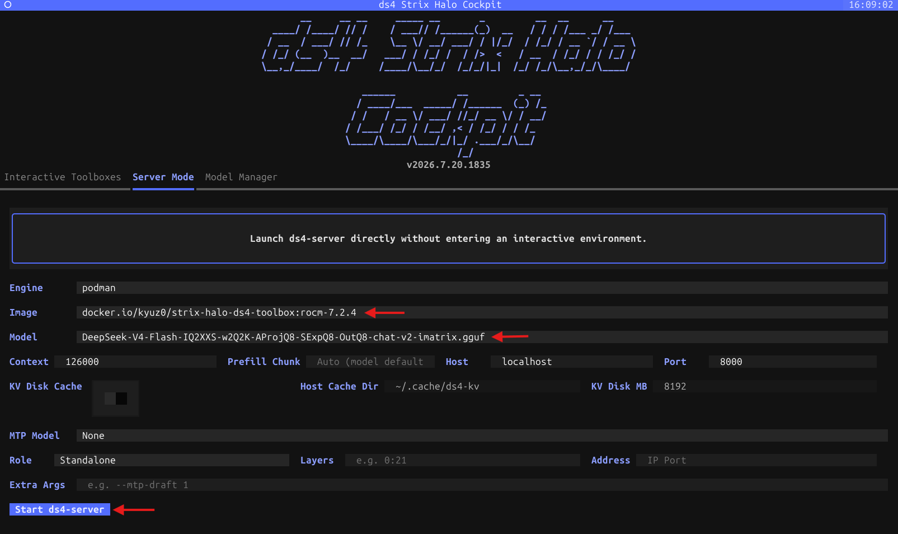

<!--
Copyright Advanced Micro Devices, Inc.

SPDX-License-Identifier: MIT
-->

<!-- @github-only -->
> [!IMPORTANT]
> This playbook uses special tags that GitHub cannot render. Please visit [amd.com/playbooks](https://amd.com/playbooks) to correctly preview this content.
<!-- @github-only:end -->

## Overview

[DeepSeek V4 Flash](https://huggingface.co/deepseek-ai/DeepSeek-V4-Flash) is the efficiency-focused variant of the DeepSeek V4 family — a 284 billion parameter Mixture of Experts model with 13 billion active parameters. According to [DeepSeek's technical report](https://huggingface.co/deepseek-ai/DeepSeek-V4-Flash), it scores 79% on SWE-bench Verified and 91.6% on LiveCodeBench.

[ds4 (Dwarf Star 4)](https://github.com/antirez/ds4) is a dedicated inference engine built specifically for this model architecture. Rather than a general-purpose runtime, ds4 targets the DeepSeek V4 family directly with architecture-specific kernel optimizations for AMD ROCm™ software. It is currently one of the best-performing implementations of DeepSeek V4 Flash on Strix Halo.

This tutorial shows how to use `ds4-cockpit`, a terminal UI, to set up ds4, download model weights, and start serving DeepSeek V4 Flash locally on the AMD Ryzen™ AI Halo Developer Platform.

## What You'll Learn

- How to install and launch the `ds4-cockpit` terminal UI
- How to create the ds4 ROCm toolbox container
- Downloading the recommended quantization for a single Halo node
- Starting the ds4 inference server and exposing an OpenAI-compatible endpoint
- Connecting a Web UI or coding agent to the local server

## Setting the Memory Configuration

<!-- @require:memory-config -->

## Installing Software Prerequisites

> **System requirements for this configuration (single-node IQ2_XXS at 126k context):**
> - A Strix Halo system with **at least 128 GB of unified memory**.
> - **BIOS dedicated VRAM (UMA frame buffer) set to the minimum**, so the shared memory pool can be as large as possible.
> - The GPU **shared-memory pool set to at least 110 GB**: run `amd-ttm --set 110` (see the memory configuration step above) and reboot. Lower values can fail with out-of-memory when the model loads at a 126k context. If your system has less memory available, lower the **Context** value in Server Mode instead.
>
> **Note:** Try setting the **GPU shared-memory pool** to **110 GB** as a starting point. If you hit out-of-memory errors, raise the shared-memory pool or lower the context size.

ds4-cockpit uses container toolboxes to run the ds4 engine. Install `podman-docker`, `distrobox`, and `pipx`:

```bash
sudo apt update
sudo apt install -y podman-docker distrobox pipx
```

<!-- @test:id=ds4-prereqs-linux timeout=60 hidden=True -->
```bash
set -euo pipefail
export PATH="$HOME/.local/bin:/usr/local/sbin:/usr/local/bin:/usr/sbin:/usr/bin:/sbin:/bin:$PATH"
docker --version
distrobox version 2>/dev/null || distrobox --version
pipx --version
echo "OK: docker, distrobox, and pipx are installed"
```
<!-- @test:end -->

## Available Quantizations

The ds4 author provides several quantized versions of DeepSeek V4 Flash in GGUF format. All models below use importance matrix (imatrix) calibration, which preserves higher precision for the parts of the model that matter most for coding and reasoning tasks.

| Quantization | Size | Description |
|-------------|------|-------------|
| [IQ2_XXS imatrix](https://huggingface.co/antirez/deepseek-v4-gguf) | ~80.8 GB | Recommended for a single 128 GB node |
| [Hybrid Q2/Q4 imatrix](https://huggingface.co/antirez/deepseek-v4-gguf) | ~97 GB | Keeps layers 37–42 at Q4 precision for better accuracy. Fits in 128 GB but leaves less room for context |
| [Q4 imatrix](https://huggingface.co/antirez/deepseek-v4-gguf) | ~153 GB | Higher quality. Requires two Halo nodes via multi-node clustering |
| [MTP Speculative Decoding](https://huggingface.co/antirez/deepseek-v4-gguf) | ~3.6 GB | Optional add-on for speculative decoding to improve generation speed |

The **IQ2_XXS imatrix** model is a good starting point. It fits comfortably on a single node and leaves enough memory for a reasonable context window.

## Installing ds4-cockpit

[ds4-cockpit](https://github.com/kyuz0/strix-halo-ds4-toolbox) is a light terminal UI to make getting up and running with ds4 on Strix Halo easy. It handles creating toolbox containers, downloading model weights, and starting servers. Install it with `pipx`:

```bash
pipx install "git+https://github.com/kyuz0/strix-halo-ds4-toolbox.git#subdirectory=ds4-strix-halo-cockpit"
```

Launch the cockpit:
```bash
ds4-cockpit
```

<!-- @test:id=ds4-cockpit-linux timeout=60 hidden=True -->
```bash
set -euo pipefail
export PATH="$HOME/.local/bin:/usr/local/sbin:/usr/local/bin:/usr/sbin:/usr/bin:/sbin:/bin:$PATH"
# Verify the pipx-installed cockpit entry point is on PATH (do NOT launch the TUI).
command -v ds4-cockpit
echo "OK: ds4-cockpit is installed and on PATH"
```
<!-- @test:end -->

## Creating the Toolbox

In the **Interactive Toolboxes** tab, select the latest available/stable toolbox (e.g. `ds4-rocm-7.2.4`) and click **Create/Update**. This pulls the container image and creates the toolbox environment.


<p align="center">
  
</p>

<!-- @test:id=ds4-toolbox-image-linux timeout=120 hidden=True -->
```bash
set -euo pipefail
export PATH="$HOME/.local/bin:/usr/local/sbin:/usr/local/bin:/usr/sbin:/usr/bin:/sbin:/bin:$PATH"

# The toolbox version changes over time, so match the image family, not a fixed tag.
if ! docker images --format '{{.Repository}}:{{.Tag}}' | grep -i 'strix-halo-ds4-toolbox'; then
  echo "No strix-halo-ds4-toolbox image found. Create the toolbox in ds4-cockpit (Interactive Toolboxes tab) first."
  exit 1
fi
echo "OK: ds4 toolbox container image is present"
```
<!-- @test:end -->

## Downloading the Model

Go to the **Model Manager** tab. Select **IQ2_XXS imatrix (~80.8 GB)** from the dropdown and click **Download**. The model files will be saved to `~/ds4` by default (you can change the storage path).

> **Note:** The IQ2_XXS model is roughly 80 GB, so the download can take a while depending on your connection. You can continue once it finishes.

<p align="center">
  
</p>

<!-- @test:id=ds4-model-downloaded-linux timeout=60 hidden=True -->
```bash
set -euo pipefail

# ds4-cockpit saves model weights to ~/ds4 by default
model_dir="$HOME/ds4"

if [ ! -d "$model_dir" ]; then
  echo "Model directory $model_dir does not exist. Download the model in ds4-cockpit (Model Manager tab) first."
  exit 1
fi

if ! find "$model_dir" -maxdepth 2 -iname '*.gguf' | grep -q .; then
  echo "No .gguf model files found under $model_dir. Download the IQ2_XXS imatrix model in ds4-cockpit first."
  exit 1
fi

# Prefer to confirm the recommended IQ2_XXS imatrix quantization is present.
if find "$model_dir" -maxdepth 2 -iname '*IQ2*imatrix*.gguf' | grep -q .; then
  echo "OK: IQ2_XXS imatrix model is downloaded"
else
  echo "OK: a GGUF model is present (recommended IQ2_XXS imatrix file not detected by name)"
fi
```
<!-- @test:end -->

## Starting the Server

Go to the **Server Mode** tab. Select the downloaded model and the toolbox, then configure the context size, host, and port. When ready, click **Start ds4-server**.

> **Tip** A context size of `126000` is a reasonable starting value that should fit on a single node — you can set it higher if you have memory to spare, or lower it if you run into out-of-memory errors. The port (`8000` in this guide) is arbitrary; pick any free port.

> **KV Disk Cache (optional).** Turning on **KV Disk Cache** offloads the KV cache to disk (at **Host Cache Dir**, default `~/.cache/ds4-kv`) so repeated system prompts are restored from SSD instead of being recomputed. It's a performance optimization for coding-agent workflows with long, repeated prompts, and is **not required** to run the server.

<p align="center">
  
</p>

The server will start and listen on port 8000, exposing an OpenAI-compatible API endpoint at `http://localhost:8000/v1`.

**Quick test:**
```bash
curl http://127.0.0.1:8000/v1/chat/completions \
  -H 'Content-Type: application/json' \
  -d '{
    "model": "deepseek-v4-flash",
    "messages": [{"role": "user", "content": "Hello!"}],
    "stream": false
  }'
```

<!-- @test:id=ds4-server-chat-linux timeout=1200 hidden=True -->
```bash
set -euo pipefail

# This runner is shared with other playbooks, and ds4 at a 126k context consumes almost the entire GPU memory pool.
# So rather than keeping ds4 resident, CI starts the server, verifies a chat completion, then stops it again.
# This frees the memory for the next job.
# ds4 has no separate "unload"; stopping the server process is what releases the ~80 GB model.

CONTAINER="ds4-ci-server"
MODEL_DIR="$HOME/ds4"

# Locate the downloaded model (prefer the recommended IQ2_XXS imatrix file).
model_file="$(find "$MODEL_DIR" -maxdepth 2 -iname '*IQ2*imatrix*.gguf' 2>/dev/null | head -1)"
if [ -z "$model_file" ]; then
  model_file="$(find "$MODEL_DIR" -maxdepth 2 -iname '*.gguf' 2>/dev/null | head -1)"
fi
if [ -z "$model_file" ]; then
  echo "No .gguf model found under $MODEL_DIR. Download it in ds4-cockpit first."
  exit 1
fi
model_name="$(basename "$model_file")"

# Pick the toolbox image (version-agnostic).
image="$(docker images --format '{{.Repository}}:{{.Tag}}' | grep -i 'strix-halo-ds4-toolbox' | head -1)"
if [ -z "$image" ]; then
  echo "No strix-halo-ds4-toolbox image found. Create the toolbox in ds4-cockpit first."
  exit 1
fi

# Always stop/remove the server on exit so it never holds GPU memory afterwards.
cleanup() {
  docker stop -t 10 "$CONTAINER" >/dev/null 2>&1 || true
  docker rm -f "$CONTAINER" >/dev/null 2>&1 || true
}
trap cleanup EXIT

# Remove any stale instance, then start ds4-server detached (same flags ds4-cockpit uses, with -d instead of -it).
docker rm -f "$CONTAINER" >/dev/null 2>&1 || true
docker run -d --name "$CONTAINER" \
  --device /dev/dri --device /dev/kfd \
  --group-add keep-groups \
  --security-opt seccomp=unconfined \
  --ipc=host \
  --cap-add=SYS_PTRACE \
  --security-opt label=disable \
  --userns=keep-id \
  -p 127.0.0.1:8000:8000 \
  -v "$MODEL_DIR":/models:ro \
  "$image" \
  ds4-server -m "/models/$model_name" --ctx 126000 --host 0.0.0.0 --port 8000

# Wait for readiness; the ~80 GB model can take a few minutes to load.
up=false
for i in $(seq 1 240); do
  code="$(curl -s -o /dev/null -w '%{http_code}' --max-time 3 http://127.0.0.1:8000/v1/models || true)"
  if [ -n "$code" ] && [ "$code" != "000" ]; then
    up=true
    break
  fi
  if ! docker inspect -f '{{.State.Running}}' "$CONTAINER" 2>/dev/null | grep -q true; then
    echo "ds4-server container exited during startup:"
    docker logs "$CONTAINER" 2>&1 | tail -40 || true
    exit 1
  fi
  sleep 2
done

if [ "$up" != "true" ]; then
  echo "ds4 server did not become ready on http://127.0.0.1:8000"
  docker logs "$CONTAINER" 2>&1 | tail -40 || true
  exit 1
fi
echo "OK: ds4 server is responding on :8000"

body='{
  "model": "deepseek-v4-flash",
  "messages": [{"role": "user", "content": "Reply with exactly: OK"}],
  "temperature": 0,
  "max_tokens": 32,
  "stream": false
}'

out="$(curl -sS --fail-with-body --max-time 300 http://127.0.0.1:8000/v1/chat/completions \
  -H 'Content-Type: application/json' \
  -d "$body")"

if [ -z "$out" ]; then
  echo "Empty response from ds4 /v1/chat/completions"
  exit 1
fi

export DS4_OUT="$out"
python3 - <<'PY'
import json, os, sys

data = json.loads(os.environ["DS4_OUT"])
choices = data.get("choices")
if not choices:
    print("Response has no 'choices':")
    print(json.dumps(data, indent=2)[:2000])
    sys.exit(1)

message = choices[0].get("message", {}) or {}
content = message.get("content") or message.get("reasoning_content")
if not content:
    print("Response choice has empty content:")
    print(json.dumps(data, indent=2)[:2000])
    sys.exit(1)

print("OK: ds4 chat/completions returned content")
PY

echo "OK: ds4 server test complete; server stopped and GPU memory released"
```
<!-- @test:end -->

## Connecting a Web UI

You can connect any chat interface that supports the OpenAI API format. For example, to use HuggingFace ChatUI:

```bash
docker run -p 3000:3000 \
  --add-host=host.docker.internal:host-gateway \
  -e OPENAI_BASE_URL=http://host.docker.internal:8000/v1 \
  -e OPENAI_API_KEY=dummy \
  -v chat-ui-data:/data \
  ghcr.io/huggingface/chat-ui-db
```

Open `http://localhost:3000` in your browser to start chatting.

## Connecting a Coding Agent

The ds4 server exposes both OpenAI and Anthropic-compatible endpoints, so most coding agents can connect to it directly. For example, to add it to the `pi` coding agent, add the following block to `~/.pi/agent/models.json`:

```json
"ds4": {
  "name": "ds4.c local",
  "baseUrl": "http://localhost:8000/v1",
  "api": "openai-completions",
  "apiKey": "dsv4-local",
  "compat": {
    "supportsStore": false,
    "supportsDeveloperRole": false,
    "supportsReasoningEffort": true,
    "supportsUsageInStreaming": true,
    "maxTokensField": "max_tokens",
    "supportsStrictMode": false,
    "thinkingFormat": "deepseek",
    "requiresReasoningContentOnAssistantMessages": true
  },
  "models": [
    {
      "id": "deepseek-v4-flash",
      "name": "DeepSeek V4 Flash (ds4.c local)",
      "reasoning": true,
      "thinkingLevelMap": {
        "off": null,
        "minimal": "low",
        "low": "low",
        "medium": "medium",
        "high": "high",
        "xhigh": "xhigh"
      },
      "input": ["text"],
      "contextWindow": 131072,
      "maxTokens": 65536,
      "cost": { "input": 0, "output": 0, "cacheRead": 0, "cacheWrite": 0 }
    }
  ]
}
```

> **Tip**: If your coding agent or Web UI is running on a different machine than the Halo platform, you will need to forward port 8000 via SSH:
> ```bash
> ssh -L 0.0.0.0:8000:localhost:8000 <halo-host-ip>
> ```

## Next Steps

- **Multi-node clustering**: If you have two Halo devices, ds4 supports distributing the Q4 model (~153 GB) across both machines via pipeline parallelism. See the [ds4-toolbox documentation](https://github.com/kyuz0/strix-halo-ds4-toolbox#distributed-inference-pipeline-parallelism) for setup instructions.
- **Speculative decoding (MTP)**: Download the MTP weights (~3.6 GB) and pass `--mtp` to the server for faster generation speed.
- **KV cache disk offloading**: For coding agent workflows, enable `--kv-disk-dir` so that repeated system prompts are restored from SSD instead of being recomputed each time.

For more information, see the [ds4 repository](https://github.com/antirez/ds4) and the [ds4-cockpit toolbox](https://github.com/kyuz0/strix-halo-ds4-toolbox).
