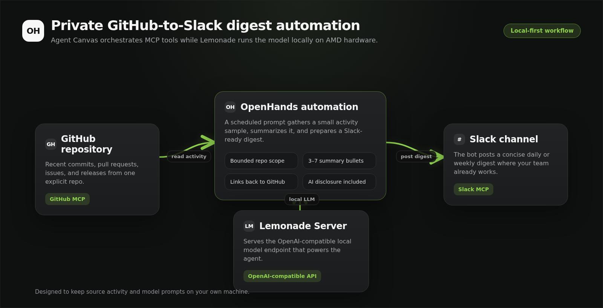
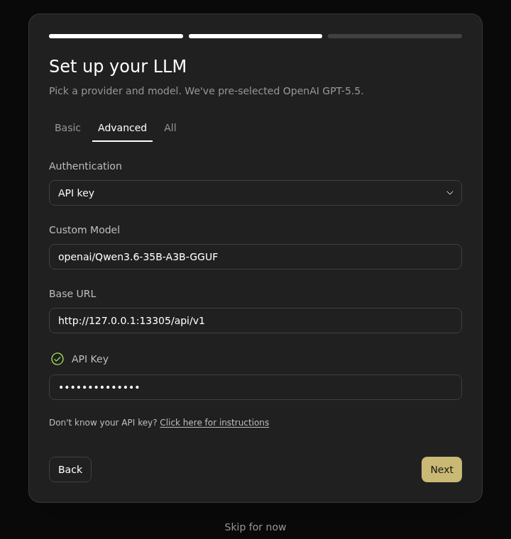
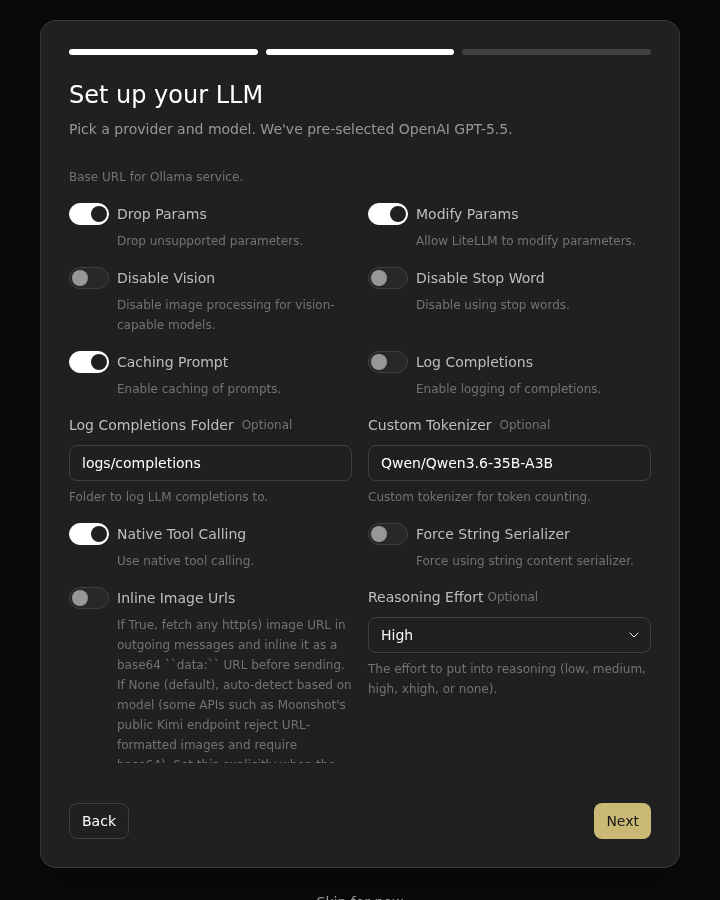
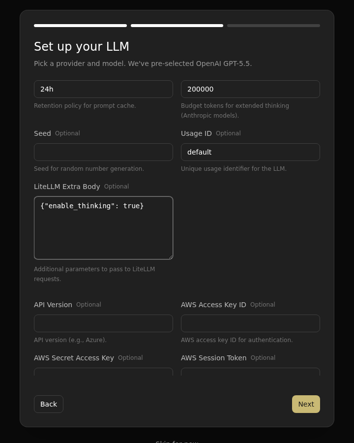
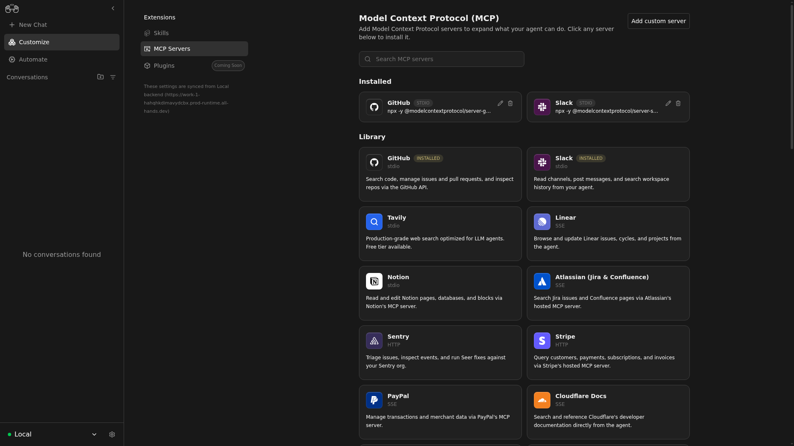
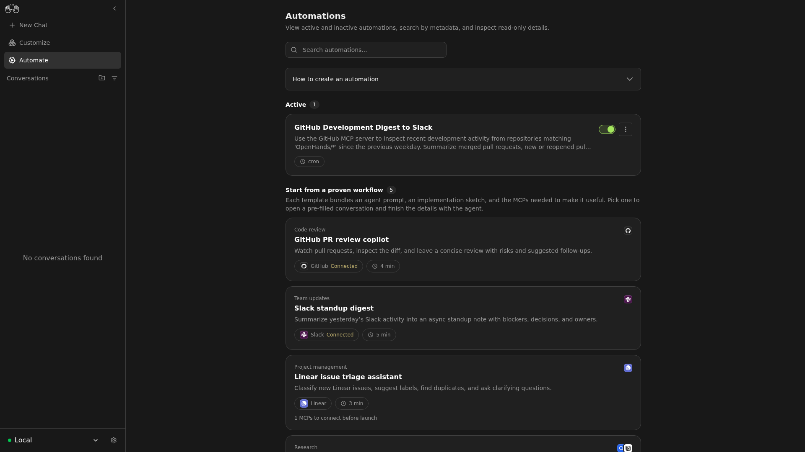
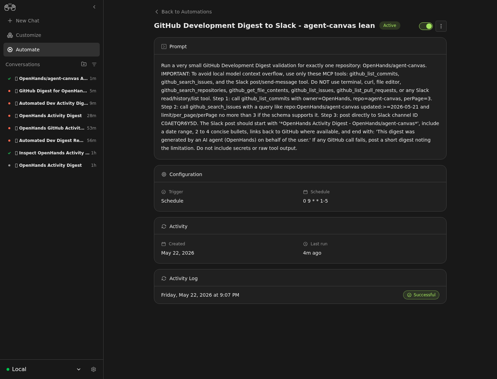
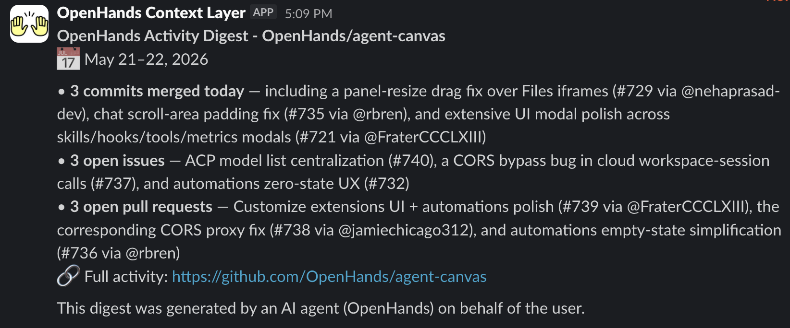

<!--
Copyright Advanced Micro Devices, Inc.

SPDX-License-Identifier: MIT
-->

<!-- @github-only -->
> [!IMPORTANT]
> This playbook uses AMD Playbooks comment tags that are interpreted by the
> AMD Playbooks site. GitHub renders the Markdown content, but not the device,
> OS, variable, or hidden-test directives.
<!-- @github-only:end -->

## Overview

Developers spend a lot of time on small recurring loops: reviewing labeled
pull requests, answering GitHub comments, triaging new issues, turning Slack
threads into standup notes or incident follow-ups, and tracking release or
research signals. Each loop is familiar, but it still requires judgment:
gather the right context, decide what matters, and post a clear update where
the team already works.

[OpenHands automations](https://docs.openhands.dev/openhands/usage/automations/overview)
turn those loops into scheduled or event-triggered agent conversations: runs
where an AI software agent can read context, call tools, and produce an update.
The shared automation templates in the OpenHands extensions catalog follow
this pattern for GitHub pull request review, repository monitoring, Linear
issue triage, incident retrospectives, Slack standup digests, and research
briefs: an automation wakes up, uses configured integrations such as GitHub or
Slack to fetch context, reasons over that context with a large language model
(LLM), and writes back a result.

[Agent Canvas](https://github.com/OpenHands/agent-canvas) is the local control
plane for building and testing those automations. In this playbook it runs an
OpenHands Agent Server, the backend process that executes agent conversations,
and connects the agent to external services such as GitHub and Slack.

To keep the workflow on your AMD system, the agent talks to a local model
served by Lemonade Server. Lemonade exposes that model through an
OpenAI-compatible API, so Agent Canvas can configure it like a remote
OpenAI-style endpoint while the model, prompt, and workflow context stay local.

In this playbook, you will build one concrete automation: a scheduled
GitHub-to-Slack development digest. It uses GitHub to inspect recent repository
activity, Slack to post the digest, Agent Canvas API calls to configure and
test the automation, and Lemonade to run the LLM locally.



## What You'll Learn

- How to start Lemonade Server and verify a local model answers chat requests
- How to launch Agent Canvas and point its Agent Server at a local LLM
- How to install GitHub and Slack Model Context Protocol (MCP) servers through
  the Agent Server API
- How to create and dispatch a scheduled OpenHands automation that posts a
  development digest to Slack
- How to troubleshoot the most common local-model and automation failures

## Core Concepts

| Concept | What it is | Where it fits in this playbook |
| --- | --- | --- |
| Lemonade Server | A local LLM serving platform built for AMD hardware that exposes an OpenAI-compatible API. Your data never leaves your machine. | Runs the model that powers the agent. |
| OpenHands Agent Server | The backend process that executes OpenHands agent conversations. | Hosts the agent, its LLM profile, and its MCP servers. |
| Agent Canvas | The local control plane for OpenHands that runs Agent Server and a UI for inspecting agent runs. | Launches the backends and provides the API you call. |
| MCP server | A Model Context Protocol server that gives an agent tools for an external service such as GitHub or Slack. | Lets the agent read GitHub and write to Slack. |
| OpenHands automation | A scheduled or event-triggered agent conversation that fetches context, reasons over it, and writes a result somewhere. | The GitHub-to-Slack digest you build here. |

<!-- @device:stx,krk -->
> [!NOTE]
> Coding-agent workflows benefit from a larger model and context window. Use at
> least 32 GB of system memory, and prefer 64 GB or more for larger GGUF models.
<!-- @device:end -->

## Prerequisites

<!-- @require:lemonade,nodejs -->

You need:

- Lemonade Server installed by following the standard
  [Lemonade installation guide](https://lemonade-server.ai/docs/guide/install/).
- Node.js 22.12 or later and `npm`, used to install the published Agent Canvas
  CLI and run MCP servers with `npx`.
- A recent published `@openhands/agent-canvas` package with
  schema-driven agent settings, `LLMSummarizingCondenserSettings.max_tokens`,
  and LLM `custom_tokenizer` support.
- The Python `transformers` package available in the Agent Server environment.
  It is required for chat-template token counting when `custom_tokenizer` is
  set.
- A GitHub token with read access to the repository you want summarized.
- A Slack bot token (`xoxb-...`) with `chat:write` and channel read access.
- A Slack team ID (`T...`).
- A Slack channel ID (`C...`) where the digest should be posted.

Invite the Slack app to the target channel before testing the automation.

## Variables Used in This Playbook

<!-- @device:halo,halo_box,stx,krk -->
<!-- @var:id=lemonade_model value="Qwen3.6-35B-A3B-GGUF" -->
<!-- @device:end -->

```bash
export LEMONADE_BASE_URL="http://127.0.0.1:13305/api/v1"
export LEMONADE_MODEL="Qwen3.6-35B-A3B-GGUF"
export OPENHANDS_LLM_MODEL="openai/${LEMONADE_MODEL}"
export QWEN_CUSTOM_TOKENIZER="Qwen/Qwen3.6-35B-A3B"
export CONDENSER_MAX_TOKENS="56000"
```

The following values are entered into the Agent Canvas UI in later steps. Set
them here so you can copy them in:

```bash
export GITHUB_REPO_FILTER="your-org/your-repo"
export SLACK_DIGEST_CHANNEL="C0123456789"
export DIGEST_TIMEZONE="America/New_York"
```

Use an explicit `owner/repo` value for `GITHUB_REPO_FILTER`. Broad organization
wildcards can return too much MCP context for local models.

<!-- @test:id=lemonade-version timeout=60 hidden=True -->
```bash
lemonade --version
```
<!-- @test:end -->

## 1. Start Lemonade Server

Start the model from the Lemonade CLI:

```bash
lemonade config set llamacpp.backend=vulkan
lemonade config set ctx_size=65536
lemonade run "${LEMONADE_MODEL}"
```

Lemonade exposes an OpenAI-compatible API at:

```text
http://127.0.0.1:13305/api/v1
```

Optional: if Agent Canvas or the automation runner is not on the same machine,
publish the Lemonade endpoint through a secure tunnel and use the HTTPS URL as
the LLM base URL:

```bash
ngrok http 13305 --url YOUR_NGROK_DOMAIN.ngrok-free.dev
```


## 2. Verify the Local Model

Confirm Lemonade can serve the selected model:

```bash
curl -s "${LEMONADE_BASE_URL}/models" | python3 -m json.tool
```

Then send a small chat request:

```bash
curl -sS "${LEMONADE_BASE_URL}/chat/completions" \
  -H "Content-Type: application/json" \
  -d '{
    "model": "'"${LEMONADE_MODEL}"'",
    "messages": [
      {"role": "user", "content": "Reply with exactly: OK"}
    ],
    "temperature": 0,
    "max_tokens": 64
  }' | python3 -m json.tool
```

If this returns a `choices` array, Lemonade is ready for Agent Canvas.

<!-- @test:id=lemonade-chat-linux timeout=1200 hidden=True -->
```bash
set -euo pipefail

models_json=""
for i in $(seq 1 120); do
  models_json="$(curl -s --max-time 2 http://127.0.0.1:13305/api/v1/models || true)"
  if [ -n "$models_json" ]; then
    break
  fi
  sleep 1
done

if [ -z "$models_json" ]; then
  echo "Lemonade server not ready on http://127.0.0.1:13305"
  exit 1
fi
echo "OK: Lemonade server is responding"

export MODELS_JSON="$models_json"
python3 - <<'PY'
import json
import os
import sys

data = json.loads(os.environ["MODELS_JSON"])
entry = None
for item in data.get("data", []):
    if item.get("id") == "${lemonade_model}":
        entry = item
        break

if entry is None:
    print("Model ${lemonade_model} is not present in Lemonade /api/v1/models.")
    sys.exit(1)

if not entry.get("downloaded", False):
    print("Model ${lemonade_model} is present but not downloaded in Lemonade. Please download it.")
    sys.exit(1)

print("OK: ${lemonade_model} model is downloaded in Lemonade")
PY

body='{
  "model": "${lemonade_model}",
  "messages": [{"role": "user", "content": "Reply with exactly: OK"}],
  "temperature": 0,
  "max_tokens": 64
}'

out="$(curl -sS --fail-with-body --max-time 300 http://127.0.0.1:13305/api/v1/chat/completions \
  -H "Content-Type: application/json" \
  -d "$body" || true)"

if [ -z "$out" ]; then
  echo "Empty response from Lemonade chat/completions"
  exit 1
fi
```
<!-- @test:end -->

<!-- @test:id=node-npm-version timeout=60 hidden=True -->
```bash
node -v
npm -v
```
<!-- @test:end -->

## 3. Start Agent Canvas

Install the published Agent Canvas package and start the full stack:

```bash
npm install -g @openhands/agent-canvas
agent-canvas
```

If the global npm install fails with a permissions error, see the npm
permissions troubleshooting entry below.

By default, Agent Canvas starts on `http://localhost:8000`. Open that URL in
your browser. The default local backend should show as healthy on the home
screen.

The `agent-canvas` command starts the agent server, the automation backend, and
the web frontend together. You only need this one command to run OpenHands
locally. The rest of this playbook configures everything through the Agent
Canvas UI in your browser.

<!-- @test:id=uv-version timeout=60 hidden=True -->
```bash
export PATH="$HOME/.npm-global/bin:$HOME/.local/bin:$PATH"
uv --version
```
<!-- @test:end -->

<!-- @test:id=agent-canvas-version timeout=60 hidden=True -->
```bash
set -euo pipefail
export PATH="$HOME/.npm-global/bin:$HOME/.local/bin:$PATH"
# Prefer --version; fall back to --help if this build has no --version flag.
agent-canvas --version || agent-canvas --help
echo "OK: agent-canvas CLI is on PATH"
```
<!-- @test:end -->

<!-- @test:id=agent-canvas-start timeout=1200 hidden=True -->
```bash
set -euo pipefail

export PATH="$HOME/.npm-global/bin:$HOME/.local/bin:$PATH"
log="/tmp/agent-canvas-test.log"
p=""
cleanup() {
  set +e
  for port in 8000 18000 18001 3001; do
    pid="$(ss -ltnp 2>/dev/null | grep ":$port " | grep -oE 'pid=[0-9]+' | head -1 | cut -d= -f2)"
    [ -n "$pid" ] && kill "$pid" 2>/dev/null
  done
  if [ -n "${p:-}" ] && kill -0 "$p" 2>/dev/null; then
    kill "$p" 2>/dev/null
    sleep 2
    kill -9 "$p" 2>/dev/null
  fi
}
# Preserve the real exit code; cleanup must never flip a pass to a fail (or vice versa).
trap 'rc=$?; cleanup; exit $rc' EXIT

# First launch builds the agent server's uv-managed Python env, so allow a generous startup window.
agent-canvas >"$log" 2>&1 &
p=$!

# Probe the agent-server backend health (18000/server_info), NOT just the 8000 ingress root:
# the ingress serves the static frontend and returns 200 for / even when the agent-server is down.
ok=false
for i in $(seq 1 300); do
  code="$(curl -s -o /dev/null -w "%{http_code}" --max-time 2 http://127.0.0.1:18000/server_info || true)"
  if [ "$code" = "200" ]; then
    ok=true
    break
  fi
  if ! kill -0 "$p" 2>/dev/null; then
    echo "agent-canvas process exited before it finished starting"
    break
  fi
  sleep 1
done

if [ "$ok" != "true" ]; then
  echo "agent-server not ready on http://127.0.0.1:18000/server_info"
  cat "$log" || true
  exit 1
fi

echo "OK: agent-canvas agent-server is responding"
```
<!-- @test:end -->

## 4. Configure the Local LLM in the UI

On first launch, Agent Canvas opens an onboarding flow. In that flow:

1. Keep **OpenHands** selected as the agent and click **Next**.
2. On **Set up your LLM**, select **Advanced**.
3. Keep **Authentication** set to **API key**.
4. Set **Custom Model** to the `OPENHANDS_LLM_MODEL` value,
   `openai/Qwen3.6-35B-A3B-GGUF`.
5. Set **Base URL** to `http://127.0.0.1:13305/api/v1`.
6. For **API Key**, enter any non-empty placeholder such as `lemonade-local`.
   Lemonade does not require a real key, but the OpenHands client needs a value
   to send.

The connection fields should look like this. The API key field is masked by
the UI.



Then select **All** and set the extra local-model fields:

1. Scroll to **Custom Tokenizer** and set it to `Qwen/Qwen3.6-35B-A3B`.
2. Scroll to **LiteLLM Extra Body** and set it to
   `{"enable_thinking": true}`.
3. Click **Next**.





The LLM settings should show:

| Field | Value |
| --- | --- |
| Custom Model | `openai/Qwen3.6-35B-A3B-GGUF` |
| Base URL | `http://127.0.0.1:13305/api/v1` |
| Custom tokenizer | `Qwen/Qwen3.6-35B-A3B` |
| LiteLLM extra body | `{"enable_thinking": true}` |

The `openai/` prefix tells LiteLLM to use OpenAI-compatible request formatting
against the Lemonade endpoint. The custom tokenizer is the original Hugging
Face tokenizer for the GGUF model; it lets OpenHands count the same
chat-template tokens that the local model server sees. The current first-use
LLM form does not show condenser settings. If your Agent Canvas build exposes
condenser settings later under **Settings > LLM**, use `llm_summarizing` and
set max tokens below the Lemonade context window, such as `56000`.

## 5. Install GitHub and Slack MCP Servers

In the Agent Canvas UI, open **Customize** (or **Settings > MCP**) to add the
MCP servers that give the agent tools for GitHub and Slack. Token values are
sent only to your local Agent Server and are persisted as encrypted settings.

### GitHub MCP server

Add a new MCP server with these settings:

| Field | Value |
| --- | --- |
| Name | `github` |
| Command | `npx` |
| Args | `-y @modelcontextprotocol/server-github` |
| Env | `GITHUB_PERSONAL_ACCESS_TOKEN` = your GitHub token |

Use a GitHub token with read access to the repository you want summarized.

### Slack MCP server

Add a second MCP server with these settings:

| Field | Value |
| --- | --- |
| Name | `slack` |
| Command | `npx` |
| Args | `-y @modelcontextprotocol/server-slack` |
| Env | `SLACK_BOT_TOKEN` = `xoxb-...` |
| Env | `SLACK_TEAM_ID` = `T0123456789` |
| Env | `SLACK_CHANNEL_IDS` = your digest channel ID |

Set `SLACK_CHANNEL_IDS` to the digest channel ID (the same value as
`SLACK_DIGEST_CHANNEL`) so the agent does not need to page through every Slack
channel.

After adding both servers, use the **Test** button on each one to confirm it
connects and advertises tools. The GitHub server should list GitHub tools, and
the Slack server should list Slack tools.



<!-- @test:id=mcp-packages-resolve timeout=300 hidden=True -->
```bash
# The GitHub and Slack MCP servers run via npx and need real tokens to connect,
# so CI only confirms the referenced packages resolve from the npm registry.
npm view @modelcontextprotocol/server-github version
npm view @modelcontextprotocol/server-slack version
```
<!-- @test:end -->

## 6. Create the Digest Automation

In the Agent Canvas UI, open the **Automations** page and create a new
automation:

1. Choose **Create automation** and select the **Prompt preset** type.
2. Set the **Name** to `GitHub Development Digest to Slack`.
3. Set the **Prompt** to the following text, replacing the repository and
   channel placeholders with your values:

   ```text
   Use the GitHub MCP server for exactly one repository: your-org/your-repo.
   Inspect recent development activity since the previous weekday, including
   merged pull requests, newly opened or reopened pull requests, notable
   commits pushed to main or release branches, new issues, important issue
   updates, releases, risks, blockers, and review requests. Keep GitHub
   lookups small: inspect the latest 3 to 5 commits, pull requests, issues,
   and releases. Use the Slack MCP server to post directly to channel ID
   C0123456789. Keep the Slack message concise: title with date range, 3 to 7
   bullets, links back to GitHub, and a Needs attention section only if
   needed. End with: This digest was generated by an AI agent (OpenHands) on
   behalf of the user. Do not include secrets, raw tokens, private
   environment variables, or unrelated Slack messages.
   ```

4. Set the **Trigger** to **Cron** with the schedule `0 9 * * 1-5` (9 AM on
   weekdays) and set the **Timezone** to your timezone, for example
   `America/New_York`.
5. Set the **Timeout** to `900` seconds.
6. Save the automation.

The automation detail page shows the new automation with its cron trigger and
the generated prompt-preset entrypoint.



## 7. Test the Automation

From the automation detail page in the Agent Canvas UI:

1. Click **Run now** (or **Dispatch**) to run the automation once immediately.
2. Watch the run list on the same page. The latest run should transition to
   `COMPLETED`.
3. Open your target Slack channel. It should contain the generated digest.

You do not need to wait for the cron schedule to fire—**Run now** triggers a
run on demand so you can confirm the prompt, MCP connections, and Slack posting
all work before relying on the schedule.





## Troubleshooting

- **Lemonade is down:** restart it with the
  `lemonade run "${LEMONADE_MODEL}"` command in step 1, then re-run the health
  check.
- **`npm install -g` fails with a permissions error:** on Linux or WSL,
  configure a user-owned global npm directory, add it to your shell startup
  file, then install Agent Canvas again:

  ```bash
  mkdir -p ~/.npm-global
  npm config set prefix "$HOME/.npm-global"
  printf '\nexport PATH="$HOME/.npm-global/bin:$PATH"\n' >> ~/.bashrc
  export PATH="$HOME/.npm-global/bin:$PATH"
  npm install -g @openhands/agent-canvas
  ```

  If you use `zsh`, add the same `export PATH=...` line to `~/.zshrc` instead
  of `~/.bashrc`.
- **Agent Canvas rejects the LLM settings after setting `custom_tokenizer`:**
  install `transformers` in the Agent Server Python environment, restart Agent
  Canvas if needed, and retry saving the LLM settings. OpenHands requires
  Transformers to load the tokenizer chat template when `custom_tokenizer` is
  set.
- **Agent Canvas cannot reach Lemonade:** verify
  `curl -fsS "${LEMONADE_BASE_URL}/health"` and confirm the base URL entered in
  the first-use LLM form or **Settings > LLM** matches the running local
  endpoint or HTTPS tunnel.
- **The LLM settings did not save:** make sure you clicked **Next** after
  entering the values. Reopen **Settings > LLM** to confirm the values
  persisted.
- **GitHub MCP cannot see private repositories:** confirm the GitHub token has
  read access to the target repository and that the MCP **Test** button in
  **Customize** advertises GitHub tools.
- **Slack can read channels but cannot post:** invite the Slack app to the
  target channel and confirm the bot has `chat:write`.
- **The automation lists too many Slack channels:** use a Slack channel ID and
  set `SLACK_CHANNEL_IDS` on the Slack MCP server in **Customize**.
- **The automation run fails or exceeds context:** confirm Lemonade was started
  with `ctx_size=65536`, confirm the OpenHands LLM has `custom_tokenizer` set,
  and use an explicit repository with GitHub result sets capped to 3 to 5
  items. If your Agent Canvas build exposes condenser settings, set condenser
  max tokens below the Lemonade context window.

## Next Steps

- Add a weekly release-only digest.
- Add a GitHub event-triggered automation for faster PR or push alerts.
- Route the same digest into Notion, Linear, or another MCP-backed tool.

## Resources

- [AMD AI Playbooks](https://developer.amd.com/playbooks/)
- [Lemonade Server documentation](https://lemonade-server.ai/docs)
- [OpenHands extensions repository](https://github.com/OpenHands/extensions)
- [Model Context Protocol servers](https://github.com/modelcontextprotocol/servers)
- [Slack MCP package](https://www.npmjs.com/package/@modelcontextprotocol/server-slack)

<!-- @test:id=lemonade-unload timeout=60 hidden=True -->
```bash
# CI cleanup: unload the model so the GPU pool is free
lemonade unload || true
```
<!-- @test:end -->
