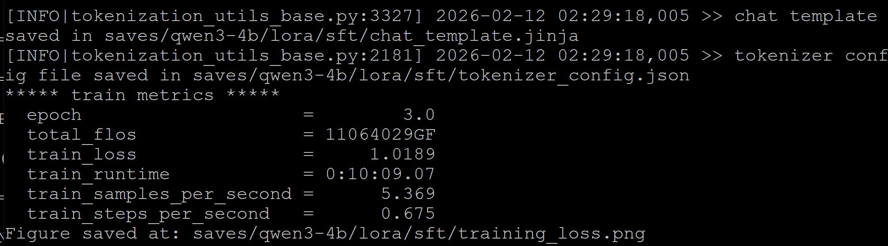
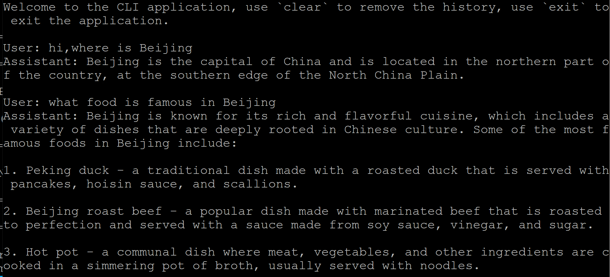
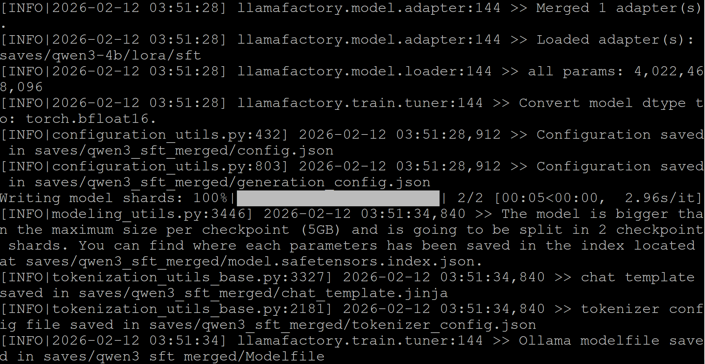

# LLM Fine-tuning with llama factory

## Overview

Efficient fine-tuning is vital for adapting large language models (LLMs) to downstream tasks. Llama factory is an open-source, efficient, and user-friendly platform designed to streamline the training and fine-tuning of large language models (LLMs) and multimodal models. Its core strength lies in enabling users to customize hundreds of pre-trained models locally with minimal coding, spanning from data preparation and model training to human alignment and deployment.

This playbook teaches you how to finetune LLMs using llama factory on your STX Halo™ GPU and other AMD RDNA3/RDNA4 GPUs.

## In This Playbook, You Will Learn

- How to set up llama factory with ROCm support
- How to configure LLM finetuning parameters (using Qwen/Qwen3-4B-Instruct-2507 as an example)
- How to run llama factory finetuning
- How to run inference with fine-tuned model
- How to export the fine-tuned model 

## Time & Risk
- Duration: It will take about 30 minutes to run this playbook at AMD Lab, but the duration of real finetuning case will depend on model/dataset size and network speed.
- Risk: Finetuning is not an easy task, and you may meet some questions,like out-of-memory and accuracy. Please check [Llama factory FAQs](https://github.com/hiyouga/LlamaFactory/issues/4614) first. 

## Instructions

### Install llama factory on ROCm GPU

llama factory depends on PyTorch, and rocm developers can install PyTorch through the below options: 
- Using a prebuilt Docker image with PyTorch pre-installed from [AMD rocm pytorch docker hub](https://hub.docker.com/r/rocm/pytorch/tags )
- Using a wheels package from [offical PyTorch webiste](https://pytorch.org/get-started/locally/)
- Building PyTorch from source as the steps of [rocm document](https://rocm.docs.amd.com/projects/install-on-linux/en/latest/install/3rd-party/pytorch-install.html#build-pytorch-from-source)

For this playbook, we'll use the **prebuilt ROCm Pytotch Docker image** as an example, making it the easiest way to get started on AMD GPUs. The below command is just for your reference, please use the latest version ROCm docker image.

If ROCm Pytorch has been pre-installed on your device, you may skip the below optional steps and install llama factory directly.

#### [optional]Setup docker environment on your device
This playbook needs ROCm PyTorch docker container,please ensure Docker is installed and configured correctly. Follow the [Docker installation guide](https://docs.docker.com/engine/install/) for your operating system.

Note: Ensure the Docker permissions are correctly configured. To configure permissions to allow non-root access, run the following commands:

```bash
sudo usermod -aG docker $USER
newgrp docker
```

Verify Docker is working correctly with:

```bash
docker run hello-world
```

#### [optional]Pull the Docker Image
First, pull the ROCm PyTorch Docker image:

```bash
docker pull rocm/pytorch:rocm7.2_ubuntu24.04_py3.12_pytorch_release_2.9.1 
```

#### [optional]Launch the PyTorch docker container
Start the ROCm PyTorch container with AMD GPU access and mount your local data directory if need.

```bash
docker run -it \
    --cap-add=SYS_PTRACE \
    --security-opt seccomp=unconfined \
    --device=/dev/kfd \
    --device=/dev/dri \
    --group-add video \
    --ipc=host \
    --shm-size 8G \
    -v {host data path}:/data \
    rocm/pytorch:rocm7.2_ubuntu24.04_py3.12_pytorch_release_2.9.1
```

#### Install llama factory

Download the source code from [llama factory official GitHub repository](https://github.com/hiyouga/LlamaFactory),and install LLaMA Factory with dependencies.

```bash
git clone --depth 1 https://github.com/hiyouga/LlamaFactory.git
cd LlamaFactory
pip install -e .
pip install -r requirements/metrics.txt
```

If you would like to try Llama Factory QLora finetuning through BitsandBytes library, you also need to install bitsandbytes. In this playbook, we introduce how to compile and install bitsandbytes library on AMD ROCm GPU, which can help developer enjoy the latest bitsandbytes quantization solution.

```bash
# Install bitsandbytes from source
# Clone bitsandbytes repo
git clone https://github.com/bitsandbytes-foundation/bitsandbytes.git && cd bitsandbytes/

# Compile & install
apt-get install -y build-essential cmake  # install build tools dependencies, unless present
cmake -DCOMPUTE_BACKEND=hip -DBNB_ROCM_ARCH="gfx1150" -S . # Use -DBNB_ROCM_ARCH to target specific gpu arch,gfx1201 for 9070xt GPU, gfx1150 for strix halo
make
pip install -e .
```

Now you have installed llama factory successfully on AMD ROCm GPU. and next step is to run LLM finetuning on it.

### Run llama factory finetuing 

In this section, we will introduce how to prepare finetuning dataset,configure LoRA/QLoRA parameters,run LoRA finetuning.
#### Dataset Preparation

Llama factory supports the finetuning datasets in Alpaca format and ShareGPT format. All the avaiable datasets have been defined in Llama Factory [dataset_info.json](https://github.com/hiyouga/LlamaFactory/blob/main/data/dataset_info.json). If you are using a custom dataset, please make sure to add a dataset description in dataset_info.json and specify dataset: dataset_name before training to use it. Detailes can be found in their [offical document](https://llamafactory.readthedocs.io/en/latest/getting_started/data_preparation.html).

In this playbook, we will use the identity and alpaca_en_demo datasets as an example,and configure the dataset information in next step.

#### Finetuning parameter configuration

Llama factory supports mutilple finetuning schemes, and has provides the parameter configuration examples for fine-tuning. You can find full-Parameter fine-tuning example from [examples/train_full](https://github.com/hiyouga/LlamaFactory/tree/main/examples/train_full), LoRA fine-tuning example in [examples/train_lora](https://github.com/hiyouga/LlamaFactory/tree/main/examples/train_lora),and QLoRA fine-tuning example in [examples/train_qlora](https://github.com/hiyouga/LlamaFactory/tree/main/examples/train_qlora).

These example configuration files have specified model parameters, fine-tuning method parameters, dataset parameters, evaluation parameters, etc. You need to configure them according to your own needs. In this playbook, we take [qwen3_lora_sft.yaml](https://github.com/hiyouga/LlamaFactory/blob/main/examples/train_lora/qwen3_lora_sft.yaml) as an example. 

**Key parameters explained:**
- `model_name_or_path` - Huggingface Model name or local model file path.
- `stage` - Training stage. Options: rm(reward modeling), pt(pretrain), sft(Supervised Fine-Tuning), PPO, DPO, KTO, ORPO.
- `do_train` - true for training, false for evaluation
- `finetuning_type` - Fine-tuning method. Options: freeze, lora, full
- `lora_rank` - The dimensionality of the low-rank matrix used in LoRA,Typical values: 4, 6, 8, 16(smaller values = fewer parameters = faster fine-tuning; larger values = better task adaptation but higher resource usage).
- `lora_target` - Target modules for LoRA method. Default: all.
- `dataset` - Dataset(s) to use. Use “,” to separate multiple datasets
- `output_dir` - File-tuning Output path
- `logging_steps` - Logging interval in steps
- `save_steps` - Model checkpoint saving interval.
- `overwrite_output_dir` - Whether to allow overwriting the output directory.
- `per_device_train_batch_size` - Training batch size per device.
- `gradient_accumulation_steps` - Number of gradient accumulation steps.
- `learning_rate` - Learning rate
- `num_train_epochs` - Number of training epochs
- `lr_scheduler_type` - Learning rate schedule. Options: linear, cosine, polynomial, constant, etc.
- `warmup_ratio` - Learning rate warmup ratio

In this playbook,we modified the default value of lora_rank to run fine-tuning on AMD GPUs.

```bash
sed -i.bak 's/lora_rank: 8/lora_rank: 6/g' examples/train_lora/qwen3_lora_sft.yaml
```

if you would like to run bitsandbytes QLoRA finetuning, you can also try to modify lora_rank in the corresponding configuration file.

```bash
sed -i.bak 's/lora_rank: 8/lora_rank: 6/g' examples/train_qlora/qwen3_lora_sft_bnb_npu.yaml
```

#### Run Llama factory finetuning 

**llamafactory-cli** is the official command-line interface (CLI) tool for LLaMA Factory,developed to simplify end-to-end LLM workflows (data preparation → fine-tuning → evaluation → deployment) without writing complex code.For training/fine-tuning, **llamafactory-cli train** is the flagship subcommand of the LLaMA Factory CLI, designed for end-to-end fine-tuning of large language models (LLMs) with minimal code. It abstracts complex fine-tuning workflows (data preprocessing, hyperparameter tuning, hardware optimization) into a single CLI command, supporting multiple fine-tuning paradigms (LoRA/QLoRA/Full Fine-Tuning) and optimized for low-resource GPUs (e.g., QLoRA on 16GB VRAM). It enforces best practices (e.g., gradient checkpointing, mixed precision) and natively integrates with Hugging Face ecosystems, making it the primary tool for customizing LLMs in LLaMA Factory.

You can run llama factory finetuning using the below command,which is based on the modified configuration file of Qwen3 LoRA finetuning. 
```bash
llamafactory-cli train examples/train_lora/qwen3_lora_sft.yaml
```
If you would like to try QLoRA with bitsandbytes, the below command is a typical example.
```bash
llamafactory-cli train examples/train_qlora/qwen3_lora_sft_bnb_npu.yaml
```

After running LLM finetuning, output files can be found in the path of "output_dir", like the model checkpoint files, model configuration files,training metrics data files.

<p align="center">
  
</p>

### Test and export the fine-tuned model 

Once you have done the fine-tuning, you may need to test the fine-tuned model to check whether it can work. You may also need to export the fine-tuned model files for production deployment. Llama facory has also developed the tools to help you on them.

#### Test the fine-tuned model 

**llamafactory-cli chat** is a core subcommand of the LLaMA Factory CLI, designed for interactive chat/inference with LLMs (both base models and LoRA-fine-tuned models). It simplifies the process of running conversational inference with minimal configuration, supports mainstream LLMs, and offers flexible control over generation hyperparameters (temperature, max tokens, etc.). This tool has multiple inference backend , like Huggingafce transformers, vLLM and ktransformers. Default backend is huggingface transformers. Llama factory also provided the sample configuration to run inference of fine-tuned models in [examples/inference](https://github.com/hiyouga/LlamaFactory/tree/main/examples/inference). You can also modify this sample configuration to change the inference settings,e.g.,inference backend.

In this playbook, we used the below command to test Qwen3 finetuned model.

```bash
llamafactory-cli chat examples/inference/qwen3_lora_sft.yaml
```
An example chat of finetuned model is shown as below.

<p align="center">
  
</p>

#### Export the fine-tuned model

We don't want to load the pre-trained model and the LoRA adapter separately every time we perform inference. Therefore, we need to merge and export the pre-trained model and the LoRA adapter into a single model for production deployment. **llamafactory-cli export** is a critical subcommand of the LLaMA Factory CLI, designed to convert fine-tuned LLMs (base models + LoRA adapters) into deployment-friendly formats for production use. You can use the merged finetuned model file as a normal HuugingFace model file. Llama factory also provided the sample configurations in [examples/merge_lora](https://github.com/hiyouga/LlamaFactory/tree/main/examples/merge_lora).

In this playbook, we used the below command to export Qwen3 finetuned model. 

```bash
llamafactory-cli export examples/merge_lora/qwen3_lora_sft.yaml
```
The result of exporting finetuned model is shown as below.

<p align="center">
  
</p>

## Next Steps
- **Try more models on AMD GPUs**: We use qwen3 as an example, developer can try other supported models,like gpt-oss, on AMD GPUs.
- **Try more finetuning schemes on AMD GPUs**: We use LoRA as an example, developer can try others,like full-Parameter, on AMD GPUs.
- **Try Fine-Tuning with LLaMA Factory GUI Tool**: LLaMA-Factory supports zero-code fine-tuning of large language models through WebUI, developer can also try [this tool](https://llamafactory.readthedocs.io/en/latest/getting_started/webui.html) on AMD GPUs. 

For more documentation, please visit: https://llamafactory.readthedocs.io/en/latest/ 