<!-- @github-only -->
> [!IMPORTANT]
> This playbook uses special tags that GitHub cannot render. Please visit [amd.com/playbooks](https://amd.com/playbooks) to correctly preview this content.
<!-- @github-only:end -->

# How to Chat with LLMs in Open WebUI

## Overview

Open WebUI is a self-hosted, browser-based interface that provides a familiar chatbot experience while acting as a frontend for one or more AI model servers. Instead of being tied to one provider, Open WebUI can connect to **any backend that exposes an OpenAI-compatible API**, so you can swap models and capabilities without switching UIs.

In this playbook, we use **Lemonade** as the backend because it exposes a **unified OpenAI-compatible endpoint** supporting multiple modalities:
- **LLMs** for text generation
- **Vision models** for image understanding
- **Stable Diffusion** for image generation
- **Audio transcription models** for speech-to-text

This setup enables you to explore the **complete multimodal workflow end-to-end**.

---

## Learning Objectives

By the end, you’ll be able to:

- Connect Open WebUI to a local OpenAI-compatible backend (Lemonade)
- Chat with a local LLM from your browser
- Upload an image and ask a vision model questions about it
- Generate images from text prompts using Stable Diffusion models (SD-Turbo / SDXL)
- Understand the mental model so you can swap in other backends later (Ollama, vLLM, llama.cpp server, etc.)

---

## Core Concepts (Mental Model)

### The Three Components

| Piece | What it does | Examples |
|---|---|---|
| Frontend (UI) | The web app you interact with | Open WebUI |
| Backend (Model Server) | Hosts models and exposes HTTP endpoints | Lemonade, Ollama, vLLM, llama.cpp server, OpenAI-compatible servers |
| Models | The actual LLM / vision / diffusion / audio models | CodeLlama, DeepSeek, Gemma-MM, SDXL, SD-Turbo, Whisper |

#### Why “OpenAI-compatible API” matters

Open WebUI is built around standard OpenAI-style endpoints, like: 
  - Chat: `/chat/completions`
  - Models list: `/models`
  - Image generation: `/images/generations`
  - Audio transcription: `/audio/transcriptions`

Lemonade exposes these under `http://localhost:8000/api/v1/...`

If a backend supports those endpoints, Open WebUI can talk to it with minimal setup. That’s why we can switch backends without changing our workflow.

---

## One-Time Setup

This section establishes a stable local environment: Lemonade running, Open WebUI running, and a working connection between them.

### 1) Install Lemonade, Start Lemonade Server, and Download Models

<!-- @os:windows -->
- Install Lemonade (App + Server) using the `.msi` installer from the [official documentation page](https://lemonade-server.ai/install_options.html).
<!-- @os:end -->
<!-- @os:linux -->
- Install Lemonade (App + Server) by following the Linux distribution-specific package manager instructions on the [official documentation page](https://lemonade-server.ai/install_options.html).
<!-- @os:end -->
- Start the Lemonade server:
  -  Open Powershell
  -  Run the command: `lemonade-server serve`
- Verify server status:
  - In the same Powershell terminal, run: `lemonade-server status`
  - Expect to see `Server is running on port 8000`
  - Open the Lemonade Server app and download required models from the `Model Manager` tab

<p align="center">
  
</p>

- Confirm the API is reachable:
  - Open `http://localhost:8000/api/v1/models` in your web browser.
  - You should see a JSON list of models downloaded in Lemonade

> If you don’t see your models in `http://localhost:8000/api/v1/models`, Open WebUI won’t be able to select them later.


### 2) Install Open WebUI

<!-- @os:windows -->
Open PowerShell and create a fresh virtual environment:

```bash
# Install open-webui into a venv [Windows]
python -m venv openwebui-venv
.\openwebui-venv\Scripts\activate
python -m pip install --upgrade pip
pip install open-webui
```
<!-- @os:end -->

<!-- @os:linux -->
Open a terminal and create a fresh virtual environment:

```bash
# Install open-webui into a venv [Linux]
python3 -m venv openwebui-venv
source openwebui-venv/bin/activate
python -m pip install --upgrade pip
pip install open-webui
```
<!-- @os:end -->

> Note: Open WebUI also provides a variety of other installation options, such as Docker, on their GitHub.

### 3) Start Open WebUI Server

- Run this command to launch the Open WebUI HTTP server:
```bash
open-webui serve
```
- In a browser, navigate to `http://localhost:8080`.
- Open WebUI will ask you to create a local administrator account. Once you are signed in, you will see the chat interface.

<p align="center">
  
</p>
  
> Keep the terminal window open. Closing it stops Open WebUI.


### 4) Connect Open WebUI to Lemonade

In Open WebUI:

1. Go to **Admin Settings → Connections**

<p align="center">
  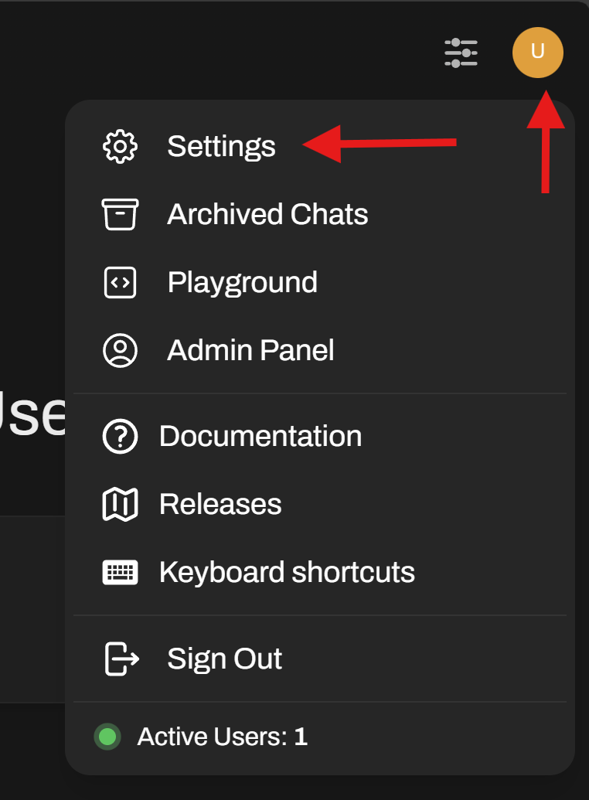
</p>
<p align="center">
  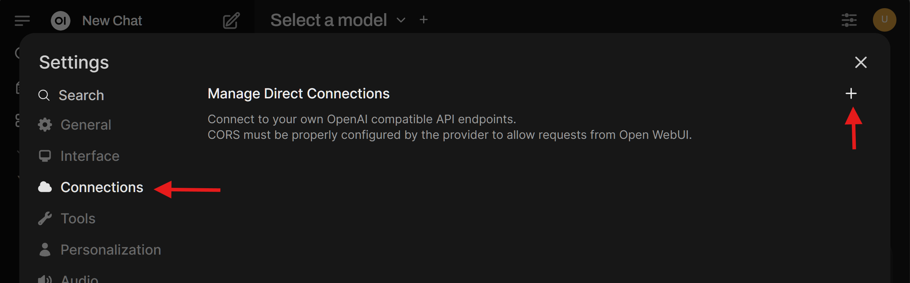
</p>

2. Under **OpenAI API**, add a new connection:
   - **Base URL:** `http://localhost:8000/api/v1`
   - **API Key:** `-` (a single dash works for local)
<p align="center">
  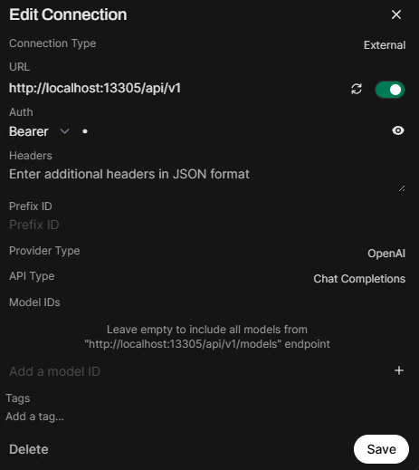
</p>

3. Save
4. Apply the following suggested settings. These help Open WebUI to be more responsive with local LLMs.
   - Click the user profile button again, and choose "Admin Settings".
   - Click the "Settings" tab at the top, then "Interface" (which will be on the top or the left, depending on your window size), then disable the following:
      - Title Generation
      - Follow Up Generation
      - Tags Generation
<p align="center">
  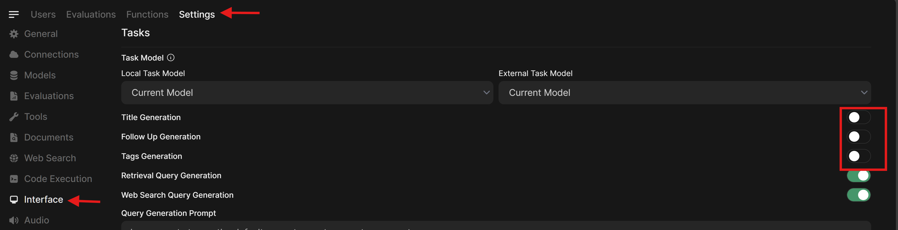
</p>

5. Click the **"Save"** button in the bottom right of the page, then return to `http://localhost:8080`.
6. Click the model dropdown and expect to see all the models that you have downloaded from Lemonade!

---

## Main Activities

Now you’re all set up. Let's look at three interesting things to do.

---

### Activity 1: Chat with a Local LLM

1. Click the dropdown menu in the top-left of the interface. This will display all of the Lemonade models you have installed. Select one to proceed. (example: `Llama-3.2-1B-Instruct-Hybrid`).
<p align="center">
  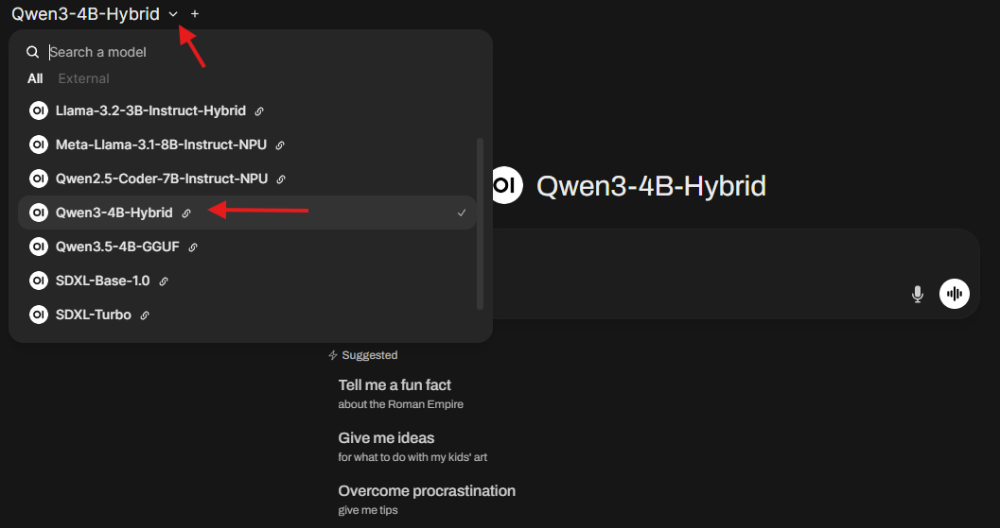
</p>

2. Enter a message to the LLM and click send (or hit Enter). The LLM will take a few seconds to load into memory and then you will see the response stream in.
<p align="center">
  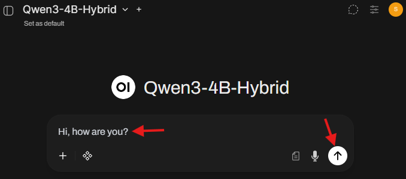
  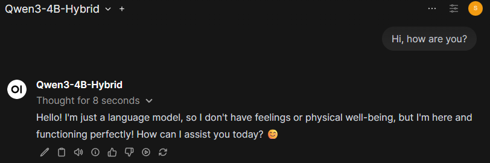
</p>

3. The model will respond in the chat.
<!-- @os:windows -->
4. At this time, open `Task Manager` on your system. You will see **high GPU/NPU utilization** based on whether the model you selected is **Hybrid** or **NPU** respectively. That clearly shows you’re running locally.
<p align="center">
  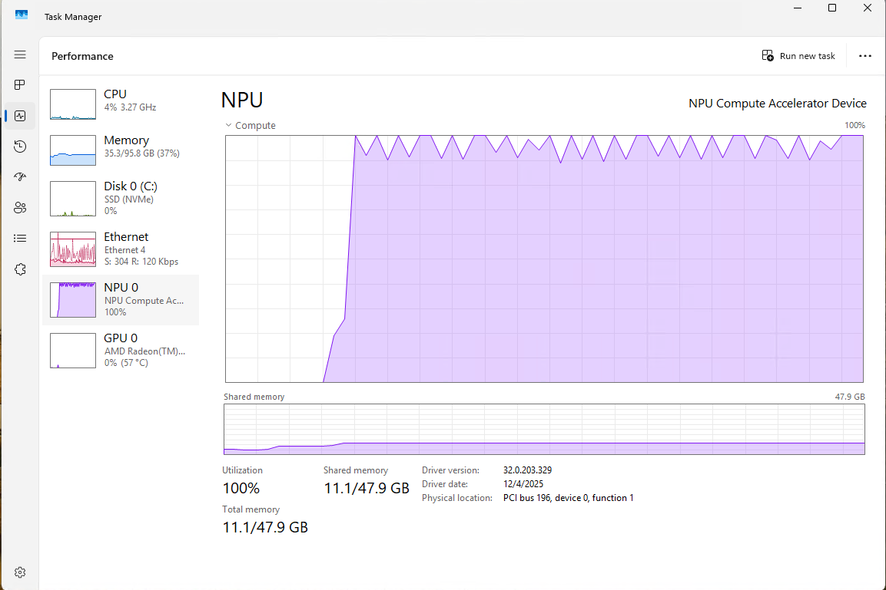
</p>
<!-- @os:end -->
This validates that Open WebUI can send requests to Lemonade using the OpenAI-compatible chat endpoint.

---

### Activity 2: Upload an Image and Ask Questions (Vision)

This requires a model that supports image input (a vision / multimodal model).

1. Select a vision-capable model (example: `Gemma-3-4b-it-GGUF`, or any model labeled for vision in Lemonade)
<p align="center">
  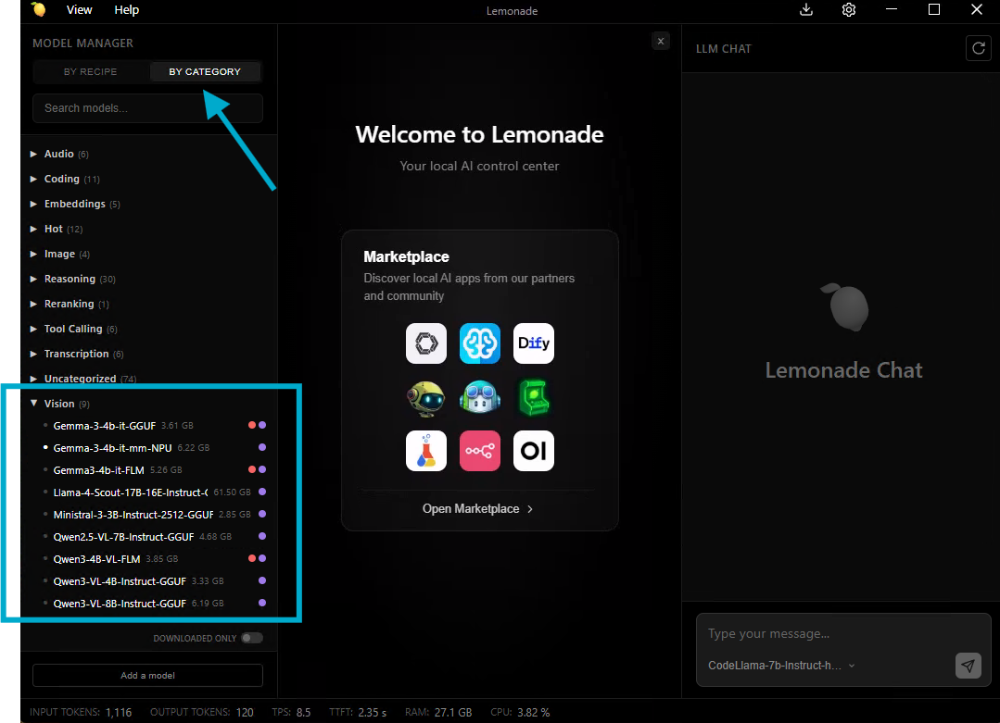
</p>

2. Click the **`+`** button in the message box and upload an image
3. Ask something that forces true image understanding: `Do you think this is a well-designed UI?`
<p align="center">
  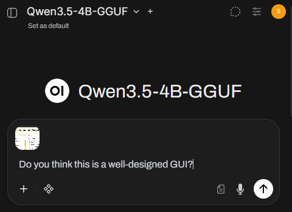
  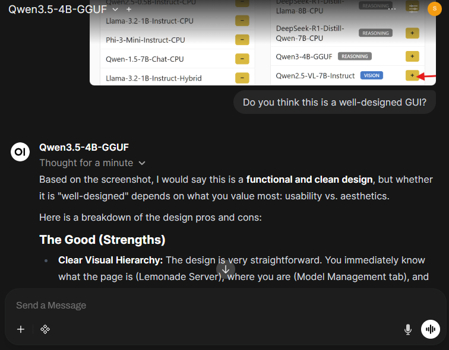
</p>

4. The model answers based on the image content, not generic text.

This demonstrates that Open WebUI can send multimodal requests (text + image) through the backend (Lemonade) to a vision model.

---

### Activity 3: Generate an Image from a Text Prompt (Stable Diffusion)

Stable Diffusion models don't support text generation, they only generate images through the Images API. 

#### Step 1: Configure Image Generation in Open WebUI

1. Go to **Admin Settings → Images**
2. Set:
   - **Image Generation:** ON
   - **Image Generation Engine:** Default (OpenAI)
   - **OpenAI API Base URL:** `http://localhost:8000/api/v1`
   - **OpenAI API Key:** `-`
   - **Model:** `SD-Turbo` (fast) or `SDXL-Base-1.0` (higher quality)
3. If you want to add more parameters, add them to the text field as JSON. For example: `{ "steps": 4, "cfg_scale": 1 }`. See available parameters at [Image Generation (Stable Diffusion CPP)](https://lemonade-server.ai/models.html).
<p align="center">
  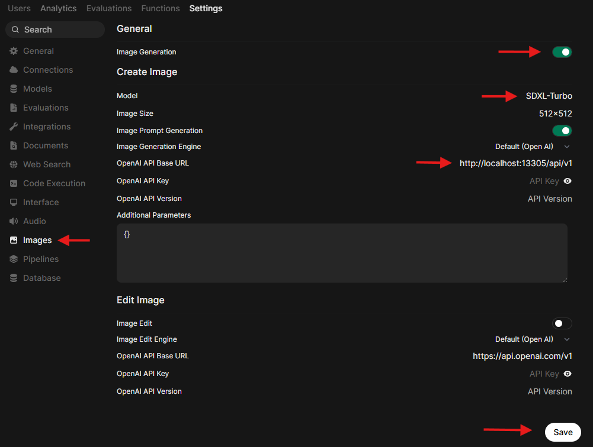
</p>
4. Save


#### Step 2: Allow Image Generation for the model
This step ensures that you enable Image Generation as a capability for your model.
1. Go to **Admin Settings → Models** and choose your model
2. Turn on `Image Generation`
<p align="center">
  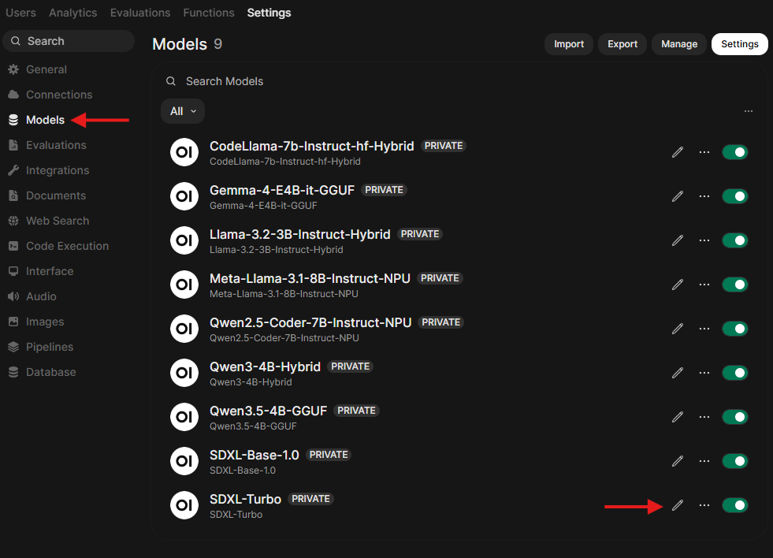
  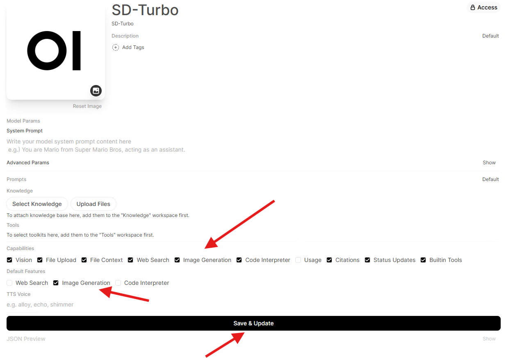
</p>

#### Step 3: Generate an image from the chat screen

1. Go back to chat at `http://localhost:8080`.
2. Select a **Text Generation LLM** in the model dropdown (example: DeepSeek, CodeLlama).  **Do not select a Stable Diffusion model** as this is a chat model selector.
3. In the message area, toggle **Image** ON.
4. Use a prompt like: `A cinematic photo of heavy traffic at sunset, ultra detailed`.
5. An image is generated and appears in the chat.
<p align="center">
  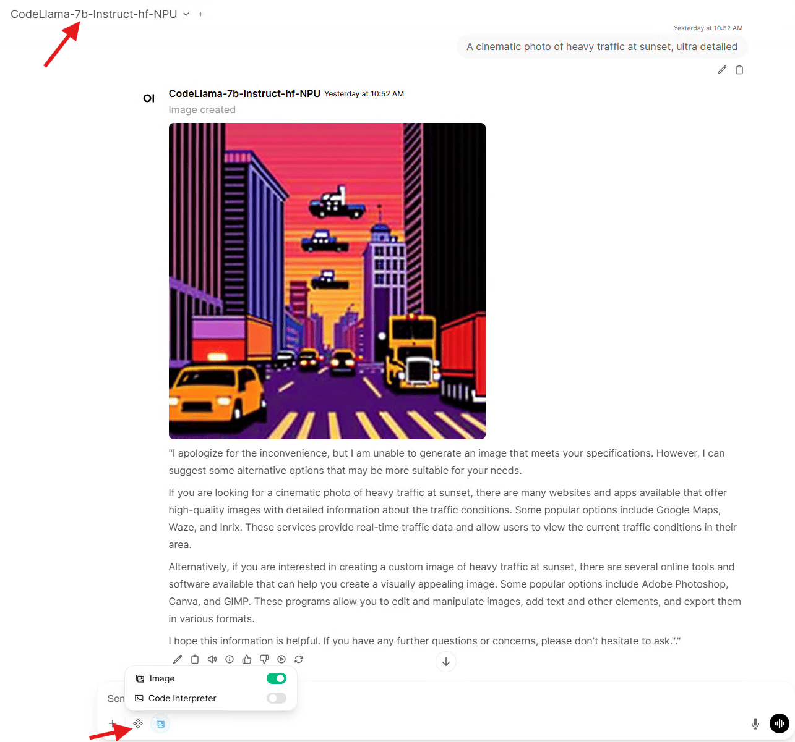
</p>

This establishes that Open WebUI can coordinate a “two-part” workflow:
  - The LLM helps refine the prompt
  - The image is generated via Lemonade’s Images endpoint using Stable Diffusion

---

## Troubleshooting

### “No models show up”
- Confirm `http://localhost:8000/api/v1/models` loads in a browser
- Re-check Open WebUI connection Base URL: `http://localhost:8000/api/v1`

### “This model does not support chat completion” error message
- You selected an image model (SD-Turbo / SDXL) in the chat model dropdown.
- **Fix**: select an LLM for chat, and use the Image toggle + Images settings for generation.
<p align="center">
  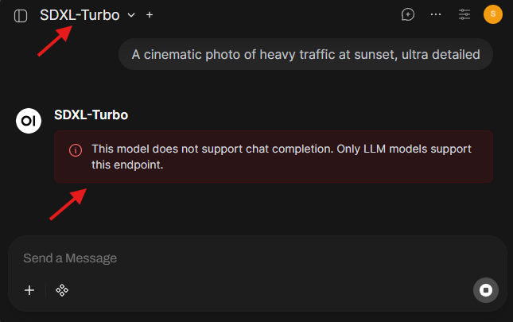
</p>

### Image generation errors/timeouts
- Start with `SD-Turbo` first (fast, fewer steps)
- Once working, switch the image model to `SDXL-Base-1.0` for quality

---

## Next Steps

You now have a working **“local AI stack”**, a single UI controlling multiple model types through a standard API.

Here are three expansions that unlock entirely new workflows:

### 1) Speech-to-Text with Whisper
Try turning audio into text using a Whisper model, then feed it into an LLM for summarization, action items, or rewriting. This is the foundation for meeting notes and voice-driven assistants.

### 2) Python Coding inside Open WebUI
Use Open WebUI’s built-in code execution experience to run Python snippets, inspect outputs, and iterate faster—without leaving the UI. [Reference](https://lemonade-server.ai/docs/server/apps/open-webui/#python-coding)

### 3) HTML Rendering inside Open WebUI
Render HTML outputs directly in the interface. This is surprisingly powerful for building quick prototypes, formatted reports, and interactive snippets. [Reference](https://lemonade-server.ai/docs/server/apps/open-webui/#html-rendering)

---

## References

- [Open WebUI (GitHub)](https://github.com/open-webui/open-webui)
- [Lemonade (GitHub)](https://github.com/lemonade-sdk/lemonade)
- [Lemonade Server docs](https://lemonade-server.ai/docs)
- [Lemonade ↔ Open WebUI integration guide](https://lemonade-server.ai/docs/server/apps/open-webui)
- [Lemonade Server API spec (endpoints)](https://lemonade-server.ai/docs/server/server_spec)
- [Video walkthrough (Lemonade)](https://www.youtube.com/watch?v=mcf7dDybUco)
- [Video walkthrough (Open WebUI + Lemonade)](https://www.youtube.com/watch?v=yZs-Yzl736E)
