## Overview


OpenClaw is an open-source AI agent framework designed to make autonomous systems easier to build, run, and experiment with on modern hardware.

It provides a modular architecture for orchestrating role-based agents, tools, and models—allowing developers to coordinate complex tasks across multiple capabilities such as reasoning, planning, and system control. Rather than relying solely on closed cloud agent platforms, OpenClaw enables flexible deployments that can run locally or on custom infrastructure.

By integrating with a wide range of LLM backends and developer tools, OpenClaw makes it practical to prototype and operate agent workflows on personal AI systems like Ryzen™ AI Halo. The framework emphasizes transparency, extensibility, and hackability—helping developers move beyond simple chat interfaces and build real-world autonomous agents that interact with software, hardware, and data. 🦞🤖

## What You'll Learn

* How to set up OpenClaw agents on AMD client devices.
* How to switch between different model serving methods, including cloud or local, and frameworks such as vLLM,  LM Studio, Lemonade.
*	How to assign tool access to bots and enable them to accomplish complex tasks.


## Why OpenClaw?
OpenClaw is built for developers who want powerful AI agents without relying on closed cloud ecosystems. It provides a modular, open-source framework that lets you run agents locally or on your own infrastructure, giving you full control over models, tools, and data. With flexible role-based agents, OpenClaw can coordinate complex tasks, integrate external tools, and automate workflows across different environments. It works with a wide range of LLMs, from local models to large datacenter-scale deployments. Because it is lightweight and extensible, developers can quickly prototype, customize capabilities, and experiment with new agent behaviors. OpenClaw also emphasizes transparency and hackability, making it ideal for researchers, robotics builders, and AI engineers who want to push beyond simple chatbots and build real autonomous systems. 


## Installing Dependencies

<!-- @require:lmstudio,driver -->

## System Setup

<!-- @setup:memory-config -->


## Downloading Models

<!-- @require:qwen3.5-32b-a3b -->


## LM Studio configuration and Server setup

### Initial setup
1. Download LM Studio 
2. Start LM Studio and click on "Skip for now" for the model download prompt. 
3. Check "Developer Mode" and "Start LLM service on login"
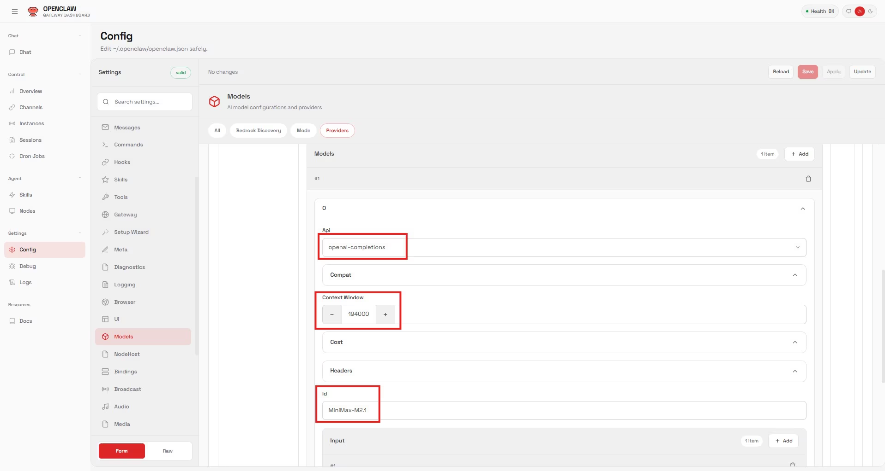
1. Click on the "Model Search" Icon represented by a Robot and a Magnifying glass
2. Select "Qwen3.5 35B A3B" on the left hand side and click download on the right hand side. Wait for it to finish 6. downloading. 

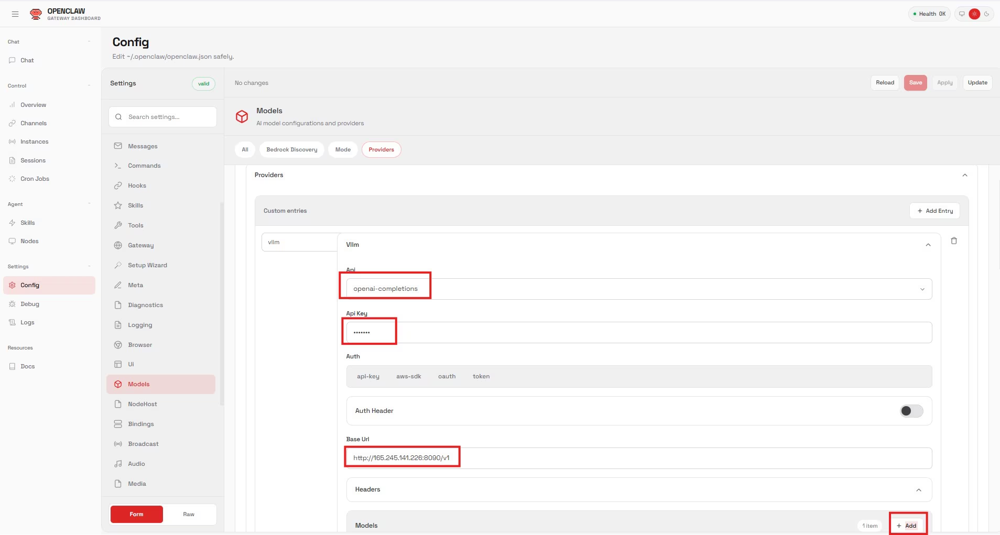
1. Click Ctrl + L to bring up model selection. Check "Manually choose load model parameters" and click on the LLM to 2. bring up the load options. 
2. Check "remember settings" and check "show advanced settings".
3. Set context to 190000 and make sure GPU Offload is set to MAX.
4. Uncheck "Try nmap"
5. Ensure "Flash Attention" is enabled. 
6. For a detailed explaination of Max Concurrent Predictions and Unified KV Cache, please see concurrent agent logic  above. For now, we will set max concurrent predictions to 6 and leave unified kv cache checked.
Click load. 
7. You may need to select the model again from the drop down menu in case it does not show up. 
8. Start a chat and send a message "test" to ensure the LLM is working.

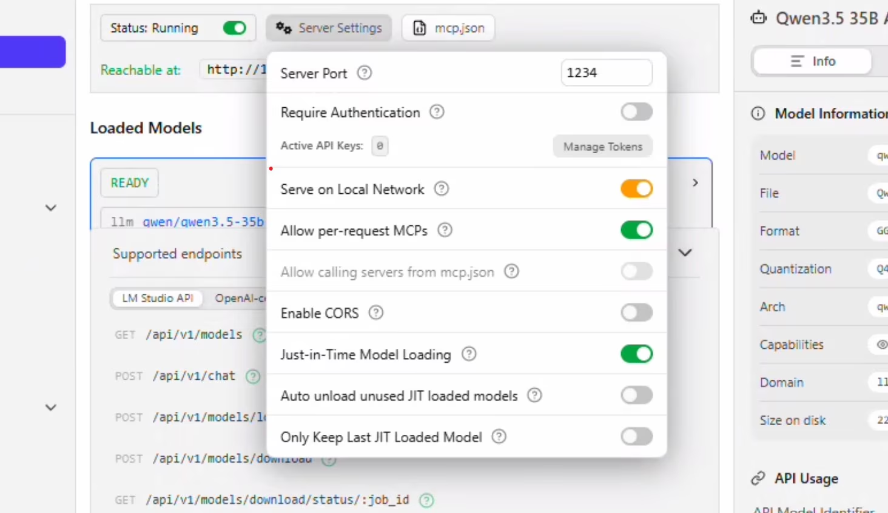
1. Press Ctrl + 2 to take you to the developer tab. 
2. Press the toggle infront of "Status: Stopped" to start the server. 
3. Click on Server Settings
4. Allow "Serve on Local Network". You will be prompted for permissions at this point. 
5. Uncheck "Auto unload unused JIT loaded models" and "Only keep last JIT loaded model". Click anywhere to close the context window. 
6. Click on Load Model. Select Qwen 35B A3B. The settings that we configured above should automatically populate. Click Load. 
7. The model should get loaded and you will see the status "READY". 
8. Keep this window open and move on. 

## Installing WSL2 and OpenClaw core

Open a powershell window as administrator.
```bash
wsl --install -d Ubuntu-24.04
```

Install Ubuntu (if you are running this command for the first time, WSL will get installed first):
Create a username and password. Run updates. You may be prompted to enter the password and press Y to continue:

```bash
sudo apt update && sudo apt upgrade
```

Enable systemd:
```bash
sudo tee /etc/wsl.conf >/dev/null <<'EOF'
[boot]
systemd=true
EOF
```

Open a second powershell terminal (as administrator) and run:  'wsl --shutdown'. 

Go back to the original powershell terminal (stay here from now on) and run: 'wsl.exe'

Verify systemd is running by executing: 'ps -p 1 -o comm='

If you recieved "systemd" as the response, you can proceed and add to path:

```bash
mkdir -p ~/.config/systemd/user ~/.npm-global

grep -qxF 'export PATH="$HOME/.npm-global/bin:$PATH"' ~/.profile 2>/dev/null || \
  echo 'export PATH="$HOME/.npm-global/bin:$PATH"' >> ~/.profile

export PATH="$HOME/.npm-global/bin:$PATH"
```
Install Homebrew (required for some skills). You may be prompted for the password and to press ENTER: 
```bash
/bin/bash -c "$(curl -fsSL https://raw.githubusercontent.com/Homebrew/install/HEAD/install.sh)"
```
Setup the shell environment:
```bash
echo >> /home/claw/.bashrc

    echo 'eval "$(/home/linuxbrew/.linuxbrew/bin/brew shellenv bash)"' >> /home/claw/.bashrc

    eval "$(/home/linuxbrew/.linuxbrew/bin/brew shellenv bash)"
```
Install build-essentials. You may be prompted for the password and to press Y to continue:
```bash
sudo apt-get install build-essential
```
Install OpenClaw
```bash
curl -fsSL https://openclaw.ai/install.sh | bash

```

## Configuring OpenClaw with a local LLM
Read the security warning and press the left arrow key to navigate to Yes and hit Enter to continue. Hit enter again to select Quick Start. 

Press the down arrow key to scroll down till you "Custom Provider" and click enter. 

Open LM Studio again - notice the section on the right which says API Usage. Copy the address  below "Local server is reachable at" and paste this (Tip: right click while the Powershell window is focused to automatically paste your clipboard) into the powershell window:


Press enter on "Paste API Key Now" and enter "lmstudio" - don't leave this blank even though it is not required. 

Select "Anthropic-compatible API" and press enter. Navigate back over to the LM Studio "API Usage" section and copy the model name exactly. Paste this in the window for the Model ID and press enter: 'qwen/qwen3.5-35b-a3b'

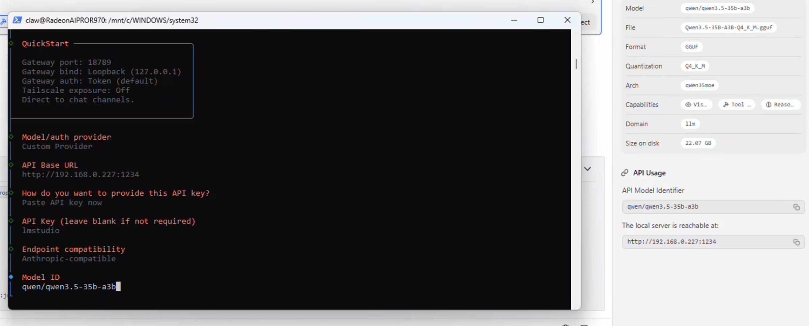

At this point OpenClaw will verify the connection and say "Verification Succesful" and prompt you for a Endpoint ID and then a Model alias. Add both of those: like 'qwen35b'

This is the point where you configure your communication channel with your bot. Before you proceed ensure you have the tokens and authentications already sorted. 

We now need to configure the web search API. You can either skip this step or sign up for an API like Brave - which offers a lot of calls for just $5. 

We will now select some starting skills: himalaya, blogwatcher, nanopdf and clawhub (don't worry if you cannot find clawhub in the list - do not worry - you can set it up later). If it prompts you - select npm - and continue installing. 

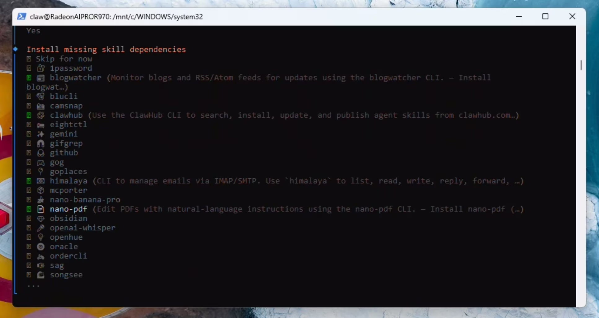
*If you prefer cloud access, add it now otherwise select NO to all the API key requests. 

*Select boot-md, command-logger and session-memory in hooks and click enter:

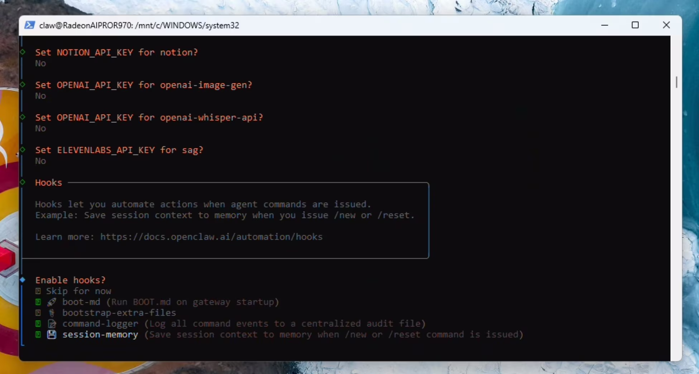

Hatch your Clawie!
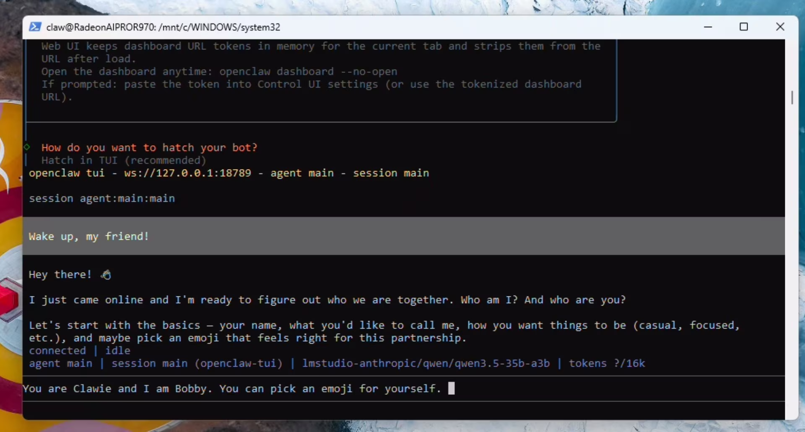


## Configuring context, agents and local embedding for memory

Send the following prompt:
```text
Lets do some house-keeping: You are running locally using LM Studio and a Qwen model with 190000 context. please update the openclaw.json file with max context and 190000 max token. Also please set the max agent count to 2 and the max sub-agent count to 2 as well. When done, restart the gateway.
```
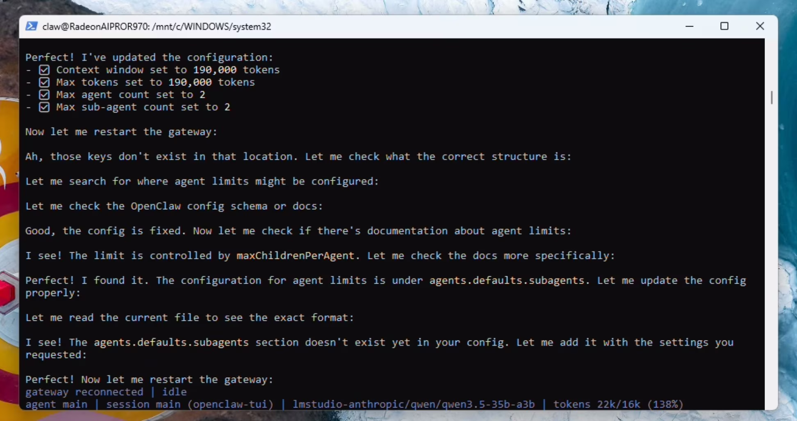

Wait for the gateway to reconnect and show as idle. The model will stop talking at this point. type /new in the TUI and the correct context limit will now show up in the terminal. 

```bash
/new
```
We now need to enable the local embedding model for functional memory.md. To do this, send the following prompt:

```text
Perfect! that is all done. Lets setup and validate memory.md now. Please read the docs. Specifically, we need to configure the embedding model – which by default is cloud based. We need to configure this to the local embedding model – which includes the memorysearch parameter in openclaw.json and should trigger a download of the local embeddding model. Once done – please validate its working along with the entire memory.md system.
```

When the gateway restarts - the model cannot tell it has restarted - just prompt the model again with "the gateway has restarted". OpenClaw will download the local embedding model and set it up properly. 


You should get confirmation of the memory system being fully functional.

Optional: If you were not able to install the clawhub skill at the beginning, do this now, otherwise skip this step:

## Enabling OpenClaw to use Chrome (visible)
We will now setup browser use (that the user can see) inside of WSL2. Open up a seperate powershell window: 'wsl.exe'

Run the following command to install the browser extension in your workspace; Run apt update; Download and install Chrome:

```bash
openclaw browser extension install

sudo apt update

wget https://dl.google.com/linux/direct/google-chrome-stable_current_amd64.deb
sudo apt install ./google-chrome-stable_current_amd64.deb
```

Run the following command to get the Dashboard token and open the browser:
```bash
openclaw dashboard
```
This will open up the browser for the first time. Accept and chose whether you want to sign in. Keep this browser open now. 

Go back to the powershell window and copy the dashboard token (the part after "#token=") 

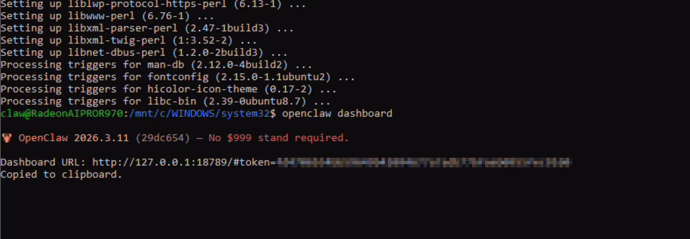

Navigate to Extensions > Turn on Developer Mode > Click on Load Unpacked Extensions

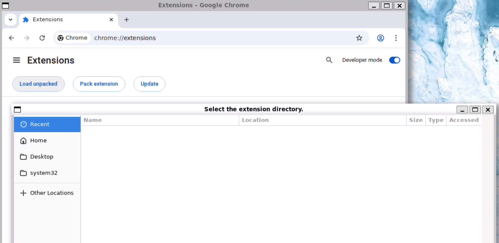

Press Ctrl+H to make dot domains show up and click on .openclaw > browser > chrome extension and while in this folder click on open.

The following page will show up asking for the token. Provide the token and click save. It should say relay reachable and authenticated: 

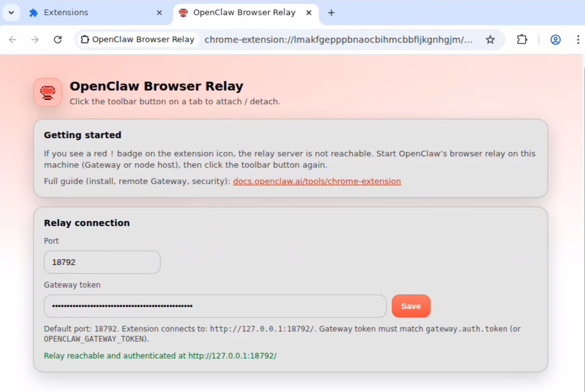

Click on the extension icon in the toolbar (jigsaw puzzle) and click on the OpenClaw Browser Relay to turn it on. You should get a notification of "OpenClaw Browser Relay started debugging this browser.
Send the following prompt in the TUI now:

```text
I just configured you with the chrome browser relay extension. can you verify its working by navigating to amd.com
```

Your OpenClaw agent now has a browser that it can use (and you can observe)!
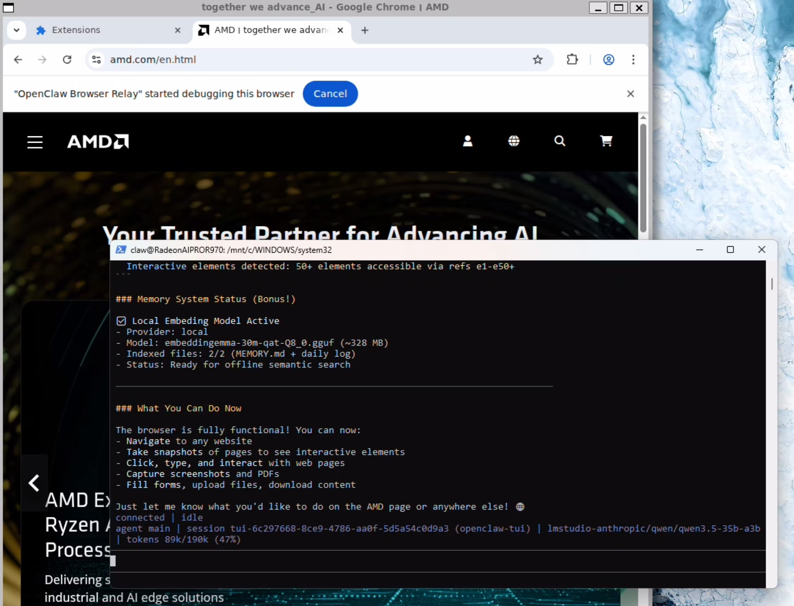

You can also explore more tools in below table and give access to them for more complicated tasks.

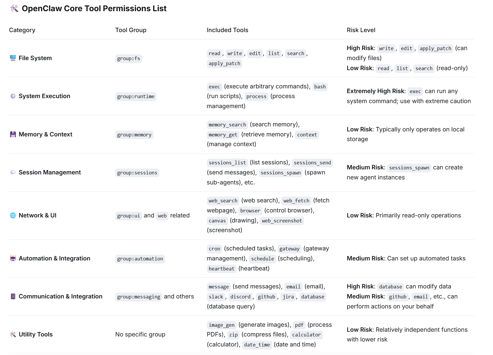

## Next Steps
And that’s it! If you have any questions about OpenClaw, feel free to join the community and continue exploring. If you run into issues, want to report bugs, stay updated with the latest OpenClaw features, or collaborate on agent projects, you can:
* Check the official documentation
* Open issues or discussions on GitHub
* Join the community channels to connect with other developers

These are great places to ask questions, share ideas, and learn how others are building AI agents with OpenClaw.

## Resources

Below are some additional resources to learn more about OpenClaw and building AI agents:

Official OpenClaw documentation: A comprehensive guide covering installation, configuration, agent roles, node setup, and system integrations such as tools, APIs, and device capabilities.
OpenClaw Documentation https://docs.openclaw.ai

OpenClaw GitHub Repository: The central code repository with installation instructions, configuration examples, and links to community discussions and updates. https://github.com/openclaw-ai/openclaw

Model setup guide for OpenClaw: A walkthrough explaining how to connect local or remote LLMs (such as Qwen, Llama, or other OpenAI-compatible endpoints) to OpenClaw, including backend configuration and performance tips. https://docs.openclaw.ai/models

Integrating OpenClaw with tools and devices: Examples demonstrating how to connect cameras, system tools, or APIs to extend agent capabilities.