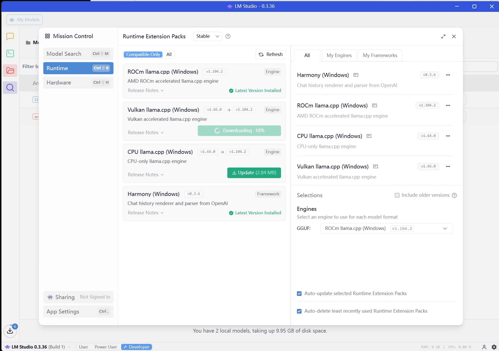

## Overview


OpenClaw is an open-source AI agent framework designed to make autonomous systems easier to build, run, and experiment with on modern hardware.

It provides a modular architecture for orchestrating role-based agents, tools, and models—allowing developers to coordinate complex tasks across multiple capabilities such as reasoning, planning, and system control. Rather than relying solely on closed cloud agent platforms, OpenClaw enables flexible deployments that can run locally or on custom infrastructure.

By integrating with a wide range of LLM backends and developer tools, OpenClaw makes it practical to prototype and operate agent workflows on personal AI systems like Ryzen™ AI Halo. The framework emphasizes transparency, extensibility, and hackability—helping developers move beyond simple chat interfaces and build real-world autonomous agents that interact with software, hardware, and data. 🦞🤖

## What You'll Learn

* How to set up OpenClaw agents on AMD client devices.
* How to switch between different model serving methods, including cloud or local, and frameworks such as vLLM,  LM Studio, Lemonade.
*	How to assign tool access to bots and enable them to accomplish complex tasks.


## Why OpenClaw?
OpenClaw is built for developers who want powerful AI agents without relying on closed cloud ecosystems. It provides a modular, open-source framework that lets you run agents locally or on your own infrastructure, giving you full control over models, tools, and data. With flexible role-based agents, OpenClaw can coordinate complex tasks, integrate external tools, and automate workflows across different environments. It works with a wide range of LLMs, from local models to large datacenter-scale deployments. Because it is lightweight and extensible, developers can quickly prototype, customize capabilities, and experiment with new agent behaviors. OpenClaw also emphasizes transparency and hackability, making it ideal for researchers, robotics builders, and AI engineers who want to push beyond simple chatbots and build real autonomous systems. 

## Prerequisites

## Part I: Set up OpenClaw agents on STX Halo™

### Step 1: Install OpenClaw

If you haven't installed OpenClaw yet, use the following command (for Mac/Linux):
```bash
curl -fsSL https://openclaw.ai/install.sh | bash
```

During installation, when asked “How do you want to hatch your bot?”, select “Open the Web UI” and follow the instructions to open the web app.

### Step 2: Configure the Provider

In the OpenClaw Web UI, navigate to Settings > Config. We need to add our local LLM information.

Name: vllm \
API: Select openai-completions \
API Key: Enter the key you defined earlier (e.g., abc-123) \
Base URL: http://<your-droplet-ip>:8090/v1 


Figure 3 OpenClaw Model Provider Configuration for vLLM 

Figure 4 OpenClaw Model Definition for Qwen3-1.7B 

Figure 5 OpenClaw Model ID and Reasoning Definition for Qwen3-1.7B 

### Step 3: Configure the Model

Add a new entry under “Models”: 
API: Select openai-completions. 
Context Window: Set to 194000 (matching the max-model-len setting).
ID: Set to Qwen3-1.7B (matching the served-model-name).
Click Apply.

### Step 4: connect this model to your main agent:
Navigate to the Agents section.
Change the Primary Model value to: vllm/Qwen3-1.7B (this is based on the values we entered under for Models configuration).
Click Apply.

Figure 6 OpenClaw Agent Primary Model Selection 
Figure 6: OpenClaw Agent Primary Model Selection

### Step 5: add system tool access to Agents

The group tools listed below, you can add proper tools access to the config file, according to the task you want agents to conduct:


## Part II: Create LLM model serving to empower the OpenClaw

There are various model serving methods, including cloud or local, and AI serving frameworks such as vLLM, SGLang, LM Studio, Lemonade, and FLM. Here we will introduce three main methods: vLLM in remote server with MI300X and LMStudio/Lemonade with ROCm in Local.

### 2.1 Setup vllm serving in remote server

(If in windows OS, we can use WSL to install Linux container, and then use vLLM)

### Step 1: pull the ROCm vLLM Docker image:

```bash
docker pull vllm/vllm-openai-rocm:v0.14.0
```

### Step 2: run the ROCm vLLM Docker:
This Docker image contains vLLM with ROCm support for AMD GPUs. 
```bash
docker run -it --network=host --device=/dev/kfd --device=/dev/dri --group-add video --ipc=host \
  --cap-add=SYS_PTRACE --security-opt seccomp=unconfined --shm-size 8G \
  -v /data:/data \
  --entrypoint /bin/bash \
  vllm/vllm-openai-rocm:v0.14.0
```

### Step 3: raise vLLM model serving:
```bash
VLLM_USE_TRITON_FLASH_ATTN=0 vllm serve Qwen/Qwen3-1.7B \
    --served-model-name Qwen3-1.7B \
    --api-key abc-123 \
    --port 8090 \
    --enable-auto-tool-choice \
    --tool-call-parser qwen3 \
    --trust-remote-code \
    --max-model-len 19400 \
    --gpu-memory-utilization 0.99
```

This command downloads the model weights, loads them onto your GPU, and creates an OpenAI-compatible endpoint accessible at: http://<your-droplet-ip>:8090/v1
Connecting OpenClaw to Your Local LLM
Now that the model is running, we can configure OpenClaw to use it.
The format is like "http://134.199.196.xxx:8090/v1".

### 2.2 Setup LM Studio serving in local device (STX Halo™) 

Refer to LM Studio playbook to create the server service. 

Download model, we recommend Qwen3-30B-Coder-GGUF to do the coding work, and Qwen3-4B-GGUF (Q4_0) model to handle the in-time task with a quick response.


Figure 3 Install dependencies for LMStudio.

Set the ctx window more than the value 32000, since agents need a large context window to store history information.

We can config the model with Baseurl, the format is like "http://127.0.0.1:8090/v1".

### 2.3 Setup Lemonade serving in local device (STX Halo™) 

Refer to Lemonade playbook to create the server service. 

Here we have two choices: GPU and NPU based model.
* For Radeon GPU, we can select the gguf model with llama.cpp runtime (ROCm or Vulkan backend).
* For NPU XDNA2, we can select the onnx hybrid model with onnx runtime (Ryzen backend).

The Baseurl was recorded to fill the OpenClaw config file. the format is like "http://127.0.0.1:8090/v1".

## Next Steps
And that’s it! If you have any questions about OpenClaw, feel free to join the community and continue exploring. If you run into issues, want to report bugs, stay updated with the latest OpenClaw features, or collaborate on agent projects, you can:
* Check the official documentation
* Open issues or discussions on GitHub
* Join the community channels to connect with other developers

These are great places to ask questions, share ideas, and learn how others are building AI agents with OpenClaw.

## Resources

Below are some additional resources to learn more about OpenClaw and building AI agents:

Official OpenClaw documentation: A comprehensive guide covering installation, configuration, agent roles, node setup, and system integrations such as tools, APIs, and device capabilities.
OpenClaw Documentation https://docs.openclaw.ai

OpenClaw GitHub Repository: The central code repository with installation instructions, configuration examples, and links to community discussions and updates. https://github.com/openclaw-ai/openclaw

Model setup guide for OpenClaw: A walkthrough explaining how to connect local or remote LLMs (such as Qwen, Llama, or other OpenAI-compatible endpoints) to OpenClaw, including backend configuration and performance tips. https://docs.openclaw.ai/models

Integrating OpenClaw with tools and devices: Examples demonstrating how to connect cameras, system tools, or APIs to extend agent capabilities.