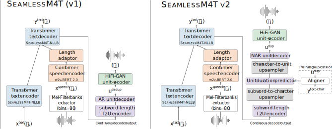
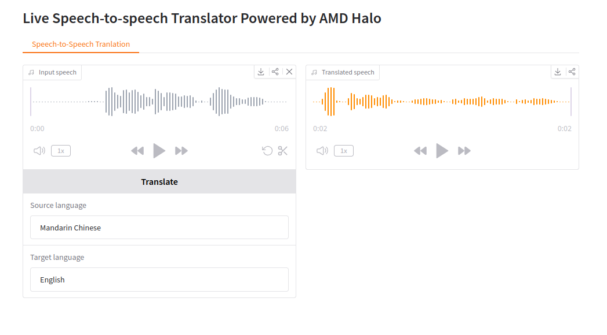

<!--
Copyright Advanced Micro Devices, Inc.

SPDX-License-Identifier: MIT
-->

<!-- @github-only -->
> [!IMPORTANT]
> This playbook uses special tags that GitHub cannot render. Please visit [amd.com/playbooks](https://amd.com/playbooks) to correctly preview this content.
<!-- @github-only:end -->

# Live Speech2Speech Translation on AMD GPU

## Overview
The ROCm (Radeon Open Compute) and Pytorch stack create a unified ecosystem for on-device AI. It works for both Windows and Linux with official support for a wide range of devices including APUs and GPUs.

This playbook will teach you how to run low-latency, expressive, and private speech-to-speech translation entirely on the edge.

## What You'll Learn
- How to set up speech-to-speech environment
- How to write Python code to load and use speech-speech models
- How to run and experiment with the Gradio UI

## Why use real-time speech-to-speech translation?
- Removes friction between translation and language barriers
- Conveys tone, emotion, and intent without awkward pauses
- Enables global collaboation and faster decision-making

## Setting Up Your Environment

### Create a Virtual Environment

<!-- @os:windows -->
On Windows, open a terminal in the directory of your choice and follow the commands to create a venv with ROCm+Pytorch already installed.
<!-- @test:id=create-venv timeout=60 -->
```bash
python -m venv s2st-env --system-site-packages
s2st-env\Scripts\activate
```
<!-- @test:end -->
<!-- @setup:id=activate-venv command="s2st-env\Scripts\activate" -->

> **Tip**: Windows users may need to modify their PowerShell Execution Policy (e.g.
> setting it to RemoteSigned or Unrestricted) before running some Powershell commands.

<!-- @os:end -->

<!-- @os:linux -->
On Linux, open a terminal and run the following prompt to create a venv with ROCm+Pytorch already installed:
<!-- @test:id=create-venv timeout=120 -->
```bash
sudo apt update
sudo apt install -y python3-venv
python3 -m venv s2st-env --system-site-packages
source s2st-env/bin/activate
```
<!-- @test:end -->
<!-- @setup:id=activate-venv command="source s2st-env/bin/activate" -->
<!-- @os:end -->

### Installing Basic Dependencies
<!-- @require:pytorch -->

### Additional Dependencies
Install m4t dependencies using pip:
<!-- @test:id=install-deps timeout=300 setup=activate-venv -->
```bash
pip install transformers==4.57.1 safetensors==0.6.2 tiktoken==0.9.0 accelerate soundfile==0.13.1 sentencepiece protobuf gradio==4.44.1 scipy==1.15.3 
```
<!-- @test:end -->

## Set up the speech-to-speech demo

#### Learn about seamless-m4t-v2
Check out the model card on Hugging Face for more information: [https://huggingface.co/facebook/seamless-m4t-v2-large/tree/main](https://huggingface.co/facebook/seamless-m4t-v2-large/tree/main)


This is the technical architecture of the speech-speech models:
<p align="center">
  
</p>


#### Import necessary dependencies
```python 
from transformers import AutoProcessor, SeamlessM4Tv2Model
import torchaudio
import scipy
import time
import os
os.environ["HIP_VISIBLE_DEVICES"] = "0"
```
#### Load models
```python
start = time.time()
processor = AutoProcessor.from_pretrained("./seamless-m4t-v2-large")
model = SeamlessM4Tv2Model.from_pretrained("./seamless-m4t-v2-large").to("cuda")
end = time.time()
print(f"model loading duration: {end - start} seconds")
```

#### Input audio clip .wav file
Please download the following file: [input1.wav](assets/input1.wav). Then, load it with torchaudio.

```python
audio, orig_freq =  torchaudio.load("input1.wav")
```

#### Preprocess input .wav file
```python
audio =  torchaudio.functional.resample(audio, orig_freq=orig_freq, new_freq=16_000) # must be a 16 kHz waveform array
audio_inputs = processor(audios=audio, return_tensors="pt").to("cuda")
```

#### Generate translated audio file 
```python
start = time.time()
audio_array_from_audio = model.generate(**audio_inputs, tgt_lang="eng")[0].cpu().numpy().squeeze()
end = time.time()
print(f"gpu infer duration: {end - start} seconds")
```
#### Save the translated file
```python
sample_rate = model.config.sampling_rate
scipy.io.wavfile.write("out1.wav", rate=sample_rate, data=audio_array_from_audio)
```

#### Run the complete file to check the audio generation duration
Please download the following file: [infer.py](assets/infer.py). Then, run it.


```bash
python ./infer.py
```

### Runing the Gradio UI demo:

This is a helpful UI that builds upon the code we have written and makes live speech-speech translation easy.

1. Download this file: https://cdn-media.huggingface.co/frpc-gradio-0.3/frpc_linux_amd64
2. Rename the downloaded file to: frpc_linux_amd64_v0.3
3. Move the file to this location: /root/.cache/huggingface/gradio/frpc
4. Download the following file: [gradio_demo.py](assets/gradio_demo.py).
5. Run the following code:

```bash
export HIP_VISIBLE_DEVICES=0
python ./gradio_demo.py --share
```

Press and hold the record button to capture your voice; releasing it will automatically execute the translation.

### Gradio UI example:

<p align="center">
  
</p>


## Next Steps
- Mix and match between dozens of languages for quick translation. 
- Experiment with voice input and text-to-speech

## Resources

Below are some additional resources to learn more about speech-to-speech translation:  
* The repo is here https://huggingface.co/facebook/seamless-m4t-v2-large 
* Research academia related to "Seamless: Multilingual Expressive and Streaming Speech Translation"