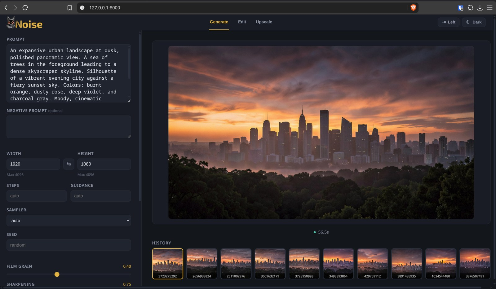
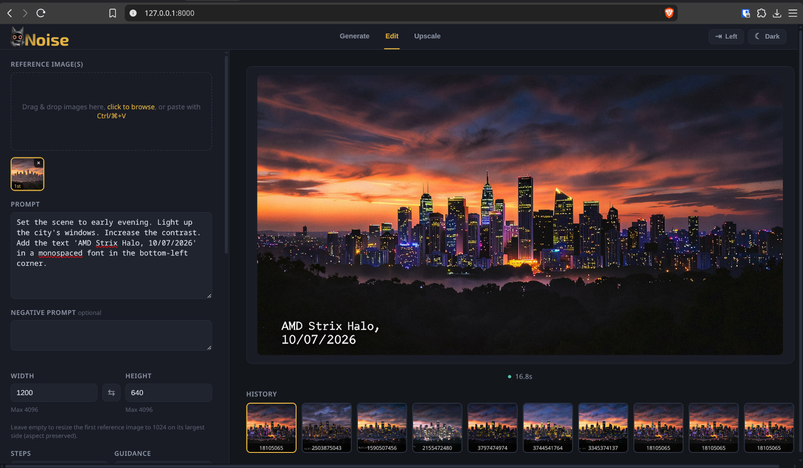
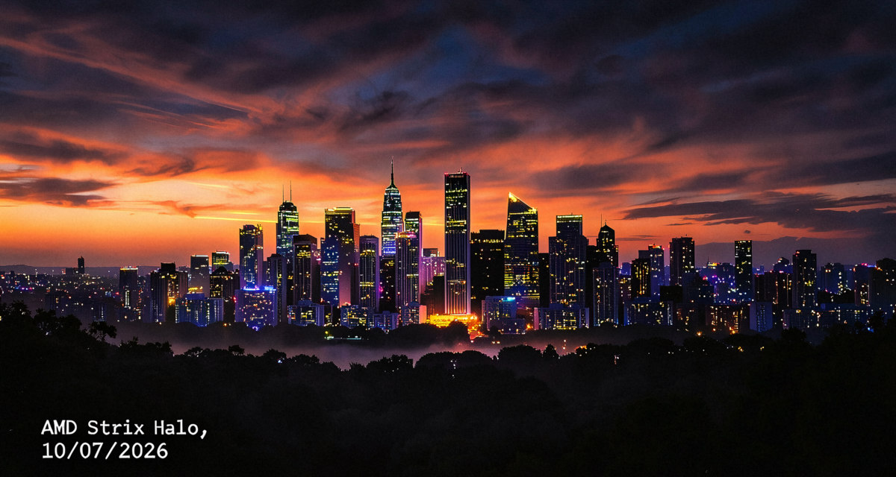

<!--
Copyright Advanced Micro Devices, Inc.

SPDX-License-Identifier: MIT
-->

<!-- @github-only -->
> [!IMPORTANT]
> This playbook uses special tags that GitHub cannot render. Please visit [amd.com/playbooks](https://amd.com/playbooks) to correctly preview this content.
<!-- @github-only:end -->

<!--
Screenshots to capture before publishing (place the files in assets/ and keep each under 500 KB):

1. assets/thenoise_generate_image.jpg - TheNoise web UI (http://localhost:8000/), Generate tab, with the Flux.2 Klein 4B model loaded and a prompt entered.
2. assets/thenoise_edit_image.jpg     - TheNoise web UI, Edit tab, with an image loaded and an instruction in the prompt box.
3. assets/city.jpg                    - The input image used in the editing example.
4. assets/city2.jpg                   - The second reference image used in the Multiple Reference Images example.
5. assets/multi_image_editing.jpg     - The result of the Multiple Reference Images edit.
6. assets/cover.jpeg                  - The playbook cover. It is also referenced as the "edit result" in the Browser UI section; if you want those to differ, use a dedicated edit-result image there.
-->

## Overview

TheNoise is a focused, open-source image generation and **editing** engine built for AMD ROCm GPUs. It loads one model at a time and gives you a clean command line, a small browser UI, and an HTTP API that other software can call. It is tuned to run fast on AMD GPUs — including the Ryzen™ AI Halo and Radeon™ discrete GPUs.

This tutorial shows you how to edit images with TheNoise using the **Flux.2 Klein 4B** model — a distilled flow-matching model that generates in only **4 steps** and can also **edit** an existing image from a text instruction. You will generate a picture, then instruct the model to change it, all on your GPU.

## What You'll Learn

- How to install TheNoise and download the Flux.2 Klein 4B model
- The difference between image generation and image editing in a diffusion model
- How to edit an image from a text instruction with the `edit` command
- How to use the browser UI to edit interactively

<!-- @device:halo_box,halo -->
## Setting the Memory Configuration

<!-- @require:memory-config -->
<!-- @device:end -->

<!-- @device:halo_box -->
## Check for Software Updates

<!-- @require:software-update -->
<!-- @device:end -->

## Installing Software Prerequisites

<!-- @os:windows -->
<!-- @require:driver -->
<!-- @os:end -->

<!-- @os:linux -->

<!-- @device:halo,rx7900xt,rx9070xt,r9700 -->
**Grant your user access to GPU devices** (log out and back in for this to take effect):

```bash
sudo usermod -aG render,video $LOGNAME
```
<!-- @device:end -->

<!-- @require:driver -->
<!-- @os:end -->

TheNoise uses [uv](https://docs.astral.sh/uv/) to create a managed Python environment and installs its own ROCm build of PyTorch automatically. The only system prerequisite is uv itself.

## Installing TheNoise

<!-- @require:uv -->

#### Clone TheNoise

TheNoise is developed on GitHub and bootstrapped with [uv](https://docs.astral.sh/uv/). uv provides a managed Python and installs every dependency; the launcher scripts create the virtual environment and install the ROCm build of PyTorch for your GPU automatically.

Clone TheNoise and let the launcher bootstrap the environment:

<!-- @os:linux -->
<!-- @test:id=thenoise-clone-linux timeout=1800 -->
```bash
git clone https://github.com/lemonade-sdk/thenoise.git
cd thenoise
./thenoise.sh --help
```
<!-- @test:end -->

The first run of `./thenoise.sh` creates a `.venv`, installs the ROCm torch build for your GPU (auto-detected from `/sys/class/kfd`), and makes `./thenoise.sh` ready to use. Expect this first run to take a few minutes.
<!-- @os:end -->

<!-- @os:windows -->
<!-- @test:id=thenoise-clone-windows timeout=1800 -->
```powershell
git clone https://github.com/lemonade-sdk/thenoise.git
cd thenoise
.\thenoise.bat --help
```
<!-- @test:end -->

The first run of `thenoise.bat` creates a `.venv`, installs the ROCm torch build for your GPU (best-effort auto-detected from the GPU name; set `$env:GFX_ARCH` to override), and makes `thenoise.bat` ready to use.
<!-- @os:end -->

From here on, use the launcher in the clone root — `./thenoise.sh` on Linux, `thenoise.bat` on Windows — for every `generate`, `edit`, and `serve` command. All commands in this playbook assume you are in the `thenoise` clone directory.

## Downloading the Flux.2 Klein 4B Model

Flux.2 Klein is a distilled flow-matching MMDiT in two sizes (4B and 9B). The **4B** is the speed pick and the default for this playbook. It can **edit**: give it one or more reference images plus an instruction and it returns the edited image.

The project ships a model download helper. Fetch the 4B checkpoints (DiT, text encoder, and the shared Flux.2 VAE all land in `./models/klein/`):

<!-- @os:linux -->
```bash
.venv/bin/python scripts/download.py --model klein
```
<!-- @os:end -->

<!-- @os:windows -->
```powershell
& .\venv\Scripts\python.exe scripts/download.py --model klein
```
<!-- @os:end -->

<!-- @os:linux -->
<!-- @test:id=thenoise-download-klein-linux timeout=1800 hidden=True -->
```bash
cd thenoise
.venv/bin/python scripts/download.py --model klein
ls -1 ./models/klein/split_files/diffusion_models/flux-2-klein-4b.safetensors \
       ./models/klein/split_files/text_encoders/qwen_3_4b.safetensors \
       ./models/klein/split_files/vae/flux2-vae.safetensors
```
<!-- @test:end -->
<!-- @os:end -->

<!-- @os:windows -->
<!-- @test:id=thenoise-download-klein-windows timeout=1800 hidden=True -->
```powershell
cd thenoise
& .\venv\Scripts\python.exe scripts/download.py --model klein
$required = @(
  ".\models\klein\split_files\diffusion_models\flux-2-klein-4b.safetensors",
  ".\models\klein\split_files\text_encoders\qwen_3_4b.safetensors",
  ".\models\klein\split_files\vae\flux2-vae.safetensors"
)
foreach ($f in $required) { if (-not (Test-Path $f)) { throw "Missing model file: $f" } }
Write-Host "OK: Flux.2 Klein 4B checkpoints present"
```
<!-- @test:end -->
<!-- @os:end -->

The three files are the model itself and everything it depends on:

| File | Role |
|------|------|
| `flux-2-klein-4b.safetensors` | The DiT — the core flow-matching network that denoises latents into an image |
| `qwen_3_4b.safetensors` | The text encoder — turns your prompt into embeddings |
| `flux2-vae.safetensors` | The VAE — encodes images to/from latent space |

## Understanding Image Editing

A **diffusion model** creates an image by starting from pure random noise and, guided by a text description, gradually removing that noise step by step until a clear picture remains. It works on a compact internal representation called **latent space**, and refines it over a few denoising steps.

**Generation** starts from that pure noise and produces a brand-new image from your text. **Editing runs the same loop** — TheNoise first encodes your photo into latent space into **reference tokens**, concatenated with the prompt embeddings into the sequence the DiT attends over, thus influencing the normal denoising process and producing the edited image.

Flux.2 Klein is trained to accept one or more **reference images** alongside the text instruction. When you run `edit`, TheNoise passes those images to the model automatically — you provide a photo and an instruction, and the model does the rest.

### The Pieces

| Component | What it does |
|-----------|--------------|
| **Text Encoder** (Qwen3-4B) | Converts your text instruction into a set of numbers (embeddings) the model can use |
| **Diffusion Model** (Flux.2 Klein 4B) | The core network that repeatedly denoises the latent representation to produce the image |
| **VAE** | Encodes the input image into latent space and decodes the final latents back into pixels |
| **Reference images** | The photo(s) the edit is conditioned on; the first one sets the output size |

## Editing Your First Image

Let's start with a clean image to edit. First generate one, then instruct the model to change it. This is the fun part: you'll watch the same picture change based on a couple of sentences.

<!-- @os:linux -->
```bash
./thenoise.sh generate \
  --dit ./models/klein/split_files/diffusion_models/flux-2-klein-4b.safetensors \
  --vae ./models/klein/split_files/vae/flux2-vae.safetensors \
  --text-encoder ./models/klein/split_files/text_encoders/qwen_3_4b.safetensors \
  --prompt "An expansive urban landscape at dusk, polished panoramic view. A sea of trees in the foreground leading to a dense skyscraper skyline. Silhouette of a vibrant evening city against a fiery sunset sky. Colors: burnt orange, dusty rose, deep violet, and charcoal gray. Moody, cinematic lighting, heavy atmospheric haze, photorealistic but dreamy. Inspired by wide-angle architectural photography." \
  --width 960 --height 540 \
  --out city.png
```
<!-- @os:end -->

<!-- @os:windows -->
```powershell
& .\thenoise.bat generate `
  --dit .\models\klein\split_files\diffusion_models\flux-2-klein-4b.safetensors `
  --vae .\models\klein\split_files\vae\flux2-vae.safetensors `
  --text-encoder .\models\klein\split_files\text_encoders\qwen_3_4b.safetensors `
  --prompt "An expansive urban landscape at dusk, polished panoramic view. A sea of trees in the foreground leading to a dense skyscraper skyline. Silhouette of a vibrant evening city against a fiery sunset sky. Colors: burnt orange, dusty rose, deep violet, and charcoal gray. Moody, cinematic lighting, heavy atmospheric haze, photorealistic but dreamy. Inspired by wide-angle architectural photography." `
  --width 960 --height 540 `
  --out city.png
```
<!-- @os:end -->

> **Note**: The first generation is slower — the DiT is compiled with `torch.compile` on load. Expect a few extra seconds of compilation (and some warnings); every generation after that runs at full speed.

Now edit that image. Compared to generation, you switch the command from `generate` to `edit`, add `--image` with the photo to change, and write the prompt as the instruction for the change you want:

<!-- @os:linux -->
```bash
./thenoise.sh edit \
  --dit ./models/klein/split_files/diffusion_models/flux-2-klein-4b.safetensors \
  --vae ./models/klein/split_files/vae/flux2-vae.safetensors \
  --text-encoder ./models/klein/split_files/text_encoders/qwen_3_4b.safetensors \
  --image city.png \
  --prompt "Set the scene to early evening. Light up the city's windows. Increase the contrast. Add the text 'AMD Strix Halo, 10/07/2026' in a monospaced font in the bottom-left corner." \
  --out city_edited.png
```
<!-- @os:end -->

<!-- @os:windows -->
```powershell
& .\thenoise.bat edit `
  --dit .\models\klein\split_files\diffusion_models\flux-2-klein-4b.safetensors `
  --vae .\models\klein\split_files\vae\flux2-vae.safetensors `
  --text-encoder .\models\klein\split_files\text_encoders\qwen_3_4b.safetensors `
  --image city.png `
  --prompt "Set the scene to early evening. Light up the city's windows. Increase the contrast. Add the text 'AMD Strix Halo, 10/07/2026' in a monospaced font in the bottom-left corner." `
  --out city_edited.png
```
<!-- @os:end -->

Open `city_edited.png` and compare it with `city.png`. The city is still the same, but the mood has changed: it's now early evening, the lights are on, and there's a short phrase written in a monospaced font in the bottom-left corner. The model changed only what your instruction asked for.

<!-- @os:linux -->
<!-- @test:id=thenoise-generate-city-linux timeout=1200 hidden=True -->
```bash
cd thenoise
./thenoise.sh generate \
  --dit ./models/klein/split_files/diffusion_models/flux-2-klein-4b.safetensors \
  --vae ./models/klein/split_files/vae/flux2-vae.safetensors \
  --text-encoder ./models/klein/split_files/text_encoders/qwen_3_4b.safetensors \
  --prompt "An expansive urban landscape at dusk, polished panoramic view. A sea of trees in the foreground leading to a dense skyscraper skyline. Silhouette of a vibrant evening city against a fiery sunset sky. Colors: burnt orange, dusty rose, deep violet, and charcoal gray. Moody, cinematic lighting, heavy atmospheric haze, photorealistic but dreamy. Inspired by wide-angle architectural photography." \
  --width 512 --height 512 \
  --out city.png
```
<!-- @test:end -->
<!-- @os:end -->

<!-- @os:windows -->
<!-- @test:id=thenoise-generate-city-windows timeout=1200 hidden=True -->
```powershell
cd thenoise
& .\thenoise.bat generate `
  --dit .\models\klein\split_files\diffusion_models\flux-2-klein-4b.safetensors `
  --vae .\models\klein\split_files\vae\flux2-vae.safetensors `
  --text-encoder .\models\klein\split_files\text_encoders\qwen_3_4b.safetensors `
  --prompt "An expansive urban landscape at dusk, polished panoramic view. A sea of trees in the foreground leading to a dense skyscraper skyline. Silhouette of a vibrant evening city against a fiery sunset sky. Colors: burnt orange, dusty rose, deep violet, and charcoal gray. Moody, cinematic lighting, heavy atmospheric haze, photorealistic but dreamy. Inspired by wide-angle architectural photography." `
  --width 512 --height 512 `
  --out city.png
```
<!-- @test:end -->
<!-- @os:end -->

<!-- @os:linux -->
<!-- @test:id=thenoise-edit-city-linux timeout=1200 hidden=True -->
```bash
cd thenoise
./thenoise.sh edit \
  --dit ./models/klein/split_files/diffusion_models/flux-2-klein-4b.safetensors \
  --vae ./models/klein/split_files/vae/flux2-vae.safetensors \
  --text-encoder ./models/klein/split_files/text_encoders/qwen_3_4b.safetensors \
  --image city.png \
  --prompt "Set the scene to early evening. Light up the city's windows. Increase the contrast. Add the text 'AMD Strix Halo, 10/07/2026' in a monospaced font in the bottom-left corner." \
  --out city_edited.png
```
<!-- @test:end -->
<!-- @os:end -->

<!-- @os:windows -->
<!-- @test:id=thenoise-edit-city-windows timeout=1200 hidden=True -->
```powershell
cd thenoise
& .\thenoise.bat edit `
  --dit .\models\klein\split_files\diffusion_models\flux-2-klein-4b.safetensors `
  --vae .\models\klein\split_files\vae\flux2-vae.safetensors `
  --text-encoder .\models\klein\split_files\text_encoders\qwen_3_4b.safetensors `
  --image city.png `
  --prompt "Set the scene to early evening. Light up the city's windows. Increase the contrast. Add the text 'AMD Strix Halo, 10/07/2026' in a monospaced font in the bottom-left corner." `
  --out city_edited.png
```
<!-- @test:end -->
<!-- @os:end -->

<!-- @os:linux -->
<!-- @test:id=thenoise-edit-output-linux timeout=60 hidden=True -->
```bash
cd thenoise
test -f city_edited.png && echo "OK: city_edited.png created" || (echo "Missing city_edited.png" && exit 1)
```
<!-- @test:end -->
<!-- @os:end -->

<!-- @os:windows -->
<!-- @test:id=thenoise-edit-output-windows timeout=60 hidden=True -->
```powershell
cd thenoise
if (-not (Test-Path .\city_edited.png)) { throw "Missing city_edited.png" }
Write-Host "OK: city_edited.png created"
```
<!-- @test:end -->
<!-- @os:end -->

## Editing in the Browser UI

The CLI is great for reproducible, scripted edits, but TheNoise also has a small browser UI for exploring. Start the server with the same three checkpoints:

<!-- @os:linux -->
```bash
./thenoise.sh serve \
  --dit ./models/klein/split_files/diffusion_models/flux-2-klein-4b.safetensors \
  --vae ./models/klein/split_files/vae/flux2-vae.safetensors \
  --text-encoder ./models/klein/split_files/text_encoders/qwen_3_4b.safetensors \
  --host 127.0.0.1 --port 8000
```
<!-- @os:end -->

<!-- @os:windows -->
```powershell
& .\thenoise.bat serve `
  --dit .\models\klein\split_files\diffusion_models\flux-2-klein-4b.safetensors `
  --vae .\models\klein\split_files\vae\flux2-vae.safetensors `
  --text-encoder .\models\klein\split_files\text_encoders\qwen_3_4b.safetensors `
  --host 127.0.0.1 --port 8000
```
<!-- @os:end -->

Open `http://localhost:8000/`. Because Flux.2 Klein supports editing, the interface shows an **Edit** tab alongside Generate.

<p align="center">
  
</p>

1. Click the **Edit** tab.
2. Load your `city.png` (or any image) as the reference image.
3. Type an instruction, for example: `Set the scene to early evening. Light up the city's windows. Increase the contrast. Add the text 'AMD Strix Halo, 10/07/2026' in a monospaced font in the bottom-left corner.`.
4. Click **Generate** and watch the image change.

<p align="center">
  
</p>

<p align="center">
  
</p>

## Adjusting Editing Parameters

The `edit` command shares most flags with `generate`. These are the ones that matter most for editing:

| Flag | What It Controls | Recommended for Flux.2 Klein 4B |
|------|------------------|---------------------------------|
| `--steps` | Number of denoising iterations | 4 (the distilled default — more steps rarely help) |
| `--guidance-scale` | CFG scale; how closely to follow the instruction | 1.0 (≤ 1.0 disables CFG; the model is distilled for low guidance) |
| `--sampler` | Denoising solver | `euler` (default) or `er_sde` |
| `--seed` | Random seed for reproducibility | Set a fixed value to iterate on a composition |
| `--image` | Reference image(s); repeatable for multiple references | The first image sets the output size |
| `--width` / `--height` | Output size (omit for auto, derived from the first reference) | 1024 on the largest side for best quality |

### Multiple Reference Images

`--image` is repeatable. The **first** image is resized to 1024 on its largest side (aspect preserved) and sets the output size; the rest are used as additional references. This is how you tell a model to blend two subjects, or to keep consistency across a scene:

```bash
./thenoise.sh edit \
  --dit ./models/klein/split_files/diffusion_models/flux-2-klein-4b.safetensors \
  --vae ./models/klein/split_files/vae/flux2-vae.safetensors \
  --text-encoder ./models/klein/split_files/text_encoders/qwen_3_4b.safetensors \
  --image city.png \
  --image city2.png \
  --prompt "Take the cityscape from image 2 and place it in the foreground of image 1. Preserve the mood and colors of image 2." \
  --out edited_city.png
```
<p align="left">
  
</p>

Combining the two images with that prompt gives this result:

<p align="center">
  
</p>


## Calling TheNoise from Other Software

The `serve` mode also exposes an HTTP API at `http://127.0.0.1:8000/`. Endpoints like `/edit` let you integrate image editing into your own scripts and tools:

```bash
curl -X POST http://127.0.0.1:8000/edit \
  -F "image=@city.png" \
  -F "prompt=Set the scene to early evening. Light up the city's windows. Increase the contrast. Add the text 'AMD Strix Halo, 10/07/2026' in a monospaced font in the bottom-left corner." \
  -F "steps=4" \
  -o city_edited.png
```

## Next Steps

- **Try other models**: TheNoise also runs Qwen-Image-Edit, Mage-Flow, and the 9B Flux.2 Klein — the 9B is the quality pick if you have the memory.
- **Upscale your results**: Use the built-in 2× latent refiner or a Real-ESRGAN pixel upscaler for up to 8× output.
- **Add LoRAs**: Apply style or subject adapters with `--lora-dir` and per-image `--lora file:weight` flags.
- **Post-process**: Add film grain (`--film-grain`) and RCAS sharpening (`--sharpening`) to finish your edit.
- **Automate it**: Wire the HTTP API into a pipeline, or serve TheNoise through [Lemonade](https://lemonade-server.ai/docs/dev/backends-reference/#backends), which ships TheNoise as a backend.

For more, see the [TheNoise documentation](https://github.com/lemonade-sdk/thenoise) — the CLI reference, the HTTP API reference, and per-model pages cover every flag and endpoint.
