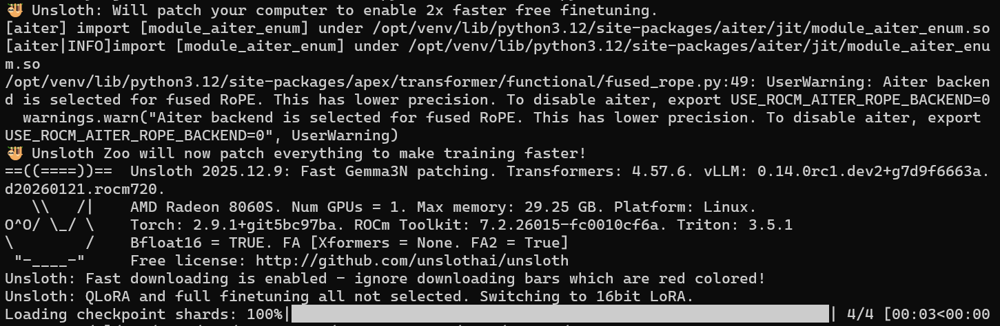
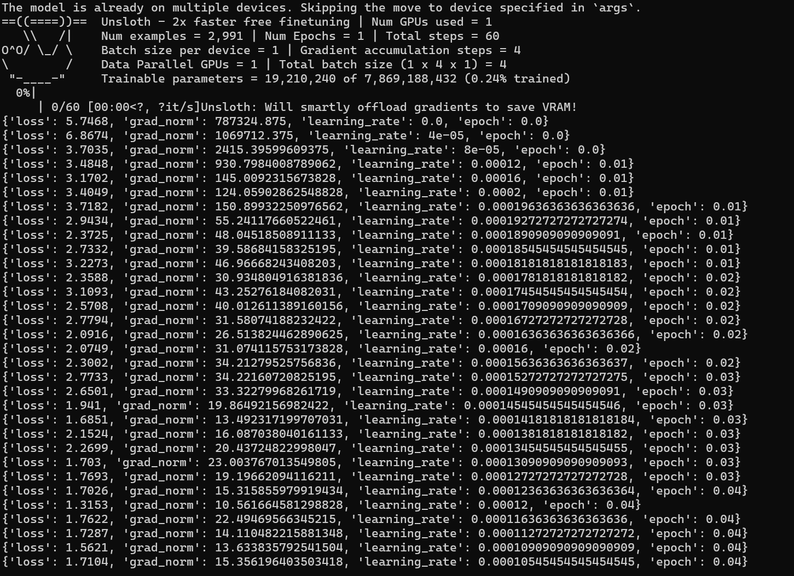

## Overview

<!--  -->

Unsloth is a high-efficiency LLM fine-tuning framework designed to make advanced model customization accessible on modern hardware.

This playbook teaches you how to use Unsloth for practical fine-tuning workflows that run efficiently on local AI hardware.

## What You'll Learn

- How to set up the Unsloth environment
- How to fine-tune a LLM using SFT with Unsloth
- How to save the fine-tuned result in local storage

## Why Unsloth?
Fine-tuning large language models no longer requires massive compute or complex infrastructure—Unsloth focuses on making it fast and memory-efficient.

A key strength of Unsloth lies in its VRAM optimization and accelerated training pipeline. By leveraging techniques such as optimized kernels and parameter-efficient fine-tuning (PEFT), it significantly reduces memory usage while enabling much faster training compared to standard approaches.

In this project, we primarily adopt Supervised Fine-Tuning (SFT) with QLoRA, where only a small subset of parameters is updated. This allows us to fine-tune large models on consumer-grade hardware without sacrificing performance.

Beyond SFT, Unsloth also supports GRPO-based reinforcement learning, enabling further alignment toward domain-specific objectives when needed.

Overall, Unsloth bridges the gap between research and real-world deployment—making it practical to adapt foundation models into specialized systems efficiently.

## Set up your environment

<!-- @os:windows -->
On Windows, open a terminal in the directory of your choice and follow the commands to create a venv with ROCm+Pytorch already installed.
<!-- @test:id=create-venv timeout=60 -->
```bash
python -m venv unsloth-env --system-site-packages
unsloth-env\Scripts\activate
```
<!-- @test:end -->
<!-- @setup:id=activate-venv command="unsloth-env\Scripts\activate" -->

> **Tip**: Windows users may need to modify their PowerShell Execution Policy (e.g.
> setting it to RemoteSigned or Unrestricted) before running some Powershell commands.

<!-- @os:end -->

<!-- @os:linux -->
On Linux, open a terminal and run the following prompt to create a venv with ROCm+Pytorch already installed:
<!-- @test:id=create-venv timeout=120 -->
```bash
sudo apt update
sudo apt install -y python3-venv
python3 -m venv unsloth-env --system-site-packages
source unsloth-env/bin/activate
```
<!-- @test:end --> 
<!-- @setup:id=activate-venv command="source unsloth-env/bin/activate" --> 
<!-- @os:end -->

### Installing Basic Dependencies
<!-- @os:linux -->
<!-- @require:rocm,pytorch,driver -->
<!-- @os:end -->

<!-- @os:windows -->
<!-- @require:pytorch,driver -->
<!-- @os:end -->

<!-- @test:id=verify-torch-env timeout=60 hidden=True setup=activate-venv -->
```python
import sys
import torch

print(f"Python executable: {sys.executable}")
print(f"PyTorch version: {torch.__version__}")
print(f"torch.cuda.is_available(): {torch.cuda.is_available()}")

if not torch.cuda.is_available():
    raise SystemExit("FAIL: ROCm-enabled PyTorch is not visible in this venv")

print("PASS: ROCm-enabled PyTorch is visible")
```
<!-- @test:end -->

### Additional Dependencies

<!-- @test:id=install-deps timeout=300 setup=activate-venv -->
```bash
pip install "unsloth[amd] @ git+https://github.com/unslothai/unsloth.git"
pip install --no-deps git+https://github.com/unslothai/unsloth-zoo.git
pip install --no-deps --upgrade timm
pip install datasets transformers trl
```
<!-- @test:end -->

<!-- @test:id=verify-imports timeout=120 hidden=True setup=activate-venv -->
```python
import torch
from datasets import load_dataset
from transformers import TextStreamer
from unsloth import FastModel
from unsloth.chat_templates import (
    get_chat_template,
    standardize_data_formats,
    train_on_responses_only,
)
from trl import SFTTrainer, SFTConfig

print(f"PyTorch version: {torch.__version__}")
print(f"ROCm available: {torch.cuda.is_available()}")
print("PASS: All required imports succeeded")
```
<!-- @test:end -->

## Download the Unsloth Fine Tuning Script

Instead of manually executing each step, this playbook provides a clean, end-to-end script here: [test_unsloth.py](assets/test_unsloth.py).

Run the following code to execute the script:

```bash
python test_unsloth.py
```

<!-- @test:id=verify-script timeout=60 hidden=True -->
```python
import os
import sys
import ast

scripts = ["test_unsloth.py", "test_unsloth_ci.py"]
missing = [s for s in scripts if not os.path.exists(s)]

if missing:
    print(f"FAIL: Missing script: {missing}")
    sys.exit(1)
print("PASS: All required script files exist")

for script in scripts:
    with open(script, "r", encoding="utf-8") as f:
        ast.parse(f.read(), filename=script)
    print(f"PASS: {script} has valid syntax")
```
<!-- @test:end -->

<!-- @test:id=quick-train-unsloth timeout=2400 hidden=True setup=activate-venv -->
```bash
python test_unsloth_ci.py
```
<!-- @test:end -->

The rest of the playbook will conceptually go through each major step of the script. 

## How It Works
The test_unsloth.py script performs the following steps:
* **Load Model**: Loads unsloth/gemma-3n-E4B-it using FastModel.
* **Prepare Data**: Standardizes the dataset (e.g., FineTome-100k) and applies the Gemma-3 chat template.
* **Apply LoRA**: Adds adapters to language, attention, and MLP modules for efficient training.
* **Train**: Uses SFTTrainer with response-only loss masking.
* **Inference**: Runs a quick generation test to verify performance.
* **Save**: Exports LoRA adapters locally.

## Key Configuration
You can modify the following constants to customize your run:

```python
MODEL_NAME = "unsloth/gemma-3n-E4B-it"
MAX_SEQ_LEN = 1024
DATASET_NAME = "mlabonne/FineTome-100k"
OUTPUT_DIR = "gemma_3n_lora"
```

Example of the Unsloth welcome message and output when loading the model weights:


## Prepare Dataset

We use a subset of:
```text
mlabonne/FineTome-100k
```
The dataset is: 
* Converted into chat format
* Processed using the Gemma-3 chat template
* Cleaned to remove duplicate BOS tokens

## Train the Model

The script runs a short training demo, with the following parameters:
- ~50 steps
- Small batch size
- Gradient accumulation

During training, you will see logs such as:
```



## Optional: Lower Memory (4-bit)
You can enable 4-bit quantization by using a 4-bit quantized model:
```python
load_in_4bit = True
model_name = "unsloth/gemma-3n-E4B-it-unsloth-bnb-4bit"
```
This reduces memory usage significantly with minimal quality loss.

## Saving and Deployment
### Local Saving (LoRA)

The script automatically saves LoRA adapters to the OUTPUT_DIR.
```python
model.save_pretrained("gemma_3n_lora")  
tokenizer.save_pretrained("gemma_3n_lora")
```

<!-- @test:id=verify-unsloth-lora-output timeout=120 hidden=True setup=activate-venv -->
```python
import os
import sys
import glob

out_dir = "gemma_3n_lora_ci"
if not os.path.isdir(out_dir):
    print(f"FAIL: Missing output directory: {out_dir}")
    sys.exit(1)

required = [
    "adapter_config.json",
    "tokenizer_config.json",
]
missing = [f for f in required if not os.path.exists(os.path.join(out_dir, f))]
if missing:
    print(f"FAIL: Missing required files: {missing}")
    sys.exit(1)

adapter_weights = (
    glob.glob(os.path.join(out_dir, "adapter_model*.safetensors")) +
    glob.glob(os.path.join(out_dir, "adapter_model*.bin"))
)
if not adapter_weights:
    print("FAIL: Missing adapter weights")
    sys.exit(1)

print("PASS: Unsloth LoRA output looks correct")
print(f"Found adapter weights: {adapter_weights}")
```
<!-- @test:end -->

### Save merged model (for vLLM) 

For deployment with vLLM, merge the adapters into a full model:
```python
model.save_pretrained_merged("gemma-3N-finetune", tokenizer)
```

<!-- @test:id=verify-unsloth-merged-output timeout=120 hidden=True setup=activate-venv -->
```python
import os
import sys
import glob

out_dir = "gemma_3n_merged_ci"
if not os.path.isdir(out_dir):
    print(f"FAIL: Missing merged model directory: {out_dir}")
    sys.exit(1)

required = [
    "config.json",
    "tokenizer_config.json",
]
missing = [f for f in required if not os.path.exists(os.path.join(out_dir, f))]
if missing:
    print(f"FAIL: Missing required merged files: {missing}")
    sys.exit(1)

model_files = (
    glob.glob(os.path.join(out_dir, "*.safetensors")) +
    glob.glob(os.path.join(out_dir, "pytorch_model*.bin"))
)
if not model_files:
    print("FAIL: Missing merged model weights")
    sys.exit(1)

print("PASS: Merged model output looks correct")
```
<!-- @test:end -->

### Export GGUF (for llama.cpp)

Convert directly to GGUF for local inference:
```python
model.save_pretrained_gguf("gemma_3n_finetune", tokenizer, quantization_method="Q8_0")
```

<!-- @test:id=verify-unsloth-gguf-output timeout=120 hidden=True setup=activate-venv -->
```python
import os
import sys
import glob

out_dir = "gemma_3n_gguf_ci"
if not os.path.isdir(out_dir):
    print(f"FAIL: Missing GGUF output directory: {out_dir}")
    sys.exit(1)

gguf_files = glob.glob(os.path.join(out_dir, "*.gguf"))
if not gguf_files:
    print("FAIL: Missing GGUF files")
    sys.exit(1)

print("PASS: GGUF export output looks correct")
print(f"Found GGUF files: {gguf_files}")
```
<!-- @test:end -->

## Next Steps
- Train on your own specific datasets
- Try finetuning with different hyperparameters
- Experiment with different quantization levels to understand the tradeoff between memory usage and quality
- Deploy with vLLM or llama.cpp

## Resources

Below are some additional resources to learn more about unsloth and finetuning on 

* [Unsloth Docs](https://docs.unsloth.ai)

* [Unsloth GitHub](https://github.com/unslothai/unsloth)

* [Unsloth Fine-tuning Guide](https://docs.unsloth.ai/get-started/fine-tuning-llms-guide)
